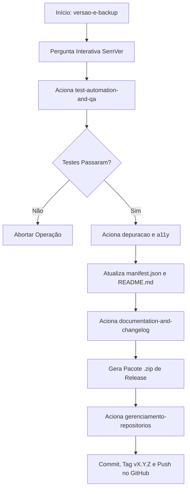

# Gestão Automatizada de Versões, Pacotes .zip e Backups - Assistente Jorge

Esta skill gerencia a numeração automática de versões (SemVer `MAJOR.MINOR.PATCH`), a criação de pacotes `.zip` de lançamento e o backup histórico das versões anteriores através de **Git Tags** e **GitHub Releases**.

---

## 🎯 Tipos de Incremento de Versão (SemVer)

1. **`patch`** (ex: `1.2.1` -> `1.2.2`): Correções de bugs, pequenas melhorias visuais ou ajustes na documentação.
2. **`minor`** (ex: `1.2.1` -> `1.3.0`): Novas funcionalidades retrocompatíveis (ex: suporte a mídias, histórico de sessões, novas abas).
3. **`major`** (ex: `1.2.1` -> `2.0.0`): Reformulações grandes da arquitetura ou mudanças incompatíveis com a versão anterior.

---

## 🔗 Orquestração Multiskill (Como esta Skill Aciona as Demais)

Quando a skill **`versao-e-backup`** é executada, ela orquestra o ecossistema chamando automaticamente as skills necessárias na seguinte ordem:



---

## 🚀 Fluxo de Execução Orquestrado

### ❓ Passo 0: Pergunta Interativa de Tipo de Incremento (Obrigatória se não especificado)

Se o tipo de incremento (`patch`, `minor` ou `major`) não for informado na chamada, pergunte ao usuário:

> **Qual o tipo de atualização que está sendo lançada para o Assistente do Jorge?**
> 1. **Patch (1.2.2)** — Correção de bugs, refatoração interna ou ajustes na documentação.
> 2. **Minor (1.3.0)** — Novas funcionalidades e recursos adicionados à extensão.
> 3. **Major (2.0.0)** — Grandes mudanças de arquitetura ou breaking changes.

---

### Passo 1: Validação de Qualidade (Chama `test-automation-and-qa`)
- Acionar a skill de QA para rodar os testes unitários (`node tests/test.js`).
- *Se algum teste falhar, abortar imediatamente a geração da versão.*

### Passo 2: Auditoria de Acessibilidade & Código (Chama `depuracao` & `chrome-extensions`)
- Garantir que nenhum atributo ARIA ou regra de Manifest V3 tenha sido quebrado.

### Passo 3: Atualizar Números de Versão
- Ler a versão atual no [`manifest.json`](file:///Users/jader/Meu%20Drive/extensao_geral/manifest.json).
- Incrementar a propriedade `"version"` conforme o tipo escolhido (`patch`, `minor` ou `major`).
- Atualizar a referência de comando no [`README.md`](file:///Users/jader/Meu%20Drive/extensao_geral/README.md).

### Passo 4: Atualizar Documentação (Chama `documentation-and-changelog`)
- Atualizar links relativos e notas de versão.

### Passo 5: Gerar o Pacote `.zip` de Produção (Backup Físico)
- Gerar o pacote empacotado limpo para a Chrome Web Store e GitHub Releases:
  ```bash
  zip -r assistente-jorge-extension-vX.Y.Z.zip manifest.json sidepanel.html sidepanel.js sidepanel.css background.js icons/ lib/ -x "*.DS_Store"
  ```

### Passo 6: Commit, Tag e Sincronização (Chama `gerenciamento-repositorios`)
- Criar o commit no padrão Conventional Commits (`chore(release): bump version to vX.Y.Z`).
- Criar a **Git Tag anotada** de backup permanente (`git tag -a vX.Y.Z -m "Release vX.Y.Z do Assistente do Jorge"`).
- Sincronizar o repositório e enviar as tags para o GitHub (`git push origin main --tags`).
