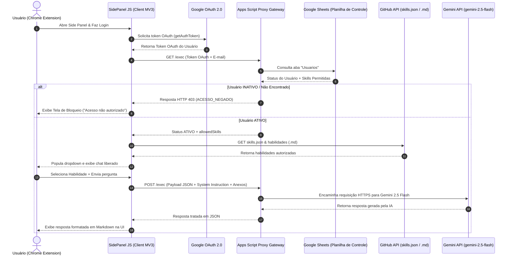

# 🏗️ Arquitetura, Especificação Técnica e Segurança

Este documento descreve a arquitetura de software, especificações funcionais, decisões de design (ADRs) e políticas de segurança/privacidade do **Assistente do Jorge**.

---

## 📐 Especificação Técnica do Produto

O **Assistente do Jorge** é uma extensão de navegador (Chrome Manifest V3) projetada para funcionar como um copiloto especialista no painel lateral (Side Panel).

### 🎯 Premissas de Funcionamento
1. **Modelo de IA Empregado**: Modelo `gemini-2.5-flash` padronizado.
2. **Contexto Dinâmico**: Leitura sanitizada do DOM da aba ativa (`<main>`, `<article>` e remoção de ruídos).
3. **Anexos e Documentos**: Processamento e consolidação textual de arquivos enviados pelo usuário ou detectados na página.
4. **Habilidades Especialistas**: Injeção dinâmica de *System Instructions* via arquivos Markdown no GitHub.

---

## 🏛️ Arquitetura de Software & Fluxo de Comunicação

A solução utiliza a arquitetura **Client-Proxy Gateway**:

---

## 💡 Registros de Decisões Arquiteturais (ADRs)

### ADR-001: Utilização do Modelo `gemini-2.5-flash`
- **Decisão**: Substituir chamadas legadas aos modelos 1.5 pelo modelo estável `gemini-2.5-flash`.
- **Justificativa**: O modelo 2.5 oferece o equilíbrio ideal entre velocidade de resposta em chat agentico, alta capacidade de janela de contexto e baixo custo computacional.

### ADR-002: Proxy Gateway no Google Apps Script
- **Decisão**: Intermediar todas as chamadas à API do Gemini utilizando o Google Apps Script Web App.
- **Justificativa**: Protege a chave de API (`GEMINI_API_KEY`) do lado do servidor, valida a permissão do usuário diretamente na Planilha Google Sheets e evita a exposição de segredos no código da extensão.

### ADR-003: Habilidades Dinâmicas via Catálogo `skills.json` no GitHub
- **Decisão**: Armazenar as habilidades em um repositório exclusivo do GitHub (`assistente-jorge-skills`) e catalogá-las no manifesto `skills.json`.
- **Justificativa**: Permite a publicação, atualização e versão contínua de novas habilidades por especialistas de domínio sem necessidade de re-compilar ou publicar atualizações da extensão na Chrome Web Store.

---

## 🔒 Segurança, Permissões V3 e Privacidade

### 🛡️ Princípios de Privacidade de Dados
1. **Processamento Local**: O texto extraído da página web e os arquivos anexados são processados localmente no navegador e enviados de forma criptografada via HTTPS para o Proxy Gateway.
2. **Sem Armazenamento Indevido**: O Proxy Gateway não grava o conteúdo das conversas ou arquivos do usuário em bancos de dados externos.
3. **Escopo Mínimo de Permissões**: A verificação do usuário utiliza apenas escopos essenciais do Google OAuth.

### 📜 Justificativa de Permissões no `manifest.json`

| Permissão | Finalidade e Justificativa Técnica |
| :--- | :--- |
| `"sidePanel"` | Exibe a interface analítica do assistente no painel lateral nativo do Chrome. |
| `"tabs"` | Identifica a URL e o título da aba ativa que o usuário deseja analisar. |
| `"scripting"` | Injeta o script de extração sanitizada de texto e detecção de links de download no DOM da aba ativa. |
| `"storage"` | Salva o histórico de chat localmente no navegador e armazena o cache offline de skills. |
| `"identity"` | Autentica o usuário via OAuth 2.0 com a conta Google para verificação na planilha de controle. |
| `"downloads"` | Realiza o download de arquivos da página (.pdf, .txt, .csv, .json) para o computador do usuário. |

### 🌐 Domínios Autorizados (`host_permissions`)
* `<all_urls>`: Permite a extração de texto em páginas web acessadas voluntariamente pelo usuário.
* `https://script.google.com/*`: Comunicação com o Proxy Gateway no Google Apps Script.
* `https://api.github.com/*` e `https://raw.githubusercontent.com/*`: Download das habilidades e manifesto `skills.json` do GitHub.
