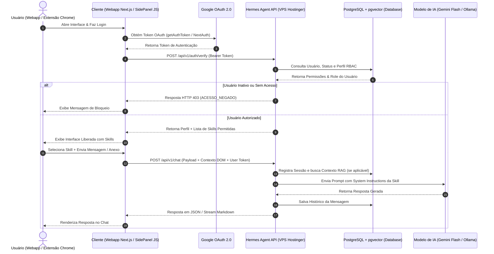

# 🏗️ Arquitetura, Especificação Técnica e Segurança

Este documento descreve a arquitetura de software, especificações funcionais, decisões de design (ADRs) e políticas de segurança/privacidade do **Assistente do Jorge** e sua evolução para a arquitetura centralizada baseada em **Hermes Agent**.

---

## 🌐 Visão da Arquitetura Alvo (Evolução Unificada)

O sistema evolui de um modelo de script isolado (Apps Script + Planilha Google) para uma **Arquitetura de Cérebro Unificado** hospedada em VPS, composta por 3 pilares integrados:

```
                  ┌──────────────────────────────────────────────┐
                  │          Google OAuth 2.0 / Auth            │
                  └──────────────────────┬───────────────────────┘
                                         │
        ┌────────────────────────────────┴────────────────────────────────┐
        │                                                                 │
        ▼                                                                 ▼
┌─────────────────────────────┐                         ┌─────────────────────────────┐
│    Webapp (Next.js App)     │                         │ Chrome Extension Sidepanel  │
│  - Interface para 20+ users │                         │  - Captura do DOM da página │
│  - Gestão de Documentos/Wiki│                         │  - Leitor de Downloads/PDFs │
│  - Controle de Acesso RBAC  │                         │  - Interface leve de chat   │
└──────────────┬──────────────┘                         └──────────────┬──────────────┘
               │                                                       │
               │         API REST / WebSockets / JSON Payload          │
               └─────────────────────────┬─────────────────────────────┘
                                         │
                                         ▼
                 ┌──────────────────────────────────────────────┐
                 │    Hermes Agent (Cérebro Central na VPS)     │
                 │  - Hostinger KVM 4 (72.61.44.164)            │
                 │  - Gestão e Execução de Skills Native        │
                 │  - Orquestração LLM (Gemini Flash / Ollama)  │
                 │  - Execução segura de tarefas e automações   │
                 └──────────────────────┬───────────────────────┘
                                        │
                                        ▼
                 ┌──────────────────────────────────────────────┐
                 │     PostgreSQL + pgvector (Database)         │
                 │  - Autenticação e Perfil de Usuários (RBAC)  │
                 │  - Sessões, Histórico e Logs de Auditoria    │
                 │  - Armazenamento Vetorial RAG (Documentos)   │
                 └──────────────────────────────────────────────┘
```

---

## 📐 Especificação Técnica do Produto

O **Assistente do Jorge** opera tanto como Extensão de Navegador (Chrome Manifest V3 no Side Panel) quanto através do Webapp corporativo.

### 🎯 Premissas de Funcionamento
1. **Cérebro Único na VPS**: Todo o raciocínio, orquestração de contexto, execução de skills e acesso aos modelos de IA (Gemini 2.5 Flash / Ollama Local) são centralizados no Hermes Agent.
2. **Contexto Dinâmico do Navegador**: Leitura sanitizada do DOM da aba ativa (`<main>`, `<article>` e remoção de ruídos) enviada da extensão para o Hermes via API.
3. **Anexos, RAG e Documentos**: Os documentos extraídos ou anexados são processados pelo Hermes Agent e vetorizados no PostgreSQL (`pgvector`), mantendo o isolamento entre contexto de rascunho e base oficial.
4. **Habilidades Especialistas Centralizadas**: As *Skills* ficam cadastradas diretamente na VPS (`~/.hermes/skills/`). A extensão e o Webapp consultam as habilidades autorizadas com base no perfil de acesso (RBAC).

---

## 🏛️ Arquitetura de Software & Fluxo de Comunicação (Alvo)


```mermaid
sequenceDiagram
    autonumber
    actor U as Usuário (Webapp / Extensão Chrome)
    participant C as Cliente (Webapp Next.js / SidePanel JS)
    participant OA as Google OAuth 2.0
    participant HA as Hermes Agent API (VPS Hostinger)
    participant DB as PostgreSQL + pgvector (Database)
    participant AI as Modelo de IA (Gemini Flash / Ollama)

    U->>C: Abre Interface & Faz Login
    C->>OA: Obtém Token OAuth (getAuthToken / NextAuth)
    OA-->>C: Retorna Token de Autenticação
    C->>HA: POST /api/v1/auth/verify (Bearer Token)
    HA->>DB: Consulta Usuário, Status e Perfil RBAC
    DB-->>HA: Retorna Permissões & Role do Usuário
    alt Usuário Inativo ou Sem Acesso
        HA-->>C: Resposta HTTP 403 (ACESSO_NEGADO)
        C-->>U: Exibe Mensagem de Bloqueio
    else Usuário Autorizado
        HA-->>C: Retorna Perfil + Lista de Skills Permitidas
        C-->>U: Exibe Interface Liberada com Skills
        U->>C: Seleciona Skill + Envia Mensagem / Anexo
        C->>HA: POST /api/v1/chat (Payload + Contexto DOM + User Token)
        HA->>DB: Registra Sessão e busca Contexto RAG (se aplicável)
        HA->>AI: Envia Prompt com System Instructions da Skill
        AI-->>HA: Retorna Resposta Gerada
        HA->>DB: Salva Histórico da Mensagem
        HA-->>C: Resposta em JSON / Stream Markdown
        C-->>U: Renderiza Resposta no Chat
    end
```

---

## 💡 Registros de Decisões Arquiteturais (ADRs)

### ADR-001: Utilização do Modelo `gemini-2.5-flash`
- **Decisão**: Padronizar o modelo principal em `gemini-2.5-flash` (com fallback local para Ollama/Qwen quando necessário).
- **Justificativa**: Equilíbrio ideal entre velocidade de resposta, janela de contexto estendida e custo eficiente.

### ADR-002: Proxy Gateway no Google Apps Script (Legado / Em Descontinuação)
- **Decisão**: *[Legado]* Intermediar chamadas à API do Gemini via Apps Script Web App.
- **Status**: Substituído pela API do Hermes Agent na VPS.

### ADR-003: Habilidades Dinâmicas via Catálogo `skills.json` no GitHub (Legado / Em Descontinuação)
- **Decisão**: *[Legado]* Armazenar habilidades em repositório GitHub e baixar `.md` dinamicamente no navegador.
- **Status**: Substituído pela gestão nativa de skills no diretório do Hermes Agent na VPS (`~/.hermes/skills/`).

### ADR-004: Centralização do Cérebro de IA no Hermes Agent na VPS
- **Decisão**: Concentrar toda a gestão de modelos, histórico de mensagens, orquestração de RAG e execução de skills em uma instância do Hermes Agent rodando em VPS dedicada (Hostinger KVM 4).
- **Justificativa**: Garante controle total de infraestrutura, elimina intermediários frágeis (Apps Script), permite streaming contínuo de respostas e desacopla as interfaces (Webapp / Extensão) da inteligência do sistema.

### ADR-005: Controle de Acesso Baseado em Papéis (RBAC) e Persistência no PostgreSQL
- **Decisão**: Migrar a autenticação e controle de permissões de Planilhas Google para um banco de dados **PostgreSQL com pgvector**.
- **Justificativa**: Suporta múltiplos usuários (20+ pessoas), auditoria rigorosa, busca vetorial integrada para RAG e garante que os usuários só acessem módulos, skills e documentos permitidos pelo seu papel (Role).

---

## 🔒 Segurança, Permissões V3 e Privacidade

### 🛡️ Princípios de Privacidade e Segurança
1. **Comunicação Segura (HTTPS/TLS)**: Todas as requisições entre os clientes (Webapp/Extensão) e a VPS utilizam criptografia de ponta a ponta.
2. **Separação de Privilégios no Webapp**: O Webapp restringe recursos sensíveis (como acesso ao terminal da VPS e alteração de chaves globais de API) e expõe apenas a interface amigável aos usuários finais.
3. **Isolamento de Dados no RAG**: O PostgreSQL organiza documentos e vetores por projeto/organização, garantindo que usuários só visualizem informações autorizadas.
4. **Validação de Token OAuth**: Toda chamada para a API do Hermes exige a apresentação do Bearer Token assinado pelo Google OAuth, validado contra a tabela de usuários.

---

### 📜 Justificativa de Permissões no `manifest.json`

| Permissão | Finalidade e Justificativa Técnica |
| :--- | :--- |
| `"sidePanel"` | Exibe a interface analítica do assistente no painel lateral nativo do Chrome. |
| `"tabs"` | Identifica a URL e o título da aba ativa que o usuário deseja analisar. |
| `"scripting"` | Injeta o script de extração sanitizada de texto e detecção de links de download no DOM da aba ativa. |
| `"storage"` | Salva o histórico de chat localmente no navegador e armazena o cache offline de skills. |
| `"identity"` | Autentica o usuário via OAuth 2.0 com a conta Google para verificação na planilha de controle. |
| `"downloads"` | Realiza o download de arquivos da página (.pdf, .txt, .csv, .json) para o computador do usuário. |

### 🌐 Domínios Autorizados (`host_permissions`)
* `<all_urls>`: Permite a extração de texto em páginas web acessadas voluntariamente pelo usuário.
* `https://script.google.com/*`: Comunicação com o Proxy Gateway no Google Apps Script.
* `https://api.github.com/*` e `https://raw.githubusercontent.com/*`: Download das habilidades e manifesto `skills.json` do GitHub.
