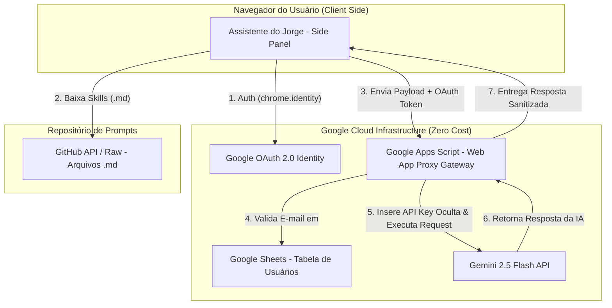
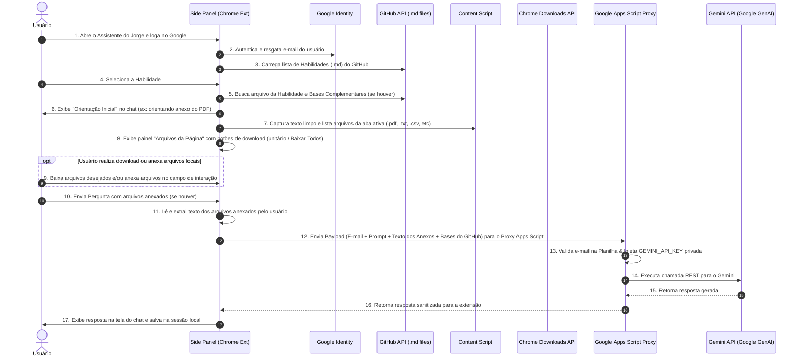

# 📄 Especificação do Produto (PRD): Assistente do Jorge (Arquitetura Serverless com Google Apps Script Proxy + GitHub + Google Sheets)

## 1. Visão Geral da Arquitetura Simplificada

### 1.1 Objetivo
Desenvolver a extensão **"Assistente do Jorge"** para o Google Chrome baseada no **Manifest V3**, atuando como assistente analítico de painel lateral (*Side Panel*). A extensão permite que o usuário faça login com sua conta Google, valide seu acesso através de uma **Planilha Google (Google Sheets)** e envie suas requisições de forma 100% segura por um **Proxy Intermediário Gratuito no Google Apps Script** (que protege a Chave do Gemini), carregando dinamicamente as **Skills em arquivos Markdown (`.md`) hospedadas no GitHub**, e realizando perguntas analíticas com base no conteúdo da página ativa e em **arquivos baixados automaticamente**.

### 1.2 Diferenciais de Segurança & Custo Zero
* **Chave do Gemini 100% Oculta (Google Apps Script Proxy)**: A `GEMINI_API_KEY` fica armazenada estritamente nas propriedades privadas do Google Apps Script (`PropertiesService`). Ela **nunca trafega para o navegador nem fica exposta na planilha**.
* **Zero Servidores Pagos**: Todo o backend intermediário roda nativamente e de forma 100% gratuita na infraestrutura serverless do Google Apps Script.
* **Gestão de Usuários Simplificada (Google Sheets)**: Adicionar ou bloquear usuários é feito editando linhas na planilha.
* **Gestão de Skills por Markdown (GitHub Repos)**: Cada *Skill* é um arquivo `.md` editado com suporte a Git.

---

## 2. Visão Geral do Ecosistema



---

## 3. Especificação do Google Apps Script (Web App Proxy Gateway)

O Google Apps Script atua como uma **Bridge/Gateway de Segurança** entre a extensão do Chrome e a API do Gemini.

### 3.1 Estrutura do Código no Google Apps Script (`Code.gs`)
```javascript
function doPost(e) {
  try {
    const data = JSON.parse(e.postData.contents);
    const userEmail = data.userEmail;
    const promptConsolidado = data.promptConsolidado;

    // 1. Validar Acesso na Planilha Google
    const SPREADSHEET_ID = "1VbXL-23CimrbmoEThgPRSepOfzmgRtTXrIyftwXBRGE";
    const sheet = SpreadsheetApp.openById(SPREADSHEET_ID).getSheetByName("Usuarios");
    const values = sheet.getDataRange().getValues();
    
    let isAutorizado = false;
    for (let i = 1; i < values.length; i++) {
      if (values[i][0] === userEmail && values[i][2] === 'ATIVO') {
        isAutorizado = true;
        break;
      }
    }

    if (!isAutorizado) {
      return ContentService.createTextOutput(JSON.stringify({ 
        error: "Acesso não autorizado ao Assistente do Jorge." 
      })).setMimeType(ContentService.MimeType.JSON);
    }

    // 2. Resgatar GEMINI_API_KEY e GEMINI_MODEL do armazenamento de propriedades do Script
    const scriptProperties = PropertiesService.getScriptProperties();
    const apiKey = scriptProperties.getProperty("GEMINI_API_KEY");
    const model = scriptProperties.getProperty("GEMINI_MODEL") || "gemini-2.5-flash";
    
    // 3. Fazer requisição para a API do Gemini com o modelo configurado
    const endpoint = "https://generativelanguage.googleapis.com/v1beta/models/" + model + ":generateContent?key=" + apiKey;
    const payload = {
      contents: [{ parts: [{ text: promptConsolidado }] }]
    };

    const options = {
      method: "post",
      contentType: "application/json",
      payload: JSON.stringify(payload),
      muteHttpExceptions: true
    };

    const response = UrlFetchApp.fetch(endpoint, options);
    const result = JSON.parse(response.getContentText());

    return ContentService.createTextOutput(JSON.stringify(result))
      .setMimeType(ContentService.MimeType.JSON);

  } catch (err) {
    return ContentService.createTextOutput(JSON.stringify({ error: err.toString() }))
      .setMimeType(ContentService.MimeType.JSON);
  }
}
```

---

## 4. Gestão de Usuários & Skills

### 4.1 Estrutura da Planilha Google (`Usuarios`)
| E-mail | Nome | Status | Skills Permitidas | Observações |
| :--- | :--- | :---: | :--- | :--- |
| `joao@empresa.com` | João Silva | `ATIVO` | `ALL` | Acesso total |
| `maria@empresa.com` | Maria Souza | `ATIVO` | `juridico, seo` | Acesso restrito a 2 skills |
| `carlos@empresa.com` | Carlos Lima | `INATIVO` | `ALL` | Acesso revogado |

### 4.2 Gestão de Habilidades e Conhecimento no GitHub (`/skills/*.md`)
As Habilidades são arquivos `.md` lidos via GitHub API / URLs Raw. Cada arquivo de Habilidade define:
- **Orientação Inicial ao Usuário**: Exibida no chat no instante da seleção da Habilidade (ex: instruir o anexo do contrato original em PDF).
- **Bases de Conhecimento Complementares**: Mapeamento de arquivos adicionais no GitHub (`/conhecimento/leis.md`, `/manuais/*.md`) necessários para respaldar a análise.
- **System Prompt**: A instrução especialista da IA.

### 4.3 Mapeamento da Página Web & Captura Viva de Formulários (Just-in-Time)

#### A. Ciclo de Vida do Mapeamento de Arquivos ("Arquivos da Página")
1. **Abertura do Side Panel**: Varre a aba ativa e lista os documentos disponíveis (`.pdf`, `.txt`, `.csv`, etc.).
2. **Login/Autenticação Concluída**: Se o usuário fizer login com uma página já aberta na tela, a extensão executa a varredura inicial **imediatamente após a validação**, sem exigir recarregamento da página web.
3. **Navegação / Troca de Abas**: Monitora `chrome.tabs.onActivated` e `chrome.tabs.onUpdated` para renovar automaticamente o painel de arquivos quando o usuário muda de aba ou navega para um novo site.

#### B. Extração Viva de Dados de Formulários ("Just-in-Time")
- A leitura do conteúdo da página web **não é um instantâneo estático**.
- No exato segundo em que o usuário clica em **Enviar** no chat:
  - O script de injeção lê o DOM **em tempo real**, extraindo os textos digitados em campos de formulário (`<input>`, `<textarea>`), opções selecionadas em menus (`<select>`), caixas de seleção (*checkboxes*) e dados inseridos dinamicamente via JS.
  - Isso garante que a IA receba o estado mais recente e completo dos dados preenchidos na tela pelo usuário.

---

## 5. Fluxo Completo de Execução da Pergunta



---

## 6. Vantagens Absolutas da Solução com Proxy Apps Script

| Aspecto | Chave na Planilha | Chave na Extensão | Proxy Google Apps Script (ESCOLHIDO) |
| :--- | :---: | :---: | :---: |
| **Segurança da Chave** | ❌ Baixa (exposta na planilha) | ❌ Baixa (exposta no JS) | 🛡️ **MÁXIMA (Chave 100% oculta no servidor)** |
| **Custo de Servidor** | Gratuito | Gratuito | 💰 **100% Gratuito (Google Workspace)** |
| **Troca de Chave** | Fácil | Exige nova versão na Web Store | ⚡ **Imediata (sem re-publicar na Web Store)** |
| **Impossível Burlar** | ❌ Não | ❌ Não | ✅ **Sim (Usuário inativo é bloqueado no servidor)** |

---

## 7. Roadmap Atualizado de Desenvolvimento

### 📍 Fase 1: Configuração do Repositório GitHub, Planilha Google & Apps Script Proxy
* **Etapa 1.1: Criar a Planilha no Google Sheets (Gestão de Usuários)**
  * Criar a planilha `Assistente do Jorge - Controle de Acesso` com a aba `Usuarios`.
  * ID da planilha: `1VbXL-23CimrbmoEThgPRSepOfzmgRtTXrIyftwXBRGE`.
* **Etapa 1.2: Criar o Google Apps Script Proxy Web App**
  * Em **Extensões > Apps Script** na planilha, cole o código `Code.gs`.
  * Em **Propriedades do Projeto**, defina `GEMINI_API_KEY` com o valor da sua chave.
  * Clique em **Implantar > Nova Implantação** (Tipo: *App da Web*, Executar como: *Eu*, Quem pode acessar: *Qualquer pessoa*).
  * Guarde a URL do Web App (ex: `https://script.google.com/macros/s/{WEB_APP_ID}/exec`).
* **Etapa 1.3: Criar o Repositório no GitHub (Skills Markdown)**
  * Criar repositório `assistente-jorge-skills` e a pasta `/skills/`.
* **Etapa 1.4: Criar as Credenciais OAuth no Google Cloud Console**
  * Criar projeto `Assistente do Jorge` e Client ID da Extensão do Chrome.

### 📍 Fase 2: Módulo de Autenticação & Validação via Proxy
* Integração da extensão com o endpoint do Google Apps Script Web App.

### 📍 Fase 3: Módulo de Carregamento Dinâmico de Skills (GitHub REST API)
* Leitura dos arquivos `.md` do GitHub e exibição no select da extensão.

### 📍 Fase 4: Captura de DOM, Painel de Arquivos da Página, Anexos Manuais e Invocação da IA via Proxy
* Captura de aba ativa, exibição do painel "Arquivos da Página" com opções de download (unitário/todos), suporte a anexar arquivos no campo de interação, extração de texto dos anexos inseridos e chamada protegida pelo Proxy.
