# GUIA DO INSTRUMENTO DE MATURIDADE DE GOVERNANÇA E GESTÃO (IMGG 100 PONTOS)

**Modelo de Governança e Gestão Pública (Gestaopublicagov.br) – Versão 2.0**  
*Ministério da Gestão e da Inovação em Serviços Públicos | Secretaria de Gestão e Inovação | Diretoria de Transferências e Parcerias da União*

---

## INTRODUÇÃO

Públicos apresenta o Instrumento de Maturidade de Governança e Gestão – IMGG 100 PONTOS,
estruturado a partir dos Critérios de Avaliação do Modelo de Governança e Gestão Pública –
Gestaopublicagov.br.
O IMGG 100 PONTOS foi desenvolvido para ser o primeiro patamar de referência do nível de
maturidade da governança e gestão do Gestaopublicagov.br. Esse instrumento visa,
especificamente, à implementação objetiva das condições para o aprimoramento da governança e
da gestão dos órgãos e entidades que operacionalizam transferências e parcerias da União, por meio
da Plataforma Transferegov.br.
Este documento reúne informações, conceitos, critérios, métodos e técnicas para orientar
avaliadores internos das organizações públicas brasileiras que operam transferências e parcerias da
União, na implementação do Gestaopublicagov.br, por meio da aplicação do Instrumento de
Maturidade de Governança e Gestão – IMGG 100 PONTOS, possibilitando a avaliação e a melhoria
das práticas e dos resultados da governança e gestão, a implementação de planos de melhoria da
gestão e a certificação do nível de maturidade da governança e da gestão.
O IMGG 100 PONTOS pode servir às organizações com vários ciclos de gestão já realizados, que
utilizam, diretamente, o Gestaopublicagov.br, mas atende, principalmente, àquelas organizações
públicas que estão iniciando seu primeiro ciclo de avaliação e de melhoria.
A implementação do Gestaopublicagov.br permite que órgãos e entidades públicos possam atuar
na implantação de ciclos contínuos de avaliação e de melhoria de seus sistemas de gestão,
oportunizando o conhecimento das práticas, os resultados atuais e o seu alinhamento aos requisitos
do Gestaopublicagov.br. Além disso, possibilita agregar valor às oportunidades de melhoria
identificadas, bem como incrementar e inovar nos pontos fortes, ambos identificados em cada
processo de avaliação da gestão. A manutenção cíclica do processo de avaliação assegura que os
resultados da gestão se mantenham ao longo do tempo e se tornem efetivos.
Nesse sentido, vale ressaltar que a opção pelo aprimoramento contínuo da governança e da gestão
pública envolve um conjunto integrado de ações e é uma decisão da organização.

## 1. Fundamentação Legal

O Governo Federal, considerando o propósito de assegurar uniformidade e Valor Público, a partir
do melhor aproveitamento de recursos federais descentralizados pela União, constituiu importante
iniciativas:
* Decreto nº 11.271, de 5 de dezembro de 2022 - Institui o Sistema de Gestão de Parcerias da
União - Sigpar;
* Portaria SEGES/MGI nº 7.383, de 21 de novembro de 2023 - Institui o Modelo de Governança
e Gestão Pública - Gestaopublicagov.br, no âmbito dos órgãos e entidades da administração
pública que operacionalizam transferências de recursos da União no Transferegov.br.

## 2. Ciclo de Aprimoramento Contínuo da Governança e da Gestão

O aprimoramento da governança e da gestão pública é um conjunto integrado de ações, realizadas
de modo contínuo, que começa com a decisão da organização de avaliar e de melhorar,
sucessivamente, as práticas e os resultados da sua gestão, e se mantém ao longo do tempo,
mediante repetição cíclica do processo.
Avaliar a governança e a gestão de uma organização pública significa, portanto, verificar o grau de
aderência das suas práticas de governança e de gestão em relação ao referencial preconizado, o
Gestaopublicagov.br.
A avaliação permite identificar os pontos fortes e as oportunidades de melhoria. Essas
oportunidades de melhoria identificadas podem ser consideradas como aspectos gerenciais menos
desenvolvidos em relação ao modelo e que, portanto, devem ser objeto das ações de
aperfeiçoamento.
Assim, o processo de avaliação é complementado pelo planejamento do aprimoramento da
governança e da gestão, formulado a partir das oportunidades de melhorias identificadas na
avaliação, que podem ser transformadas em metas a serem atingidas em determinado período e
formalizadas em um plano de melhorias da gestão.
Quando realizada de forma sistemática, a avaliação da governança e da gestão funciona como uma
oportunidade de aprendizado sobre a própria organização e, também, como instrumento de
internalização dos princípios e práticas da gestão pública de elevado nível de maturidade em
governança e gestão.
Na constituição do IMGG 100 pontos, os Critérios de Avaliação do Gestaopublicagov.br se
desdobram em alíneas. As alíneas não são prescritivas em termos de métodos, técnicas e
ferramentas. Cabe a cada organização definir, em seu Plano de Melhoria de Governança e Gestão -
PMGG, o que fazer para responder às oportunidades de melhorias identificadas durante a aplicação
do IMGG 100 pontos.
No entanto, os Critérios de Avaliação estabelecem o que se espera de uma organização pública com
qualidade em gestão. Os princípios e características de uma gestão de qualidade constituem o cerne
do processo de aprimoramento e devem ser evidenciados pelas práticas de gestão da organização
e pelos resultados decorrentes dessas práticas.

### 2.1 O Caminho do Aprimoramento Contínuo da Gestão (Ciclo)

Esse processo de aprimoramento da gestão é aplicável a todas as organizações públicas
repassadoras e recebedoras das Transferências da União que desejarem avaliar e melhorar as suas
práticas gerenciais visando elevar o nível de maturidade em governança e gestão.
Ao decidir pela prática do aprimoramento continuado da governança e da gestão, a organização que
opera com recursos da União, seja integrante de qualquer dos três poderes, seja de qualquer das
três esferas de governo, deverá cumprir as etapas conforme mostra a Figura 3.
Figura 3 – Etapas da melhoria contínua da gestão
A primeira avaliação estabelece o “marco-zero” da gestão dos órgãos e entidades que operam com
Transferências da União em relação ao Gestaopublicagov.br. A realização de ciclos periódicos de
avaliação e melhoria permite medir e descrever a evolução dos resultados alcançados pela
organização.
É recomendável que a avaliação seja realizada periodicamente, não devendo ultrapassar dois anos,
gerando dados históricos comparativos que permitirão a análise do grau de evolução dos esforços
da organização e o redirecionamento sistemático das ações de melhoria, visando ao elevado nível
de maturidade em governança e gestão.

### 2.2 Implementação e Adesão ao Gestaopublicagov.br

Para aplicação do IMGG 100 pontos, foram desenvolvidos material metodológico e capacitações,
bem como sistema on-line (sistema Gestaopublicagov.br), que estão disponibilizados para apoiar os
órgãos e entidades nas ações de implementação do Gestaopublicagov.br.
Para aplicação do IMGG 100 pontos, as organizações deverão constituir Comitê de Aplicação, que
deve ser multidisciplinar, ou seja, composto por representantes das diversas áreas, processos e
níveis hierárquicos.
Atenção:
A aplicação deste instrumento não deve ser realizada por uma pessoa, pois corre-se o risco de se ter
apenas uma visão individual e, portanto, reduzida e incompleta da governança e da gestão da
organização, devendo o Comitê de Aplicação ser composto de no mínimo 4 membros. Contudo,
havendo disponibilidade, recomenda-se a formação com 18 membros, pois facilitará a divisão do
trabalho em 6 grupos, com 3 membros cada.
Para esse Comitê, deverá ser designado, ao menos, um Presidente do Comitê de Aplicação, que
terá as seguintes atribuições:
* Realizar a adesão do órgão/entidade no sistema Gestaopublicagov.br;
* Ativar e desativar os membros do Comitê de Aplicação previamente cadastrados para
acesso/uso ao sistema Gestaopublicagov.br;
* Submeter a aplicação do IMGG 100 pontos, gerado pelo sistema Gestaopublicagov.br, para
validação e certificação pela secretaria-executiva da Rede de Parcerias.
Contudo, para o sucesso da aplicação do IMGG 100 pontos, é fundamental que sejam indicados dois
Presidentes, sendo um o dirigente da organização, que terá a responsabilidade de patrocinar o
projeto, empoderando o outro Presidente, que atuará a frente do Comitê de Aplicação.
Os Presidentes e os demais membros do Comitê de Aplicação de cada órgão e entidade deverão
realizar o seu cadastro de usuário conforme os requisitos disponíveis no sistema
Gestaopublicagov.br, no Portal da plataforma Transferegov.br.
Só após o aceite do Termo de Adesão ao Gestaopublicagov.br, pelo Presidente do Comitê de
Aplicação, será possível o cadastro da organização e a aplicação do IMGG 100 pontos pelos
membros do Comitê de Aplicação, relacionados no cadastro da organização.

## 3. Instrumento de Maturidade de Governança e Gestão – IMGG 100 pontos

O Instrumento de Maturidade de Governança e Gestão – IMGG 100 pontos está estruturado nos
sete Critérios do Gestaopublicagov.br. E cada Critério é composto por um conjunto de alíneas, que
são desdobradas em requisitos, os quais devem ser considerados e avaliados.
A avaliação dos requisitos define a pontuação de cada alínea e, consequentemente, de todos os
Critérios, estabelecendo a pontuação total, que define o nível de maturidade atingido pela
organização.
O sistema Gestaopublicagov.br apresenta a configuração de cada alínea dos Critérios. Portanto, o
grau de atendimento aos requisitos de cada alínea, pela organização, é fundamental para definir a
pontuação em cada alínea.
O sistema de pontuação permite quantificar o grau de atendimento aos requisitos. A escala de
pontuação compreende o intervalo de 0 (zero) a 100 (cem) pontos. Na configuração de cada Critério,
é apresentada sua respectiva pontuação máxima.
Os requisitos de todas as alíneas dos Critérios no IMGG 100 pontos são compostos por sentenças
que solicitam a avaliação e a pontuação das práticas de gestão e os seus respectivos padrões de
trabalho.
Realiza-se a avaliação da gestão da organização com base em duas dimensões: processos gerenciais
e resultados.
Os Critérios de 1 a 6 correspondem aos denominados processos gerenciais e, portanto, solicitam
tanto as práticas de gestão empregadas pela organização para atender aos requisitos das alíneas
dos Critérios para avaliação da gestão pública, quanto à constância da aplicação dessas práticas.
As alíneas do Critério 7 - Valor Público, no IMGG 100 pontos, solicitam os resultados organizacionais,
que consistem na apresentação das consequências objetivas da implementação das práticas de
gestão descritas nas alíneas dos Critérios dos processos gerenciais. Esses resultados devem ser
comparados com referenciais pertinentes e com os requisitos das partes interessadas.
A metodologia adotada para a avaliação da gestão da organização tem por base a verificação das
práticas e dos resultados de gestão quanto ao atendimento aos requisitos das alíneas.
A descrição das práticas de gestão deve apresentar o atendimento dos requisitos expressos nas
alíneas, assim como os principais refinamentos ou inovações implementadas com impactos no
desempenho global da organização.
Nesse momento, é importante, também, a descrição dos indicadores de desempenho, se houver,
utilizados no monitoramento destas práticas de gestão, cujos resultados deverão ser apresentados
quando da aplicação do Critério 7.
Na avaliação e pontuação das alíneas do Critério 7, deverão ser apresentados os resultados
organizacionais, decorrentes da implementação objetiva das Práticas de Gestão descritas nos
processos gerenciais dos Critérios de 1 a 6.
Aqui, são solicitados os resultados de indicadores (que foram citados quando da descrição das
práticas de gestão para os Critério de 1 a 6), por meio de uma série de números, porcentagens,
relações numéricas que, geralmente, são mostrados por meio de tabelas ou gráficos.

### 3.1 Requisitos das Alíneas

Os requisitos das alíneas são compostos por sentenças que solicitam a descrição que os atendem,
ou seja, os requisitos são as condições que devem ser satisfeitas, exigências legais ou particulares
essenciais para o sucesso de um processo, serviço ou produto da organização.
Para a identificação dos requisitos, faz-se necessário verificar quantas ações a alínea explicita, bem
como seus respectivos complementos, ou seja, deve-se atentar para todas as combinações (ações e
complementos) expressas na alínea. Veja o exemplo, a Alínea “d” do Critério 3 - Público-Alvo:
d) A Carta de Serviços ao Cidadão é divulgada e os compromissos formalizados são
monitorados.
Essa alínea apresenta duas ações: divulgar, que está associada ao complemento Carta de Serviços
ao Cidadão; e monitorar, que está associada ao complemento compromissos formalizados.
Portanto, estão expressas 2 combinações (ação e complemento), que são os requisitos solicitados
pela alínea.
Requisitos da alínea:
* A Carta de Serviços ao Cidadão é divulgada;
* Os compromissos formalizados (na Carta de Serviços ao Cidadão) são monitorados;
Todos os requisitos já foram definidos para cada alínea, sendo que o grau de atendimento de cada
um dos requisitos pelas práticas e resultados de gestão apresentados pela organização é
fundamental para definir a pontuação das alíneas e, consequentemente, de cada Critério. A
pontuação geral dos Critérios estabelece o nível de maturidade da governança e da gestão atingido
pela organização. Na configuração de cada Critério, é apresentada a sua respectiva pontuação
máxima.

## 4. Organização da Oficina de Aplicação do IMGG 100 pontos

A avaliação e melhoria da gestão é feita pela própria organização, mediante a aplicação do IMGG
100 pontos, por meio do sistema Gestaopublicagov.br, tendo por objetivo quantificar e qualificar os
principais fatores relacionados à gestão da organização, com ênfase em suas práticas de gestão e
resultados institucionais.
Após a adoção das medidas preliminares de implementação e adesão ao Gestaopublicagov.br, a
organização deverá realizar a Oficina de Aplicação do IMGG 100 pontos, que está assim programada:
1º encontro – Reunião de Planejamento (8 horas)
* Apresentação do(s) Presidentes (e) do Comitê de Aplicação;
* Realização da adesão ao Gestaopublicagov.br;
* Apresentação do IMGG 100 pontos no sistema Gestaopublicagov.br;
* Apresentação do Ciclo de Aplicação (período de referência para avaliação - será sempre o
ano imediatamente anterior ao da aplicação, definido automaticamente pelo sistema);
* Definição de calendário de reuniões (o calendário de reuniões deverá contemplar reuniões
semanais para o bom andamento dos trabalhos); e
* Definição dos grupos de trabalho por Critério, para aplicação do IMGG 100 pontos.
Essa primeira reunião deve ser presidida pelo maior dirigente da organização, que dará início da
aplicação no sistema do Gestaopublicagov.br, se possível, com a participação de toda organização,
que tomará ciência da relevância do projeto, que ora se inicia.
Para maior efetividade dos trabalhos, recomenda-se que o Comitê de Aplicação seja dividido em
Grupos de trabalho - GT, conforme proposição abaixo, para:
a) realizar o cadastro da organização;
b) identificar, analisar e pontuar as práticas de gestão e os resultados da organização;
c) descrever e priorizar as oportunidades de melhorias;
d) elaborar os Planos de Melhoria de Governança e Gestão;
e) descrever e classificar os Requisitos para certificação; e
f) descrever e classificar as Práticas Destacadas.
Formação de Grupos por Critério
Grupos
Critérios (Processos Gerenciais)
Alíneas do Critério 7
GT 1
1 e 2
“b”
GT 2
3
“a”; “f”
GT 3
4 e 5
“c”; “d”; “e”
GT 4
6
“g”
Observação:
A partir da segunda aplicação do IMGG 100 PONTOS, a alínea “i” do Critério 7 deverá ser preenchida
pelos Grupos de trabalho responsáveis pelo Critério correspondente ao Plano de Melhoria de
Governança e Gestão - PMGG, ou seja, se o PMGG foi elaborado no Critério 1, o GT 1 deverá
preencher; se o PMGG foi elaborado no Critério 5, o GT 3 deverá preencher.
2º encontro - reuniões de consenso (80 horas)
* Aplicação do IMGG 100 pontos para todos os Critérios.
* Apresentação pelos grupos da pontuação das práticas e dos resultados, dos planos de
melhoria da governança e gestão, dos requisitos para certificação e das Práticas destacadas.
Recomenda-se que as reuniões para realização das atividades desse encontro tenham início uma
semana depois do encontro anterior, com a participação apenas dos membros dos grupos que
participaram do 1° encontro.
Nas reuniões de consenso, também conhecida como validação interna, quando da apresentação de
cada grupo, os demais poderão apresentar sugestões quanto à pontuação das práticas de gestão e
dos resultados, à priorização das oportunidades de melhoria e, consequentemente, quanto aos
Planos de Melhoria de Governança e Gestão; bem como a descrição e classificação dos Requisitos
para Certificação e das Práticas Destacadas.
O resultado da reunião de consenso consiste na emissão automática, pelo sistema
Gestaopublicagov.br, do Relatório Preliminar de Melhoria de Governança e Gestão - RPMGG, que
apresenta os dados de cadastro da organização, a pontuação geral e por Critério, e o Nível de
Maturidade de Governança e Gestão, bem como, da Declaração de Aplicação do IMGG 100 pontos
em nome do órgão ou entidade.
3º encontro – eventos externos
* Validação dos requisitos e da metodologia de aplicação do IMGG 100 pontos.
* Certificação do nível de maturidade de gestão da organização.
Logo após o encerramento das reuniões de consenso, o servidor designado no perfil de Presidente
do Comitê de Aplicação deverá encaminhar, por meio do sistema Gestaopublicagov.br, a aplicação
do IMGG 100 pontos para a validação externa, no caso de atendimento as condições estabelecidas
no Item 6, Validação externa.

## 5. Aplicação do IMGG 100 pontos no sistema Gestaopublicagov.br

Para aplicação do IMGG 100 pontos, preliminarmente, é necessário que o(s) Presidente(s) e os
Membros do Comitê de Aplicação cadastrem-se no sistema Gestaopublicagov.br, nos seus
respectivos perfis de usuário.
Após a ativação dos cadastros, o sistema do Gestaopublicagov.br disponibilizará, no perfil do
Presidente do Comitê de Aplicação, o Termo de Adesão ao Gestaopublicagov.br. Após o aceite, o
sistema habilitará as demais funcionalidades para aplicação do instrumento.
A primeira funcionalidade é iniciar a aplicação. Para tanto, deve-se clicar, na tela abaixo, no botão
“Iniciar Aplicação de Instrumento”. Essa ação só ocorre no perfil do Presidente do Comitê de
Aplicação.
Em seguida, ainda no perfil do Presidente do Comitê de Aplicação, na tela abaixo, deve-se selecionar
o instrumento a ser aplicado.
No momento da seleção do instrumento, o Presidente do Comitê de Aplicação deverá se atentar
para:
* Se primeira aplicação do órgão/entidade, selecionar IMGG 100 pontos (Primeira aplicação);
* Se segunda aplicação em diante do órgão/entidade, selecionar IMGG 100 pontos (A partir
da segunda aplicação).
O preenchimento do campo "Descrição/Referência” não é obrigatório. Este deverá ser preenchido
nos casos em que seja necessário especificar que a aplicação é de uma determinada unidade,
desassociando-a de outras. Exemplos: a aplicação se refere, exclusivamente, à uma Secretaria
Estadual, cujo CNPJ é o mesmo do estado ao qual pertence ou, ainda, a aplicação se refere a uma
unidade descentralizada (uma superintendência, por exemplo) da principal.
O campo “Ciclo de Aplicação” já vem preenchido automaticamente pelo sistema. Este refere-se ao
ano base (de 1º de janeiro a 31 de dezembro) para avaliação das práticas e resultados de gestão, em
atendimento aos requisitos de cada alínea. Assim, caso a aplicação ocorra no ano x, o “Ciclo de
Aplicação” será, necessariamente, o ano imediatamente anterior a esse.

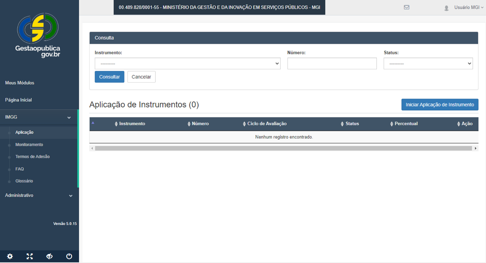  
*(Figura 1: Tela de início de aplicação do instrumento no sistema)*

Na sequência, o sistema apresenta a tela abaixo, onde se deve clicar no ícone de lupa/lápis,
disponível na coluna “Ação”, referente ao instrumento da organização.  Nessa tela, o instrumento
será visualizado pelos Membros do Comitê de Aplicação somente após a realização dos passos
anteriores, que só ocorrem no perfil dos Presidentes do Comitê de Aplicação.

  
*(Figura 2: Configuração de parâmetro e ciclo de avaliação)*

  
*(Figura 3: Painel de acompanhamento do instrumento em aplicação)*

## 6. Cadastro da Organização

O Cadastro da Organização é uma descrição geral da organização que será avaliada. Seu objetivo
principal é proporcionar uma visão sistêmica da organização a todos os avaliadores, pois,
normalmente, os colaboradores conhecem a instituição em que trabalham parcialmente.
Além disso, o Cadastro da Organização será de grande importância para entes externos no momento
da validação do processo de avaliação da gestão, que servirá de base para a certificação do
respectivo nível de maturidade da governança e da gestão.
Os dados referentes à organização serão um referencial imprescindível para a análise da
consistência das práticas e dos resultados relatados em relação à pontuação atribuída na avaliação.
Independentemente da forma adotada para a condução da avaliação da gestão, é recomendável
que o Comitê de Aplicação elabore, em conjunto, o cadastro de sua organização antes de iniciar o
processo avaliativo.
São apresentados, na tela abaixo, os campos para a descrição das “Competências Regimentais”
(obrigatório) e da “Missão”. Não é necessário descrever todas as competências gerências do
regimento interno. Basta apresentar as competências transversais, suficientes para que os
Validadores externos tenham conhecimento da organização.
Na aba “Produtos/Serviços e Usuários”, estão habilitados os campos para descrição dos
“Produtos/Serviços” e dos respectivos “Usuários”.
Serviço público é uma atividade desenvolvida com a participação do Estado que tem a finalidade de
atender necessidades dos cidadãos-usuários do órgão/entidade.

  
*(Figura 4: Aba de cadastro das Competências Regimentais e Missão)*

Os serviços públicos podem ser gerais ou individuais. Os gerais são os destinados ao atendimento
da população em geral e são financiados pelos valores dos impostos, como o fornecimento de
iluminação pública e a segurança pública. Os serviços individuais são os que são prestados a cada
pessoa, individualmente, e devem ser cobrados por taxas. São exemplos os serviços de fornecimento
de energia elétrica e de água.
Os serviços públicos chamados de essenciais são aqueles considerados urgentes e que podem causar
danos caso sejam interrompidos ou não fornecidos. São ligados às garantias de condições de saúde
e de segurança, que são indispensáveis para a vida digna dos cidadãos. Assim, a lei determina que a
prestação destes serviços não pode ser interrompida.
A Lei nº 7.783, de 28 de junho de 1989 (Lei de Greve), definiu quais são os serviços públicos
essenciais:
* tratamento e fornecimento de água;
* distribuição de energia elétrica;
* fornecimento de gás e outros tipos de combustível;
* serviços médicos e hospitalares;
* distribuição e venda de medicamentos;
* venda de alimentos;
* serviços funerários;
* transporte coletivo;
* tratamento de esgoto;
* recolha de lixo;
* serviços de telecomunicações;
* guarda e controle de substâncias radioativas e de materiais nucleares;
* atividades de processamento de dados dos serviços essenciais;
* controle do tráfego aéreo; e
* serviços de compensação bancária.
Nesse momento, é importante atentar-se que, para cada “Produto/Serviço”, deve-se relacionar os
seus respectivos “Usuários” e a quantidade que foi atendida durante o Ciclo de Aplicação.
É comum se confundir um serviço com uma Política Pública ou um Programa, veja o exemplo a
seguir:
Assistência Social é uma Política Pública, que tem, como um de seus Programas, o Combate à Fome,
que tem, entre seus Serviços, o Bolsa Família. Os usuários desse serviço são famílias vulneráveis
inscritas no Cadastro Único (CadÚnico).
Na próxima aba, estão habilitados os campos pertinentes ao Comitê de Aplicação, onde é possível a
inclusão ou exclusão de usuários. No caso de um usuário se cadastrar no sistema após iniciada a
aplicação, o Presidente do Comitê de Aplicação deverá inclui-lo, clicando no respectivo nome do
usuário relacionado no campo “Usuário”.
Finalmente, a aba “Arquivos e Evidências da Aplicação” funcionará como repositório de toda a
documentação que será anexada à aplicação, facilitando, assim, a consulta de cada uma delas com
seu respectivo local.

  
*(Figura 5: Aba de Produtos/Serviços e quantidade de cidadãos atendidos)*

  
*(Figura 6: Gestão de usuários membros do Comitê de Aplicação)*

## 7. Avaliação e Pontuação dos Critérios

A avaliação deverá ser realizada logo após o preenchimento do Cadastro da Organização, pelos
Membros do Comitê de Aplicação, que devem verificar se as práticas e os resultados de gestão da
organização atendem aos Fatores de Avaliação das Alíneas, a seguir:
* Adequação - verificar quais requisitos da alínea foram atendidos; e
* Continuidade - verificar o início da utilização das práticas e dos resultados de gestão (desde
quando) e com que periodicidade ocorrem. Nesse caso, é necessário apenas a apresentação
das práticas e dos resultados do ano anterior ao ciclo de aplicação do IMGG.
Será necessária a descrição das práticas de gestão quando for sinalizado “Sim” para o fator
“Adequação” na avaliação dos requisitos de cada alínea dos Critérios 1 a 6 – Processos Gerenciais.
Caso a organização sinalize “Não” para o fator “Adequação”, consequentemente, deverá sinalizar
“Não” para o fator “Continuidade”.
Descreve-se uma prática de gestão respondendo, objetivamente, à pergunta “como a organização
executa esta ou aquela ação de gestão?”, ou seja, deve-se responder “como” a organização atende
aos requisitos da alínea, atentando-se para registrar a “Continuidade” dessa prática pela
organização. A descrição pode contemplar, também, as melhorias recentes implementadas na
Prática de Gestão.
Sempre que possível, informar, também, na descrição da Prática de Gestão, a constância da
aplicação dessas práticas pelas principais áreas, processos, serviços/produtos e/ou pelas partes
interessadas pertinentes.

  
*(Figura 7: Repositório geral de documentação da aplicação)*

Se uma prática de gestão para atendimento de um determinado requisito contemplar indicadores
de desempenho, estes deverão ser relacionados na descrição dessa prática de gestão, e os
resultados desses indicadores deverão ser apresentados quando da aplicação do Critério 7.
Prática de Gestão (O que faz) – resposta à palavra COMO.
Algumas orientações para a descrição das práticas de gestão:
* Identificar os requisitos solicitados pela alínea.
* Fazer uma reflexão sobre o conteúdo das Práticas de Gestão, para que se registre apenas os
requisitos atendidos pela organização.
* Descrever, de forma simples e objetiva; para tanto, recomenda-se utilizar termos de uso
corrente da organização e, sempre que possível, estruturar os textos na ordem direta
(sujeito, predicado e complemento) e em frases curtas.
* Ter em mente, ao se identificar as práticas, o cadastro da organização definido e sua situação
na estrutura organizacional do Poder Federativo à qual ela se vincula, de maneira a observar
os seguintes aspectos:
o Considerar as práticas que sejam da alçada ou da competência da gestão do dirigente
da organização.
o Considerar as práticas decorrentes da política da organização como um todo, que
tenham um impacto na organização avaliada, assim como aquelas em que ela tenha
participação ativa e comprovada.
o Não considerar as demais práticas, decorrentes da política da organização, nas quais
a organização não tenha nenhum envolvimento.
o Demonstrar, caso a prática de gestão não seja realizada, exclusivamente, pela
organização, e sim pela organização competente dentro do Poder Federativo à qual
ela se vincula, como esta participa/contribui para o atendimento da prática de gestão
pela instituição competente.
Tendo em vista a forte inter-relação existente entre os Critérios, é muito comum ocorrer que uma
prática de gestão que atenda a outros requisitos de outras alíneas. Nesse caso, não se deve fazer
apenas uma referência à alínea na qual a prática já foi descrita, deve-se apresentar esta mesma
prática de gestão e arquivos comprobatórios para atendimento de outros requisitos.
Veja o exemplo de descrição de uma Prática de Gestão para o requisito 1, da alínea “c”, do Critério
1 - Governança.

#### Critério 1 – Governança

c) A alta direção promove o monitoramento e a divulgação do desempenho institucional com foco
nos resultados estratégicos ou nas prioridades estabelecidas.
Requisito da alínea

## 1. A alta direção promove o monitoramento ... do desempenho institucional com foco nos

resultados estratégicos ou nas prioridades estabelecidas.
Descrição das Práticas de Gestão
Ocorrem, mensalmente, desde 202x, (Continuidade) reuniões do Comitê Gestor, que têm como
foco principal o acompanhamento e a aprovação de ações de melhoria relacionadas à análise crítica
do desempenho da organização (Prática de Gestão) por meio da avaliação dos principais dos
resultados dos indicadores de desempenho abaixo relacionados. Participam da reunião o colegiado
formado pela Alta Administração e a Assessoria de Gestão Estratégica.
Principais indicadores de desempenho: - Índices de satisfação do cidadãos-usuário; Percentual de
arrecadação de Receitas; Percentual de desempenho de Despesas; Índice de investimentos em
áreas verdes; Índice de Desenvolvimento Humano; Percentual de retorno dos programas sociais;
Percentual de absenteísmo; e Índice de melhoria da qualidade dos produtos fornecidos.
Importante destacar que, além de descrever as práticas de gestão, deverão ser disponibilizadas
evidências para a comprovação destas, seja por meio da inserção de links na descrição da prática de
gestão, seja por meio da anexação de documentos, conforme veremos na próxima sessão.

### 7.1 Avaliação e Pontuação dos Critérios 1 – 6

Tendo por base a identificação prévia das Práticas de Gestão, os Membros do Comitê de Aplicação
devem verificar o grau de atendimento dessas práticas aos requisitos de cada alínea, seguindo os
próximos passos apresentados.
A imagem abaixo apresenta o ciclo de vida de Aplicação do Instrumento, exibindo, já habilitada, a
fase 2 “Avaliação e Pontuação dos Critérios”.

#### A) Avaliação das Alíneas

Logo abaixo, é apresentada seção de tela para seleção do Critério que se deseja aplicar. Nessa tela,
temos apresentado o Critério 01 – Governança. Deve-se clicar em cada alínea, na ação “Avaliar”,
para iniciar a avaliação dos respectivos requisitos.
A seguir, na seção de tela abaixo, são apresentados os requisitos da alínea para sinalização dos
Fatores de Avalição (Adequação e Continuidade). Nesse momento, os Membros do Comitê de
Aplicação devem escolher a assertiva que melhor reflete o grau de atendimento aos requisitos de
cada alínea pelas práticas de gestão.
Caso seja sinalizado “Sim” para o fator “Adequação”, o sistema abre campo obrigatório para a
descrição da Prática de Gestão de atendimento ao requisito da alínea em avaliação, permitindo,
também, a sinalização para o fator “Continuidade”, conforme demonstrado na seção de tela abaixo.

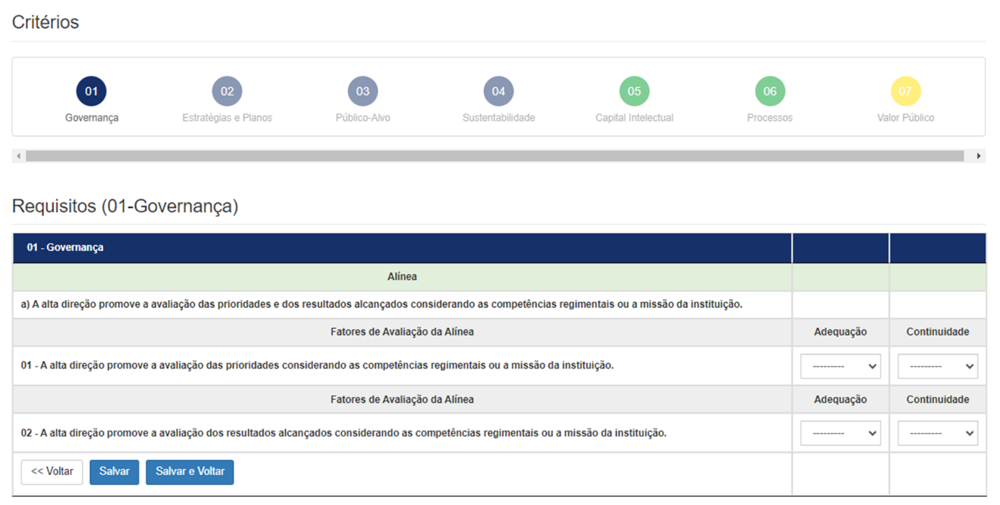  
*(Figura 8: Tela de seleção e avaliação dos Critérios 1 a 6)*

  
*(Figura 9: Sinalização de Adequação e Continuidade nos requisitos)*

É importante frisar que, caso seja sinalizado “Não” para o fator “Adequação”, o sistema só aceitará
a sinalização “Não” para o fator “Continuidade”, pois não há que se falar em continuidade para algo
que não é realizado, ou seja, não há continuidade para o que não é feito.

#### B) Apresentação de evidências

Também é possível fazer upload de arquivos e links de acesso a informações para evidenciar as
práticas de gestão. Veja o campo habilitado na aba “Arquivos”. É fundamental que a organização
insira documentos que comprovem a prática de gestão apresentada, uma vez que estes subsidiarão
a análise pelos validadores externos. É aceitável a indicação de links no campo de descrição da
prática.
Importante salientar que os documentos anexados, para terem validade, devem ser assinados ou
provenientes de publicações oficiais e/ou confiáveis, a exemplo dos diários oficiais e notícias de sites
consolidados.
Além disso, a documentação inserida deve ser de, pelo menos, 1 (um) ano anterior ao ciclo de
avalição e de até 3 (três) anos em relação a este. Fora desse período, ficará a critério do Validador a
consideração desta.
Após selecionar o(s) arquivo(s) a ser(em) anexado(s), é necessário clicar em “Salvar”.

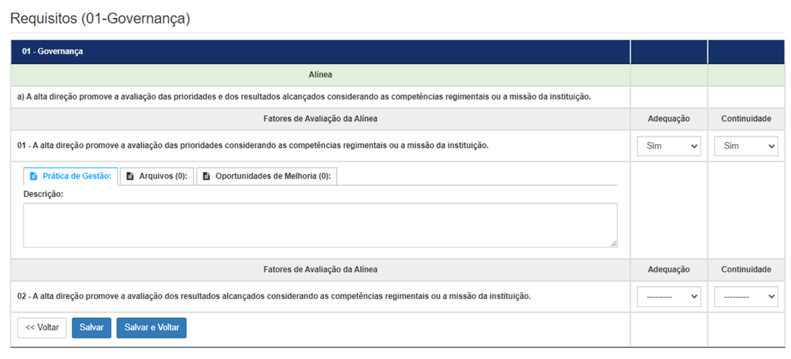  
*(Figura 10: Inserção de documentos e links comprobatórios)*

#### C) Priorização das Oportunidades de Melhoria

Na sequência, segue a apresentação de Oportunidade de Melhoria – OM, que pode ser um
problema, uma melhoria ou uma inovação para as possíveis lacunas não atendidas pelas práticas de
gestão. Apesar de não ser obrigatório, é recomendável a descrição dessas OMs, mesmo que não
venham a ser contempladas nos Planos de Melhoria de Governança e Gestão.
O objetivo dessa etapa é selecionar, entre as identificadas na avaliação, um conjunto de OM que
possa gerar melhores resultados e que, portanto, serão foco das ações do Plano de Melhoria de
Governança e Gestão, evitando-se, assim, a dispersão de recursos.
O principal critério de priorização não necessita de qualquer técnica ou ferramenta, basta responder
à pergunta: “há alguma oportunidade de melhoria identificada que diga respeito a um problema,
melhoria ou inovação que a alta administração tem manifestado interesse em resolver ou
implementar?”. Se positivo, essa ou essas Oportunidades de Melhoria são, necessariamente,
prioritárias.
Outro critério importante de priorização é considerar os projetos já em desenvolvimento que têm
relação direta com, pelo menos, uma das OMs identificadas.
É importante salientar que a realização da avaliação e o planejamento para a melhoria não
interrompem as ações e os projetos em desenvolvimento na organização.
Identificadas as OMs que respondam a esses dois critérios, e, caso os planejadores decidam incluir
outras OMs, pode-se utilizar alguma ferramenta de priorização que poderá ajudar a dar consistência
técnica à escolha. No entanto, de forma alguma, substituirá a percepção do que é e o que não é
considerado importante pela organização naquele momento. Assim, deve-se ficar com aquelas OMs
que representem a preocupação da organização, principalmente, da alta administração.

  
*(Figura 11: Repositório de arquivos anexados por alínea)*

Entre algumas das ferramentas que podem auxiliar a organização na priorização das oportunidades
de melhoria que devem ser selecionadas no momento de elaboração do Plano, destacamos a matriz
GUT (Gravidade, Urgência e Tendência). Essa ferramenta poderá auxiliar na tarefa de definir
prioridades, quando há várias atividades a serem executadas.
Essa matriz tem esse nome pelo fato de levar em consideração as seguintes características:
➢ Gravidade: impacto do problema sobre as coisas, pessoas, resultados, processos ou
organizações, e efeitos que surgirão em longo prazo, caso o problema não seja resolvido.
➢ Urgência: relação com o tempo disponível ou necessário para resolver o problema.
➢ Tendência: potencial de crescimento do problema, avaliação da tendência de crescimento,
redução ou desaparecimento do problema.
Essas características são analisadas e pontuadas conforme demonstrado a seguir:
Tabela de Priorização - GUT
pontos
Gravidade
(Consequências se nada
for feito)
Urgência
(Prazo para tomada de
decisão)
Tendência
(Proporção do problema no futuro)
5
Os
prejuízos
ou
dificuldades
são
extremamente graves.
É necessária uma ação
imediata.
Se nada for feito, o agravamento da
situação
ou
problema
será
imediato.
4
Os
prejuízos
ou
dificuldades são muito
graves.
É necessária uma ação
com alguma urgência.
Se nada for feito, vai piorar a
situação ou problema em curto
prazo.
3
Os
prejuízos
ou
dificuldades são graves.
É necessária uma ação o
mais rápido possível.
Se nada for feito, haverá um
agravamento da situação ou do
problema em médio prazo.
2
Os
prejuízos
ou
dificuldades são pouco
graves.
Pode esperar um pouco
para agir.
Se nada for feito, vai piorar a
situação ou o problema em longo
prazo.
1
Os
prejuízos
ou
dificuldades
não
são
graves.
Não há pressa para agir.
Se nada for feito, não haverá
agravamento, e a situação pode até
melhorar ou o problema ser
solucionado.
É importante observar que a ordem de priorização não determina, necessariamente, quais OMs
serão transformadas em metas nos Planos. Deve-se estabelecer um ponto de corte, cuidando para
não se priorizar muitas OMs. É bom lembrar que a organização tem suas metas finalísticas e precisa
compartilhar a melhoria da gestão com vistas ao aumento da capacidade de desempenho.
Cabe ressaltar algumas recomendações no momento da priorização das oportunidades de melhoria:
* Resistir à vontade de considerar todas as oportunidades de melhoria como prioritárias.
* Priorizar, pelo menos, uma importância; não se deixar seduzir pelas urgências.
* Identificar, objetivamente, o principal critério de priorização a ser utilizado.
* A melhoria da qualidade dos serviços disponibilizados aos cidadãos deve levar em consideração
a eficiência da ação pública, com ênfase na capacidade de fazer o máximo com os recursos
disponíveis.
* As atividades finalísticas da organização são preferenciais como estratégia para se atingir, mais
rapidamente, o cidadão usuário.
Apesar de as ferramentas auxiliarem na priorização, estas não substituem a percepção da
organização sobre si mesma.
O sistema possibilita a descrição de quantas OMs forem necessárias para cada requisito e a
priorização por meio da Matriz GUT. Na seção de tela abaixo, na aba “Oportunidades de Melhoria”,
são apresentados os campos para descrição e priorização das OMs.
Após a descrição e priorização das OMs, o sistema apresenta a relação para habilitação dos Planos
de Melhoria de Governança e Gestão – PMGGs, devendo ser habilitadas, no mínimo 3 OMs, dentre
as priorizadas.
O sistema do Gestaopubicagov.br não possibilitará a emissão da Declaração de Aplicação do IMGG
100 pontos, caso não sejam elaborados os PMGGs para as OMs habilitadas. Na seção de tela abaixo,
em “Priorização das Oportunidades de Melhoria”, a ação “Habilitar PMGG” permite, ao Comitê de
Aplicação, a seleção das OMs que serão contempladas com um PMGG.

  
*(Figura 12: Inserção da Oportunidade de Melhoria e pontuação GUT)*

O sistema possibilita, ainda, desabilitar uma OM, caso o Comitê de Aplicação julgue que esta não
será contemplada com um PMGG, conforme demonstrado na seção de tela abaixo. Para isso, basta
clicar na ação “Desabilitar PMGG”.

### 7.2 Avaliação e Pontuação do Critério 7 – Valor Público

A avaliação e pontuação desse Critério consiste na análise preliminar dos resultados, em
atendimento ao requisito de cada alínea, que ocorre por meio da verificação do desempenho da

  
*(Figura 13: Seleção e habilitação das OMs priorizadas para geração do PMGG)*

organização, mediante a apresentação e avaliação dos resultados dos indicadores de desempenho.
O elevado nível de maturidade em governança e gestão não diz respeito apenas às práticas em si,
mas o quanto essas práticas permitem ou impedem a organização de ter o desempenho esperado.
A descrição dos resultados deve ser, essencialmente, quantitativa, por meio da apresentação de
Indicadores de Desempenho - ID. Contudo, a informação qualitativa é também muito importante,
embora mais rara. Normalmente, diz respeito a reconhecimentos e premiações recebidas. Veja
exemplos de indicadores de desempenho para cada alínea no item 4.7.7 Valor Público do
documento Modelo de Governança e Gestão Pública - Gestaopublicagov.br.
Com base nos indicadores de desempenho que devem ter sido relacionados quando da descrição
das práticas de gestão, em atendimento aos requisitos das alíneas dos Critérios 1 – 6, o Comitê de
Aplicação deve verificar o atendimento aos Fatores de Avaliação da alínea, por meio da
apresentação e avaliação dos resultados dos IDs.
Em atendimento ao requisito 1 das alíneas deste Critério, ao selecionar “Sim” para o fator
“Adequação”, o Comitê de Aplicação deverá selecionar o “Tipo de indicador”: se de “Eficácia” (fazer
o que tem que ser feito - cumprir meta); de “Eficiência” (fazer otimizando custos - financeiro e
tempo); ou de “Efetividade” (impacto dos resultados percebido pelos usuários). Deverá, ainda,
descrever o ID, selecionar o ano (se referente ao ciclo de aplicação ou aos anos anteriores), e
descrever a meta e o resultado do ID.
No fator “Continuidade”, deve-se verificar o início da utilização dos resultados de gestão (desde
quando) e com que periodicidade ocorrem. Nesse caso, é necessário apenas a apresentação dos
resultados do ano anterior ao ciclo de aplicação do IMGG 100 pontos. O mesmo vale para o requisito
de avaliação, ou seja, deve-se demonstrar que a avalição dos resultados ocorre há pelo menos um
ano.
Aqui, também, não há que se falar em “Continuidade” se não forem apresentados e avaliados os
resultados dos IDs.
Para atendimento ao requisito 2 das alíneas do Critério 7 – Valor Público, deverão ser apresentadas
as práticas de avaliação e de monitoramento descritas nas alíneas “a” e “c” do Critério 1 -
Governança e/ou alínea “d” do Critério 2 – Estratégias e Planos, devendo ainda, serem acrescidas
de uma avaliação específica de cada um (ou de seu conjunto, o que for mais adequado) dos
resultados dos indicadores de desempenho apresentados no requisito 1 das alíneas.
Observação 1
Iniciar a descrição da prática de gestão citando desde quando e com periodicidade ocorre,
demonstrando, assim, atendimento ao fator de pontuação “Continuidade”, atentando-se para a
apresentação da documentação comprobatória, que deve ser de, pelo menos, a 1 ano anterior ao
Ciclo de aplicação do IMGG 100 pontos.
Exemplo de descrição dos Resultados de Gestão para a alínea “a” do Critério 7, considerando que o
Ciclo de aplicação é 2022.

#### Critério 7 - Valor Público

Alínea
a) Os indicadores de desempenho para medir os resultados relativos às estratégias ou às prioridades
estabelecidas estão definidos e são avaliados periodicamente.
Requisito 1 da alínea
01 - Os indicadores de desempenho para medir os resultados relativos às estratégias ou às
prioridades estabelecidas estão definidos.
Descrição dos Indicadores
Ano
2021
2022
Percentual de capacitação da equipe técnica que opera recursos da
União.
Meta
80%
95%
Resultado
80%
95%
Tempo médio de execução dos Projetos.
Meta
2 anos
1 ano
Resultado
2 anos
1 ano
Percentual de ampliação dos pontos de atendimento dos serviços.
Meta
50%
55%
Resultado
50%
60%
Índice de satisfação dos cidadãos usuários.
Meta
70%
85%
Percentual de aplicação dos recursos orçamentários (destinados a
gestão de riscos).
Resultado
75%
85%
Índice de Frequência de Acidentes.
Meta
1%
0,5%
Percentual de denúncias recebidas.
Resultado
0,8%
0,3%
Requisito 2 da alínea

## 2. Os indicadores de desempenho para medir os resultados relativos ao capital intelectual são

avaliados periodicamente.
Mensalmente, desde 2021, são realizadas reuniões de monitoramento e avaliação dos indicadores
de desempenho, quando são apresentados pelos respectivos responsáveis os resultados
alcançados e proposições de ações necessárias. Os resultados dos indicadores de desempenho
apresentados no requisito 1 desta alínea demonstram que as metas foram alcançadas e
impactaram positivamente nos prazos estabelecidos para a execução dos projetos.
Observação 2
A partir da segunda aplicação do IMGG 100 Pontos, deverão ser apresentados os resultados e a
respectiva avaliação dos indicadores de desempenho estabelecidos nos Planos de Melhoria de
Governança e Gestão - PMGG apresentados na aplicação anterior, em atendimento aos requisitos
da alínea “i” do Critério 7 – Valor Público.
Para tanto, a organização deve apresentar as evidências do monitoramento de implementação de
cada um dos PMGGs apresentados na aplicação anterior, que podem ser:
* Telas de monitoramento de cada um dos PMGGs extraídas do sistema Gestaopublicagov.br;
* Planilhas de coleta e análise de dados que contemplem o monitoramento dos PMGGs
apresentados na aplicação anterior;
* Projetos de implementação dos PMGGs apresentados na aplicação anterior, se for o caso;
* Relatórios que contemplem o monitoramento dos PMGG apresentados na aplicação
anterior.
A seção de tela abaixo exibe os campos para apresentação e avaliação dos resultados dos IDs, bem
como as funcionalidades para upload de arquivos e de descrição e de priorização das Oportunidades
de Melhoria de Governança e Gestão.

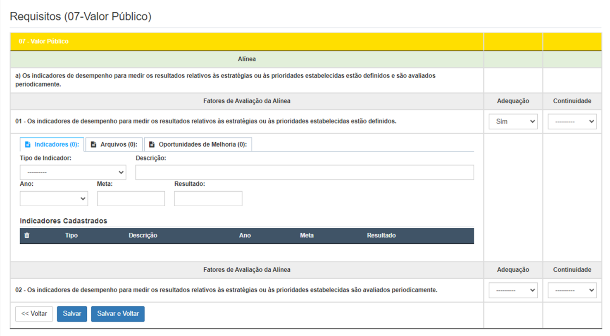  
*(Figura 14: Tela de cadastro e histórico de resultados dos Indicadores de Desempenho)*

No Critério 7, também, depois da descrição e priorização das OMs, o sistema apresenta a relação
para habilitação dos PMGGs. Na tela abaixo, a ação “Habilitar PMGG” permite a seleção, pelo Comitê
de Aplicação, somente das OMs que serão contempladas com um PMGG.
Após a avaliação de todos os requisitos de cada alínea, o sistema gera a pontuação do Critério, que
é apresentada no Relatório Preliminar de Melhoria de Governança e Gestão.

## 8. Planos de Melhoria de Governança e Gestão - PMGG

De posse das Oportunidades de Melhorias priorizadas, inicia-se a etapa de elaboração dos Planos
de Melhoria de Governança e Gestão - PMGG.
O PMGG é um instrumento de gestão constituído por um conjunto de metas e ações estabelecidas
a partir do processo de avaliação da gestão da organização, com vistas a transformar sua ação
gerencial e a melhorar o seu desempenho institucional.
Vale ressaltar que a avaliação da gestão proporciona às organizações uma visão panorâmica sobre
os seus sistemas e práticas de gestão. Ao determinar que aspectos da avaliação serão objeto de ação
do PMGG, possivelmente, as áreas ou funções da organização a serem atingidas pelo referido Plano
deverão passar por estudos mais aprofundados, para que a ação proposta seja, ao mesmo tempo,
consistente e adequada à organização.
Por ser um instrumento de melhoria da gestão, o PMGG independe do planejamento estratégico e
dos planos dele decorrentes, nem os substitui. Pode, entretanto, contemplar metas de
implementação ou de melhoria do próprio sistema de planejamento estratégico da organização
avaliada.

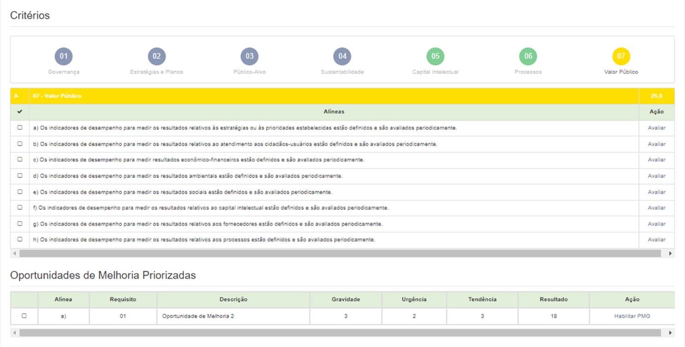  
*(Figura 15: Habilitação de Planos de Melhoria no Critério de Valor Público)*

### 8.1 Definição das metas e indicadores de desempenho

As metas são formuladas a partir das Oportunidades de Melhoria priorizadas.
Metas são objetivos quantificados que indicam uma direção, um estado futuro desejado específico
para uma área de atuação da organização, ou seja, é uma “demarcação objetiva”, em tempo e
quantidade, dos objetivos estabelecidos. As metas devem ser desafiantes, porém atingíveis em
determinado tempo. Devem exigir esforço adicional, implicando, às vezes, em ruptura e ousadia.
Essencial na definição de uma meta são os seus indicadores de desempenho, ou seja, que
“ponteiros” o gestor da meta vai utilizar para monitorar a sua execução e, principalmente, os seus
resultados.
Indicadores de desempenho são peças-chave de um sistema de medição do desempenho
institucional e são escritos com o uso de linguagem matemática que servem de parâmetros de
referência para medir a eficiência, a eficácia e a efetividade dos processos e de suas atividades.
Mostram um cálculo que deve ser efetuado com grandezas distintas. O resultado do cálculo, ou o
próprio indicador, é também uma grandeza com um significado. É um número, percentagem ou
razão que mede um aspecto do desempenho, com o objetivo de comparar essa medida com metas
pré-estabelecidas.
Os indicadores de desempenho servem para mensurar os resultados e gerir o desempenho; embasar
a análise crítica dos resultados obtidos e do processo de tomada decisão; contribuir para a melhoria
contínua dos processos organizacionais; facilitar o planejamento e o controle de desempenho; e
viabilizar a análise comparativa do desempenho da organização e do desempenho de diversas
organizações atuantes em áreas ou ambientes semelhantes.
Diferentemente das medições de desempenho, que são efetuadas quando os aspectos do
desempenho podem ser mensurados diretamente e quantificados com facilidade, os indicadores de
desempenho são utilizados quando não é possível efetuar tais mensurações de forma direta. São
uma alternativa para a medição do desempenho, embora não forneçam uma mensuração direta dos
resultados.
Veja abaixo a comparação entre simples informações gerenciais e indicadores de desempenho:
INFORMAÇÕES GERENCIAIS
INDICADORES DE DESEMPENHO
META ANO
A organização possui 100
servidores.
Índice de absenteísmo.
1%
2022
Percentual de servidores capacitados.
80%
2022
A organização possui 10 projetos
com recursos das transferências da
União.
Percentual de projetos concluídos no prazo
estabelecido.
90%
2022
Percentual de projetos em conformidade.
90%
2022
A organização possui 1000 cidadãos
usuários.
Percentual
de
cidadãos
usuários
muito
satisfeitos com a qualidade do serviço.
95%
2022
Um conjunto de dados isolados, mostrando os resultados atingidos por uma instituição, não diz nada
a respeito do desempenho desta, a menos que seja confrontado com metas ou padrões pré-
estabelecidos ou seja realizada uma comparação com os resultados atingidos em períodos
anteriores, obtendo-se, assim, uma série histórica para análise.
A Instrução Normativa SEGES/ME nº 2, de 12 de janeiro de 2022, estabeleceu o sistema de medição
de desempenho de repassadores e recebedores de recursos discricionários e legais da União, na
gestão de instrumentos operacionalizados por meio da Plataforma Transferegov.br.
Segundo o art. 4º, parágrafo único, para a composição do Índice de Capacidade Técnica na Gestão
das Transferências da União - ICTRU, poderão ser utilizados os seguintes critérios de avaliação,
considerando as peculiaridades de recebedores e repassadores:
* capacitação da força de trabalho;
* maturidade da governança e da gestão institucional;
* desempenho nos processos de transferências da União;
* maturidade institucional da gestão de riscos;
* conformidade das informações fiscais e contábeis; e
* nível de desenvolvimento institucional.
A maturidade da governança e da gestão institucional será obtida pela certificação do Nível de
Maturidade de Governança e Gestão emitida a partir da aplicação de um IMGG. Portanto, o Nível
de Maturidade de Governança e Gestão poderá servir como um dos critérios prioritários para
captação de recursos da União.
O estabelecimento e o monitoramento desses indicadores possibilitam o incremento de melhorias
na execução dos recursos advindos das transferências da União e proporcionam uma tomada de
decisão mais efetiva quanto à destinação desses recursos para atendimento das políticas públicas.

### 8.2 Elaboração dos Planos de Melhoria de Governa e Gestão (5W2H)

O sistema apresentará a relação das Oportunidades de Melhoria Priorizadas em cada Critério, que
deverão ser habilitadas para elaboração dos PMGG. Estes deverão ser preenchidos seguindo a
metodologia 5W2H, que é um checklist de atividades específicas que devem ser desenvolvidas, com
o máximo de clareza e eficiência, por todos os envolvidos em um projeto.
Essa série de caracteres corresponde às iniciais (em inglês) das sete diretrizes que, quando bem
estabelecidas, eliminam as principais questões que possam ocorrer ao longo de um processo ou de
uma atividade. São elas:
5 W: What (o que será feito?) – Why (por que será feito?) – Where (onde será feito?) – When
(quando?) – Who (por quem será feito?)
2 H: How (como será feito?) – How much (quanto vai custar?).
Essa metodologia está fundamentada nas respostas para essas sete perguntas essenciais. Com essas
respostas em mãos, teremos um mapa de atividades que vão ajudar a seguir todos os passos
relativos a um projeto, de forma a tornar a execução muito mais clara e efetiva.
Além de ser muito útil na execução dos projetos, essa metodologia contribui, sobretudo, no controle
das ações estabelecidas, possibilitando, ainda, uma maior produtividade pela economia de tempo e
recursos, já que os colaboradores envolvidos em um projeto específico saberão, exatamente, o que
fazer, quando, onde, de que forma, etc.
O preenchimento da etapa Plano de Melhoria de Governança e Gestão é obrigatório no sistema,
quando da aplicação do IMGG 100 pontos, para pelo menos 3 Oportunidades de Melhoria
priorizadas. Além disso, os resultados desses planos deverão ser apresentados e pontuados no

#### Critério 7 – Valor Público, a partir da segunda aplicação do IMGG 100 pontos, especificamente, na

alínea “i”. Nessa situação, quando da nova aplicação, o Presidente do Comitê de Aplicação deverá
selecionar o Instrumento de Maturidade de Governança e Gestão - IMGG 100 pontos (A partir da
segunda aplicação).
Para elaboração dos PMGGs, o Comitê de Aplicação deve clicar em “PMGG”, na coluna “Ação”,
conforme demonstrado na seção de tela abaixo:
Em seguida, o sistema abre a tela para elaboração do PMGG. Nela, podemos verificar que os campos
“Critério” e “Alínea” já vêm preenchidos e correspondem à Oportunidade de Melhoria habilitada
anteriormente, devendo os demais campos serem preenchidos, conforme explicitado na
metodologia acima mencionada.

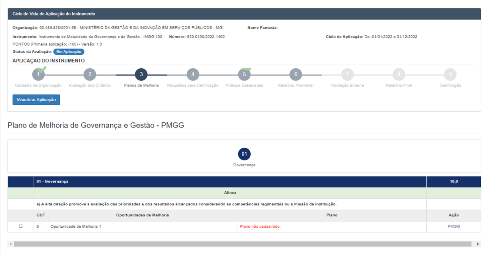  
*(Figura 16: Tela de início de preenchimento do formulário do PMGG)*

Deve-se definir o indicador de desempenho, a meta e o ano para o alcance dos resultados
pretendidos com a implementação da Oportunidade de Melhoria. Para tanto, deve-se analisar o que
se deseja resolver, melhorar ou, ainda, inovar.
Veja o exemplo de estabelecimento de indicadores de desempenho e respectivas metas para a
Oportunidade de Melhoria Priorizada a seguir:

#### Critério 5 - Capital Intelectual

Alínea e) São implementadas ações de capacitação considerando o desenvolvimento das
competências institucionais.
Oportunidade de Melhoria Priorizada:
Aprimorar a elaboração dos projetos para aplicação dos recursos das transferências da União.
Vejamos uma breve análise da situação atual e dos resultados esperados, preliminar ao
estabelecimento de indicadores de desempenho e respectivas metas para a Oportunidade de
Melhoria Priorizada:
Situação atual
Resultados esperados
Os projetos apresentam um índice elevado de
inconsistências.
Reduzir inconsistências.
O tempo médio de execução dos projetos está acima do
desejável.
Reduzir a demora na execução dos
projetos.
Baixa aplicação dos recursos orçamentários/financeiros
com capacitação.
Elevar a aplicação dos recursos.
Após a análise da situação atual e visando ao monitoramento dos resultados esperados para essa
Oportunidade de Melhoria, poderão ser estabelecidos os seguintes indicadores de desempenho e
respectivas metas:
Indicadores de desempenho
Meta Ano
Percentual de capacitação dos servidores que atuam na execução dos projetos para
aplicação dos recursos das transferências da União.
80%
202x
Percentual de aplicação de recursos orçamentários/financeiros com capacitação.
100% 202x
Percentual de projetos para aplicação dos recursos das transferências da União
executados sem inconsistências.
95%
202x
Tempo médio de execução de projetos para aplicação dos recursos das transferências
da União executados sem inconsistências.
1 mês 202x
Considerando esta análise podemos escolher o indicador mais adequado para elaboração de um
PMGG para a essa Oportunidade de Melhoria. No exemplo a seguir foi considerado o indicador de
capacitação, tomando por base este tema como o fator crítico de sucesso mais relevante.
Veja o exemplo de PMGG:
05 - Capital Intelectual
10,0
Alínea
Alínea e) São implementadas ações de capacitação considerando o desenvolvimento das competências
institucionais.
Oportunidade de Melhoria
Gravidade Urgência Tendência Resultado
Aprimorar a elaboração dos projetos para aplicação dos
recursos das transferências da União.
5
5
5
125
Plano de Melhoria da Governança e Gestão (PMGG)
Nome do PMG: Plano de capacitação.
Indicador: Percentual de capacitação dos servidores
Meta: 80%
Ano: 2024 Data Início: 31 de dezembro de 2023 Recursos Financeiros: R$ 80.000,00
Local: Coordenação Geral de Capacitação
Quem: Analista*
Como:
* Constituir um Comitê de capacitação por meio de portaria até 31/12/23.
* Capacitar os membros do Comitê de capacitação até 31/01/24 - R$ 10.000,00.
* Realizar visita técnica até 15/02/24 - R$ 20.000,00.
* Elaborar e aprovar plano de capacitação até 28/02/24.
* Implementar metodologia/ sistema para acompanhamento das capacitações até 31/03/24 - R$ 50.000,00.
* Executar as ações de capacitação estabelecidas no plano até 31/12/24.
* Elaborar e divulgar relatório das ações de capacitação e do resultado do indicador de desempenho até
31/12/24.
*Se o responsável (Quem) pela implementação do PMGG não fizer parte do Comitê de Aplicação, o indicado deverá se cadastrar no sistema do
Gestaopublicagov.br no perfil de Membro Comitê de Aplicação para poder ter acesso ao monitoramento do PMGG.
Após essa análise, o Comitê de Aplicação define e descreve, na tela de elaboração do PMGG abaixo,
o ID que será o norteador do que se deseja alcançar.

### 8.3 Monitoramento dos Planos de Melhoria de Governança e Gestão:

Essa etapa é imprescindível para o alcance dos resultados estabelecidos nos Planos de Melhoria de
Governança e Gestão, pois é impossível ser proativo sem a prática do monitoramento em tempo de
execução, ou seja, é de muita pouca valia o simples estabelecimento de metas se não houver o
acompanhamento dos indicadores e análise periódica de seus resultados.
Esse monitoramento deve ocorrer logo após a deliberação quanto à implementação dos Planos de
Melhoria da Governança e da Gestão pela alta direção do órgão/entidade, ou seja, não precisa
aguardar pela Declaração de Aplicação ou pela Certificação do Nível de Maturidade de Governança
e Gestão.
Para tanto, faz-se necessária a definição da periodicidade de aplicação dos indicadores definidos, ou
seja, o período de tempo previsto para a coleta dos dados (diário, semanal, mensal, etc.), bem como
a periodicidade de avaliação dos resultados alcançados.
Veja os exemplos abaixo, tendo por base o PMGG - Plano de capacitação.
Acompanhamento das atividades previstas no PMGG:
ATIVIDADES
STATUS*
PRAZO
REPACTUADO
JUSTIFICATIVA
* Constituir um Comitê de capacitação por meio de
portaria até 31/12/23.
Concluído

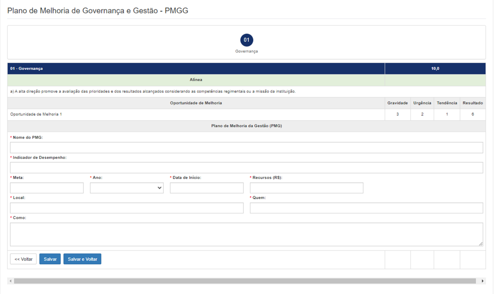  
*(Figura 17: Preenchimento de metas, prazos, custos e atividades do PMGG)*

* Capacitar os membros do Comitê de capacitação
até 31/01/24 - R$ 10.000,00.
Atrasado
15/02/2023
Dificuldade
de
ajustes
nas
agendas
dos
interlocutores.
* Realizar visita técnica até 15/02/24 - R$
20.000,00.
Concluído
* Elaborar e aprovar plano de capacitação até
28/02/24.
Atrasado
15/03/2023
Solicitação
de
ajustes no projeto
pela Alta Direção.
* Implementar sistema para acompanhamento
das capacitações até 31/03/24 - R$ 50.000,00.
Concluído
* Executar as ações de capacitação estabelecidas
no projeto até 31/12/24.
Não iniciado
* Elaborar e divulgar relatório das ações de
capacitação e do resultado do indicador de
desempenho até 31/12/24.
Não iniciado
* Não iniciado / Em andamento / Atrasado / Concluído
Veja o exemplo abaixo de avaliação do indicador de desempenho do PMGG para os 2 (dois)
primeiros meses após a Implementação do sistema para acompanhamento das capacitações, que,
na tabela anterior, apresenta o prazo final de execução até 31/03/24.
AVALIAÇÃO DO INDICADOR DE DESEMPENHO
DATA DA
APLICAÇÃO E
AVALIAÇÃO*
RESULTADO
CONSIDERAÇÕES
O QUE FAZER
QUANDO
30/04/2023
1,5%
O RESULTADO DO INDICADOR DE
DESEMPENHO APRESENTADO NA
PRIMEIRA
AVALIAÇÃO,
ENCONTRA-SE
ABAIXO
DO
ESPERADO PARA O PERÍODO,
INDICANDO QUE A META ANUAL
ESTABELECIDA PODERÁ NÃO SER
ALCANÇADA.
INFORMAR O RESULTADO E AS
CONSIDERAÇÕES
AS
PARTES
INTERESSADAS,
SOLICITANDO
INFORMAR AS POSSÍVEIS CAUSAS
PARA
O
NÃO
ALCANCE
DO
RESULTADO ESPERADO PARA A
PRIMEIRA AVALIAÇÃO MENSAL E
AÇÕES A SEREM IMPLEMENTADAS.
30/04/2023
30/05/2023
7%
O RESULTADO DO INDICADOR DE
DESEMPENHO APRESENTADO NA
SEGUNDA
AVALIAÇÃO,
ENCONTRA-SE
DENTRO
DO
ESPERADO PARA O PERÍODO,
INDICANDO
QUE
AS
AÇÕES
IMPLEMENTADAS
CORRIGIRAM/ELIMINARAM
AS
CAUSAS PARA O NÃO ALCANCE A
META NO PERÍODO ANTERIOR.
INFORMAR O RESULTADO E AS
CONSIDERAÇÕES
AS
PARTES
INTERESSADAS,
SOLICITANDO
O
EMPENHO DE TODOS PARA O
ALCANCE
DO
RESULTADO
ESPERADO PARA OS PRÓXIMOS
PERÍODOS.
30/05/2023
*APLICAÇÃO E AVALIAÇÃO - MENSAL
A tela abaixo apresenta, no Menu principal, o submenu “Monitoramento” e o botão para inserir um
novo monitoramento.
A primeira ação na etapa do monitoramento é a definição da Periodicidade de Aplicação e da
Avaliação para o Plano de Melhoria selecionado, conforme demonstrado na tela abaixo:
Após esses procedimentos, o sistema abre a tela abaixo, onde se deve clicar na ação para os
próximos procedimentos.

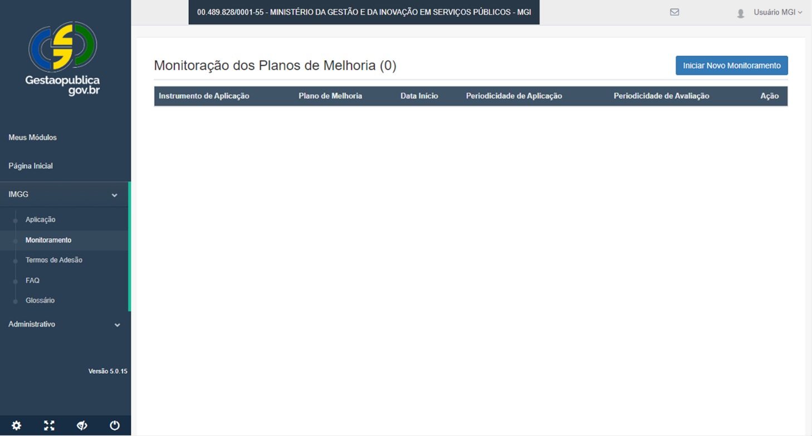  
*(Figura 18: Tela de acompanhamento dos monitoramentos ativos)*

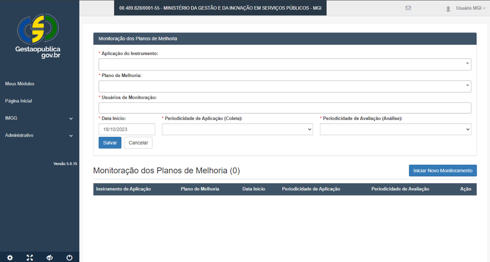  
*(Figura 19: Definição da periodicidade de aplicação e análise)*

  
*(Figura 20: Registro de novos dados e resultados do monitoramento)*

Na tela abaixo, deve-se clicar em “Nova Aplicação/Avaliação”:
Na próxima tela, deve-se clicar em “Tipo de Monitoramento” para selecionar a aplicação e a
descrição do Resultado.
Se na tela anterior, ao clicar em “Tipo de Monitoramento”, for selecionado “Avaliação”, o sistema
abrirá a tela abaixo para registro da avaliação do resultado alcançado e dos demais campos. A cada
novo levantamento do resultado (conforme definido na aplicação e avaliação), deve-se registrar as
novas avaliações, o que fazer, o prazo e o responsável.

## 9. Requisitos para Certificação

Os Requisitos para Certificação formam um conjunto de iniciativas e/ou instrumentos que foram
efetivamente implementados e viabilizam as práticas de governança e de gestão em atendimento
aos requisitos das alíneas.
Fazem parte das condições preliminares que a organização precisa apresentar durante a aplicação
do IMGG 100 pontos, que a qualifica ao processo de validação externa, visando à Certificação do
Nível de Maturidade de Governança e Gestão.
REQUISITOS PARA CERTIFICAÇÃO DO NÍVEL DE MATURIDADE DE GOVERNANÇA E GESTÃO
Critérios
Requisitos
Pontos
1 - Governança
Código de Ética
3
2 - Estratégias e
Planos
Planejamento Estratégico
4
Portfólio de Projetos
3
3 - Público-Alvo
Carta de Serviços
3
Ouvidoria
3
4 - Sustentabilidade
Plano Orçamentário e Financeiro
3
Portal de Transparência (próprio ou de terceiros)
3
Regra de ouro - STN
4
5 - Capital
Intelectual
Plano de Capacitação
4
Avaliação de Desempenho das pessoas
3
6 – Processos
Relatório de Diagnóstico (nível de suscetibilidade a fraude e
corrupção do PNPC-Estratégia de Integridade Pública)
3
7 - Valor Público
Sistema de avaliação por meio de Indicadores
4
Total
40
A seguir, apresentamos uma breve definição de cada um dos Requisitos para Certificação com
sugestões de leitura e cursos para um maior aprofundamento.
➢ Requisito 1: Código de Ética - O código de ética e/ou de conduta é um documento que
estabelece os princípios e as normas que definem as práticas de atuação de uma empresa.
Sugestão de Curso
Ética e Serviço Público (ENAP)
https://www.escolavirtual.gov.br/curso/4
➢ Requisito 2: Planejamento Estratégico - O planejamento é a primeira das quatro funções
clássicas que compõem o ciclo administrativo (planejamento, organização, direção e
controle), segundo Chiavenato (Administração Geral e Pública. Rio de Janeiro: Elsevier, p.
340, 2008.).
“O produto do planejamento estratégico é um plano, que documenta os desafios, a missão,
a visão, os valores, os objetivos, os indicadores, as metas e as ações necessárias para alcançá-
las” (Guia Técnico de Gestão Estratégica, Vol. 1/ME).
Sugestões de Leitura
* 
Guia Técnico de Gestão Estratégica v1.0; Brasília; ME; SEDGG; SEGES, 2019.
Versão 1/2020. (https://www.gov.br/economia/pt-br/centrais-de-conteudo/
publicacoes/guias-e-manuais/defeso/guia-tecnico-de-gestao-estrategica )
* 
Referencial básico de governança aplicável a organizações públicas e outros
entes jurisdicionados ao TCU / Tribunal de Contas da União. Edição 3.
(https://portal.tcu.gov.br/imprensa/noticias/tcu-publica-a-3-edicao-do-
referencial-basico-de-governanca-organizacional.htm)
* 
Artigo “Planejar é preciso”, Cristiana de Castro Moraes e Sidney Estanislau
Beraldo.
(https://www.tce.sp.gov.br/sites/default/files/publicacoes/20151006_-
_artigo-planejar_e_preciso.pdf )
Sugestão de Curso
* Planejamento Estratégico para Organizações Públicas (ENAP)
https://www.escolavirtual.gov.br/curso/107
➢ Requisito 3: Portfólio de Projetos - “é uma coleção de projetos, programas e outros
trabalhos, que são agrupados com o propósito de facilitar o gerenciamento efetivo dos
trabalhos e meios para atender objetivos organizacionais estratégicos, fazem parte da
estratégia organizacional”.
Sugestões de Cursos
* Gerenciamento de Portfólio de Projetos de Transformação Digital
https://www.escolavirtual.gov.br/curso/809
* Inovando na Gestão de Projetos
https://www.escolavirtual.gov.br/curso/956
* Gestão de projetos
https://www.escolavirtual.gov.br/curso/787
➢ Requisito 4: Carta de Serviços - é um documento elaborado por uma organização pública
que visa informar aos cidadãos quais os serviços prestados por ela, como acessar e obter
esses serviços e quais são os compromissos com o atendimento e os padrões de atendimento
estabelecidos.
Sugestão de Leitura
Lei nº 13.460, de 26 de junho de 2017 (“Art. 7º)
➢ Requisito 5: Ouvidoria - Uma ouvidoria pública atua no diálogo entre o cidadão e a
Administração Pública, de modo que as manifestações decorrentes do exercício da cidadania
provoquem contínua melhoria dos serviços públicos prestados.
Segundo o Ouvidor-Geral da União Valmir Dias: A ouvidoria pública “é um local de
acolhimento e interlocução, onde o cidadão pode apresentar suas demandas individuais e
contribuir com soluções para a coletividade, seja no âmbito da prestação de serviços
públicos, políticas públicas ou qualquer atividade desempenhada por agentes do Estado”
(https://agenciabrasil.ebc.com.br/geral/noticia/2021-06/ouvidor-geral-da-uniao-explica-
papel-das-
ouvidorias#:~:text=A%20ouvidoria%20p%C3%BAblica%20%C3%A9%2C%20portanto,desem
penhada%20por%20agentes%20do%20Estado)
Sugestão de Leitura
Lei nº 13.460, de 26 de junho de 2017
Sugestões de Cursos
* Gestão em Ouvidoria (ENAP)
https://www.escolavirtual.gov.br/curso/119
* Atuação Gerencial das Ouvidoras para Melhoria da Gestão Pública (ENAP)
https://www.escolavirtual.gov.br/curso/512
➢ Requisito 6: Plano Orçamentário e Financeiro - é importante aliado da gestão estratégica.
Conforme o Guia de Gestão Estratégica ( ): “Ponto de intersecção de diversas funções, a
gestão estratégica usa os resultados das atividades de planejamento e orçamento como
insumos para definir os produtos e serviços, melhorar os processos internos, aperfeiçoar as
estruturas, desenvolver as competências e alocar os recursos necessários para alcançar os
objetivos estratégicos da organização” (Guia Técnico de Gestão Estratégica v1.0; Brasília;
ME; SEDGG; SEGES, 2019. Versão 1/2020).
Sugestões de Leitura:
* 
Administração
Financeira
e
Orçamentária
no
Setor
Público  https://www.contabeis.com.br/artigos/5623/administracao-financeira-
e-orcamentaria-no-setor-publico/
* 
Artigo “Planejar é preciso”, Cristiana de Castro Moraes e Sidney Estanislau
Beraldo
https://www.tce.sp.gov.br/sites/default/files/publicacoes/20151006_-
_artigo-planejar_e_preciso.pdf
Sugestões de Cursos
* Gestão Orçamentária e Financeira (ENAP):
https://www.escolavirtual.gov.br/curso/257
* Básico em Orçamento Público (ENAP):
https://www.escolavirtual.gov.br/curso/115
* Introdução ao Orçamento Público (ENAP):
https://www.escolavirtual.gov.br/curso/116
* Lei de Diretrizes Orçamentárias (ENAP):
https://www.escolavirtual.gov.br/curso/113
* Orçamento Público (ENAP)
https://www.escolavirtual.gov.br/curso/296
➢ Requisito 7: Portal de Transparência (próprio ou de terceiros) - Site que tem por finalidade
veicular dados e informações detalhados sobre a execução orçamentária e financeira do
ente. A finalidade desse portal é possibilitar que o cidadão encontre informações sobre como
o dinheiro público é utilizado, além de se informar sobre assuntos relacionados à gestão
pública do Brasil.
Sugestões de Leitura:
* 
Lei nº 12.527, de 18 de novembro de 2011 -
http://www.planalto.gov.br/ccivil_03/_ato2011-2014/2011/lei/l12527.htm
* 
Portal da Transparência - Controladoria-Geral da União -
https://www.portaltransparencia.gov.br/sobre/o-que-voce-encontra-no-portal
➢ Requisito 8: Regra de Ouro - Da Secretaria do Tesouro Nacional – STN - Resumidamente, a
Regra de Ouro:
* Veda a realização de operações de crédito que excedam o montante das despesas de
capital, ressalvadas as autorizadas mediante créditos suplementares ou especiais
com finalidade precisa, aprovados pelo Poder Legislativo por maioria absoluta;
* Cumprida no orçamento e também na execução financeira;
* Em cada exercício financeiro, deverão ser considerados o total dos recursos de
operações de crédito nele ingressados e o das despesas de capital executadas.
A seguir, o passo a passo para análise da Regra de Ouro:
a) Acessar o site da Secretaria do Tesouro Nacional:
https://siconfi.tesouro.gov.br/siconfi/index.jsf.
b) No menu "Consultas", escolher "Consultar Declarações" e, em seguida, a opção
"Homologadas no Siconfi".
c) Preencher os campos disponibilizados na tela. Ex.: Estado do Ceará.
Observação: o exercício será sempre o ano do Ciclo de Aplicação.
d) Escolher o "Relatório Resumido da Execução Orçamentária - 6º Bimestre" (arquivo
.xls).
e) Será gerada uma planilha com vários anexos, distribuídos por abas. A Regra de
Ouro está disponível na aba "RREO Anexo nº 9".
Para análise da Regra de Ouro, serão consideradas as Linhas e Colunas da RREO-
Anexo 09 destacadas na imagem abaixo.
Segundo o Manual de Demonstrativos Fiscais/2022, em sua página 365, o RESULTADO
PARA APURAÇÃO DA REGRA DE OURO será registrado pela diferença entre a despesa
de capital líquida e as receitas de operações de crédito. O resultado positivo
representa o cumprimento do dispositivo constitucional, que veda a realização de
receitas de operações de créditos que excedam o montante das despesas de capital.
Assim, para a análise em questão, deve-se levar em consideração a diferença entre
as DESPESAS EMPENHADAS e as RECEITAS REALIZADAS.
Observações:
* Esse relatório só é válido para análise da Regra de Ouro no nível de Estados e
Municípios. Para a União, os dados são consolidados em um único painel no site do
Tesouro Nacional, não sendo possível a extração de um relatório de um órgão ou
entidade em separado.
* Com relação aos Estados, o relatório extraído é consolidado para as todas as
secretarias/unidades orçamentárias, ou seja, todas as instituições públicas estaduais
terão como base a Regra de Ouro do Governo do Estado.
* Para os Municípios, é possível verificar individualmente o atendimento à Regra de
Ouro, por meio do relatório extraído.
➢ Requisito 9: Plano de Capacitação - é um documento que contempla o planejamento
essencial para atingir a eficiência dos recursos humanos de uma instituição, identificando e
gerindo as necessidades de capacitação dos agentes internos em atenção às competências
organizacionais.
Sugestão de Leitura
Elaboração de Planos de Capacitação (ENAP).
https://repositorio.enap.gov.br/bitstream/1/2383/1/Apostila%26CE_EPC_rev_final_
24-11-15.pdf
➢ Requisito 10: Avaliação de Desempenho das Pessoas - “Consiste em identificar informações
válidas, precisas e sistemáticas acerca do quanto o desempenho do indivíduo está de acordo
com o esperado para seu cargo. Para tal, a delimitação prévia de um plano de trabalho, entre
chefia e subordinado, na etapa de planejamento, que esteja alinhado com os critérios de
verificação de desempenho, é fundamental para a correta execução e consequente avaliação
de desempenho” (COELHO Jr, 2011 apud SEGEP, 2013).
Sugestões de leitura
* 
Avaliação da Política de Gestão de Desempenho Sob o Ponto de Vista das Áreas
de Gestão de Pessoas (AGP) na Administração Pública Federal, de Robinson
Rosario Pitelli. https://repositorio.enap.gov.br/handle/1/3446
* 
Guia Referencial para Construção e Análise de Indicadores, de Leandro Oliveira
Bahia. https://repositorio.enap.gov.br/bitstream/1/6154/1/GR%20Construindo%
20e%20Analisando%20Indicadores%20-%20Final.pdf
* 
Referencial básico de governança aplicável a organizações públicas e outros entes
jurisdicionados
ao
TCU
/
Tribunal
de
Contas
da
União.
3ª
Edição.  https://portal.tcu.gov.br/data/files/FA/B6/EA/85/1CD4671023455957E
18818A8/Referencial_basico_governanca_2_edicao.PDF
➢ Requisito 11: Relatório de Diagnóstico (nível de suscetibilidade a fraude e corrupção do PNPC
– Estratégia de Integridade Pública) - Consiste em emitir um relatório de diagnóstico sobre o
nível de suscetibilidade da organização a fraude e corrupção por meio do Programa Nacional
de Prevenção a Corrupção (PNPC-Estratégia de Integridade Pública).  O relatório estará
disponível na plataforma do e-Prevenção após a organização concluir o questionário de
avaliação do seu grau de aderência às boas práticas previstas no PNPC.
Sugestões de Leitura
* Guia Prático do e-Prevenção
Sugestões de Cursos
* Vídeo Orientações Técnicas para o Uso do e-Prevenção
Dúvidas
* gt-pnpc@tcu.gov.br
➢ Requisito 12: Sistema de avaliação por meio de Indicadores de desempenho - “A
construção de indicadores e metas para os objetivos estratégicos possui um forte
componente político, que envolve decidir sobre quais aspectos da intervenção serão
mensurados (indicadores) e em que medida a organização vai se comprometer com a
entrega de resultados metas)...”
Sugestões de leitura
* 
Guia Referencial para Construção e Análise de Indicadores, de Leandro Oliveira
Bahia.  https://repositorio.enap.gov.br/bitstream/1/6154/1/GR%20Construindo
%20e%20Analisando%20Indicadores%20-%20Final.pdf
* 
Referencial básico de governança aplicável a organizações públicas e outros entes
jurisdicionados
ao
TCU.
https://portal.tcu.gov.br/data/files/FA/B6/EA/85/1CD4671023455957E18818A8
/Referencial_basico_governanca_2_edicao.PDF
* 
Guia Referencial para Gerenciamento de Projetos e Portfólios de Projetos (Tiago
Chaves Oliveira)
https://repositorio.enap.gov.br/handle/1/6155
Sugestão de Curso
Elaboração
de
Indicadores
de
Desempenho
Institucional
(ENAP) -
https://www.escolavirtual.gov.br/curso/604
Atenção:
Para atendimento dos Requisitos para certificação o Comitê de aplicação deverá atentar para:
* 
Apresentação de documento ou link que comprove a formalização do Requisito para
Certificação;
* 
Caso o Requisito para a Certificação apresentado em link/documento tenha sido instituído
por instituições a que a organização esteja subordinada ou vinculada, essa informação, bem
como as ações de sua implementação deverá estar explícita no documento;
* 
Documentos com outras denominações que contenham os objetivos do Requisito para a
Certificação, poderão ser apresentados;
* 
Documento que faça referência à apenas uma ou mais estruturas administrativas do órgão
ou entidade não será aceito;
* 
Vigência do documento apresentado, que deverá contemplar o ano do Ciclo de Aplicação.
Por meio das seções de telas abaixo do sistema Gestaopublicagov.br, os Membros do Comitê
Aplicação deverão relacionar os Requisitos para Certificação e realizar upload dos respectivos
arquivos que evidenciarão sua efetiva implantação, ou seja, não basta apresentar apenas um
normativo, um plano e/ou um projeto. É necessário demonstrar as ações e/ou resultados
devidamente documentadas de sua implementação.
Imagem sobre como relacionar os Requisitos para certificação.
Como realizar upload de arquivos
O sistema computará a pontuação total obtida de acordo com os requisitos atendidos, o que
definirá, junto com a pontuação total obtida no IMGG 100 pontos, se a aplicação será encaminhada
para a validação externa. Veja o exemplo abaixo:

  
*(Figura 21: Lista de seleção dos 12 Requisitos para Certificação)*

  
*(Figura 22: Anexo de comprovação do Requisito de Certificação)*

REQUITOS PARA CERTIFICAÇÃO DO NÍVEL DE MATURIDADE DA GOVERNANÇA E DA GESTÃO
Critérios
Pré-requisitos
SIM/NÃO
PONTUAÇÃO OBTIDA
1 - Governança
Código de Ética
SIM
3
2 - Estratégias e
Planos
Planejamento Estratégico
SIM
4
Portfólio de Projetos
SIM
3
3 - Público-Alvo
Carta de Serviço
SIM
4
Ouvidoria
NÃO
* 
4 - Sustentabilidade
Plano Orçamentário e financeiro
SIM
3
Portal de Transparência (próprio ou de
terceiros)
SIM
3
Regra de ouro (Secretaria do Tesouro
Nacional- STN)
NÃO
5 - Capital Intelectual
Plano de Capacitação
SIM
4
Avaliação de Desempenho das pessoas
e equipes
NÃO
* 
6 – Processos
Relatório de Diagnóstico (nível de
suscetibilidade a fraude e corrupção
do PNPC-Estratégia de Integridade
Pública)
NÃO
* 
7 - Valor Público
Sistema de avaliação por meio de
Indicadores
NÃO
* 
Total
24
Neste exemplo, a apresentação de atendimento aos Requisitos gerou uma pontuação obtida
superior a 50% do total de 40 pontos possíveis. Caso a aplicação do IMGG 100 pontos tenha também
alcançado uma pontuação maior ou igual a 50% da régua de pontuação, essa aplicação atingiu as
condições necessárias para validação externa.

## 10. Práticas Destacadas

Esse item trata da apresentação de boas práticas de melhoria e inovação que foram implementadas,
testadas e que atendem aos seguintes fatores técnicos:
* 
Inovação - A Prática Destacada é inovadora no contexto? Ela demonstra a geração de valor público
para a organização (se for área-meio) e/ou para cidadão (se for área-fim)?
* 
Relevância - Qual o nível de contribuição na melhoria da governança e gestão da instituição (se for
área-meio) e/ou do impacto social e a abrangência (local, regional, nacional e internacional) da
Prática Destacada?)
* 
Replicabilidade - A Prática Destacada é passível de ser implantada em outros órgãos ou entidades da
Administração Pública Federal, Estadual ou Municipal?
Essa iniciativa visa formar um banco de boas práticas que poderão ser aplicadas por outras
organizações públicas, como solução para situações semelhantes.
O registro das Práticas Destacadas é facultativo, porém se apresentadas, deverão, na sua descrição
demonstrar, explicitamente, o atendimento a cada um dos fatores técnicos supramencionados, com
a respectiva documentação comprobatória, que serão verificados na Validação Externa e, uma vez
aceitas, sua pontuação comporá o Relatório de Melhoria de Governança e Gestão.
A descrição das Práticas Destacadas deve seguir o roteiro abaixo:

## 1. Discorrer brevemente sobre o que se trata a melhoria e/ou inovação e porque acredita ser

ela uma iniciativa de sucesso que gera valor público;

## 2. Apresentar suscintamente como era o cenário antes e como ficou após a implementação da

melhoria e/ou inovação (descreva as mudanças realizadas e seu impacto);

## 3. Quais resultados a melhoria e/ou inovação gerou para o público-alvo/sociedade/cidadãos

(destacar melhoria da governança e gestão da instituição (se for área-meio) e/ou do impacto
social e a abrangência (local, regional, nacional e internacional);

## 4. Utilidade da iniciativa para outros órgãos/áreas, destacar os ganhos que poderiam ter, a

facilidade de replicação por outras instituições, e para se obter uma maior escalabilidade,
quais recursos ou ferramentas necessários para sua implementação.
A pontuação máxima das Práticas Destacadas é de 5 pontos, e estas deverão ser pontuadas de
acordo com os seguintes parâmetros:
* Prática Destacada de melhoria de processo gerencial - vale 1 ponto; e
* Prática Destacada de melhoria do atendimento ao cidadão – vale 2 pontos.
Assim sendo, o comitê de aplicação poderá apresentar quantas práticas destacadas quiser, porém o
sistema pontuará até 5 pontos.
Veja, na seção de tela abaixo, os campos para registro e pontuação das Práticas Destacadas.

## 11. Relatório Preliminar de Melhoria de Governança e Gestão

Após a aplicação do IMGG 100 pontos pelo Comitê de Aplicação, o sistema do Gestaopeblicagov.br
emitirá o Relatório Preliminar de Melhoria de Governança e Gestão, que apresentará:

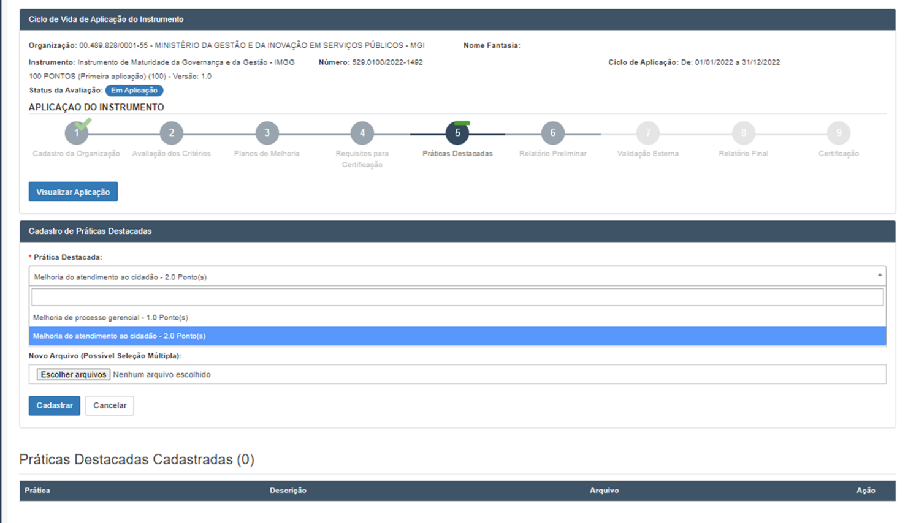  
*(Figura 23: Formulário de inclusão de Prática Destacada)*

* Ciclo de Aplicação;
* Comitê de Aplicação;
* Cadastro da organização;
* Pontuação geral;
* Certificado do Nível de Maturidade de Governança e Gestão; e
A pontuação geral preliminar é gerada pela pontuação obtida por Critério e pelas Práticas
Destacadas, conforme apresentado nas telas abaixo.
A pontuação geral provisória se enquadrará em uma das faixas apresentadas na Tabela Faixas de
Pontuação Geral (veja Anexo I), definindo, assim, o Nível de Maturidade de Governança e Gestão
alcançado pela organização, que é, também, apresentado no Relatório Preliminar de Melhoria de
Governança e Gestão.

  
*(Figura 24: Pontuação por critério no Relatório Preliminar)*

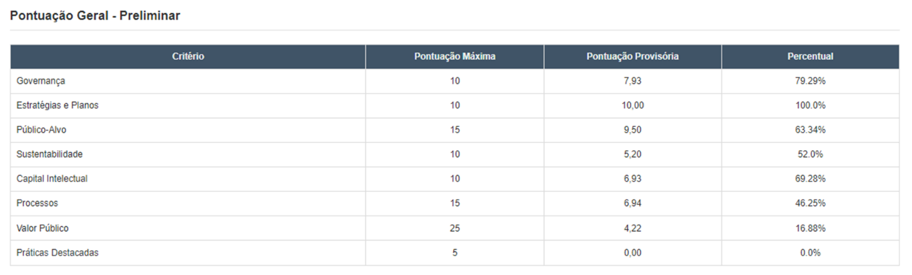  
*(Figura 25: Gráfico radar de maturidade organizacional)*

A próxima imagem apresenta o estágio da organização, correspondente à categoria da pontuação
provisória obtida na aplicação do IMGG.

## 12. Reuniões de consenso

A validação interna da aplicação do IMGG 100 pontos ocorre por meio de reuniões de consenso das
proposições apresentadas pelos grupos de trabalho, para análise e deliberação pelos demais
membros do Comitê de Aplicação, da avaliação dos fatores de pontuação das práticas e resultados
de gestão de cada Critério, dos Planos de Melhoria de Governança e Gestão - PMGGs elaborados,
das Práticas Destacadas e dos Requisitos para Certificação apresentados.
O consenso se encerra com apresentação da aplicação do IMGG 100 pontos e do Relatório
Preliminar de Melhoria de Governança e Gestão pelo Comitê de Aplicação para a alta direção do
órgão/entidade, que deliberará quanto à implementação dos PMGG elaborados para a melhoria da
governança e gestão.
O sistema do Gestaopubliagov.br ativará, ao final do Relatório Preliminar de Melhoria de
Governança e Gestão, unicamente, no perfil do Presidente do Comitê de Aplicação, o botão de
emissão da Declaração de Aplicação e o botão para encaminhamento para a Validação Externa,
conforme os resultados da aplicação do IMGG 100 pontos.
A imagem abaixo apresenta a pontuação provisória obtida tanto para os Requisitos para Certificação
quanto para Pontuação da Aplicação, com condições necessárias para a Validação Externa, ativando
o botão “Enviar para Validação”.

  
*(Figura 26: Categoria de Maturidade atingida no instrumento)*

Após o Presidente do Comitê de Aplicação clicar no botão “Enviar para Validação”, o sistema
apresentará a mensagem de confirmação dessa ação e, só então, ativará o botão para emissão da
Declaração de Aplicação, conforme imagem abaixo.

## 13. Declaração de Aplicação do IMGG 100 pontos

Para todas as aplicações, o sistema do Gestaopubliagov.br ativará, ao final do Relatório Preliminar
de Melhoria de Governança e Gestão, unicamente, no perfil do Presidente do Comitê de Aplicação,
o botão de emissão da Declaração de Aplicação.

  
*(Figura 27: Habilitação dos botões de Enviar para Validação e Emissão de Declaração)*

Para as aplicações que não obtiverem pontuação dos Requisitos para Certificação e/ou pontuação
do IMGG 100 pontos maiores ou iguais a 50%, o sistema do Gestaopubliagov.br ativará o botão para
emissão da Declaração de Aplicação.
As aplicações submetidas à validação externa que não obtiverem pontuação dos Requisitos para
Certificação e pontuação do IMGG 100 pontos maiores ou iguais a 50% permanecerão apenas com
a declaração de sua aplicação, anteriormente emitida no do Relatório Preliminar de Melhoria de
Governança e Gestão.
Nessa declaração, constará uma devolutiva apontando o estágio da gestão da instituição, com a
recomendação de priorizarem, na melhoria de sua gestão, os Requisitos para Certificação ainda não
implementados, visando alcançarem, nas aplicações futuras, as condições necessárias para elevação
do nível de maturidade da gestão.

## 14. Validação Externa

Serão submetidas à Validação Externa as aplicações dos órgãos e entidades que obtiverem
pontuação dos requisitos para certificação e pontuação do IMGG maiores ou iguais a 50%.
Importante salientar que a etapa de Validação Externa é acessível apenas aos usuários ativos no
perfil Validador.
A Validação Externa inicia com a análise preliminar da documentação apresentada como evidência
de atendimento a cada um dos Requisitos para Certificação.
Caso se verifique, nesse momento, que o atendimento aos Requisitos para Certificação a pontuação
ficou abaixo de 50%, será ativado no Relatório Final de Melhoria da Governança e da Gestão, o botão
“Encerrar Validação.

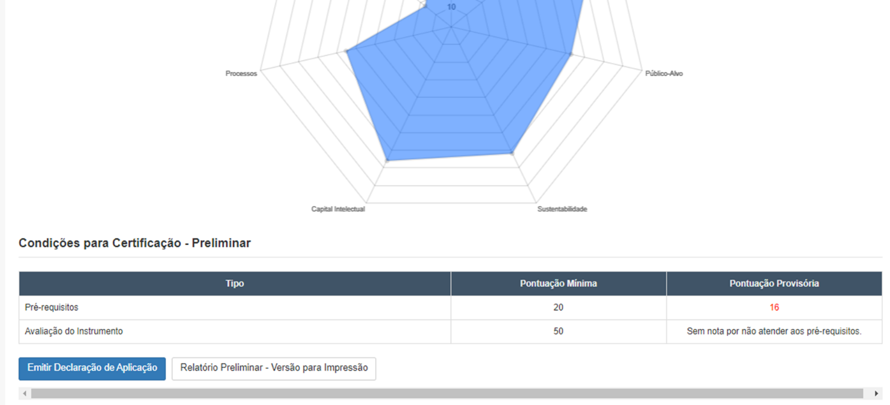  
*(Figura 28: Painel informando nota inferior ao ponto de corte de 50%)*

Por outro lado, a validação da aplicação do IMGG 100 pontos terá prosseguimento se o resultado
dessa análise preliminar, demonstrar o atendimento às condições necessárias para a Validação
Externa, que ocorre por meio de processo de verificação dos aspectos relevantes da aplicação do
IMGG 100 pontos, com vista ao estabelecimento da conformidade entre a organização que a
conduziu e os validadores externos, indicados pela Secretaria Executiva da Rede de Parcerias.
Os validadores externos deverão examinar possíveis inconsistências na avaliação dos requisitos das
alíneas, atendando-se para as inter-relações dos Critérios, devendo, ainda:
* Verificar o atendimento dos fatores de avaliação dos requisitos das alíneas.
o Adequação – atendimento aos requisitos da alínea pelas práticas e resultados de
gestão; e
o Continuidade – identificação do início da utilização (desde quando) e com que
periodicidade ocorre.
* Critérios de 1 a 6 - Processos Gerenciais - analisar se as práticas de gestão e documentação
apresentadas atendem aos requisitos das alíneas;
* Critério 7 – Valor Público - analisar se os resultados dos indicadores de desempenho e a
documentação apresentados atendem aos requisitos das alíneas.
* Realizar a sinalização dos fatores de avaliação (Adequação e Continuidade) dos requisitos
das alíneas, considerando o atendimento pelas práticas e resultados de gestão apresentados.
Após a Validação Externa, o sistema emitirá o Relatório Final de Melhoria de Governança e Gestão,
apresentando o campo “Considerações Finais dos Validadores”, em que os Validadores podem
expor sucintamente algumas observações e recomendações de orientação para melhoria de futuras
aplicações do IMGG.

## 15. Certificação do Nível de Maturidade de Governança e Gestão

O Nível de Maturidade de Governança e Gestão é gerado pela pontuação global dos Critérios
alcançada pela organização, quando da aplicação do IMGG 100 pontos, e se enquadrará numa das
faixas apresentadas na Tabela – Faixas de Pontuação Global (ver Anexo I). As faixas de pontuação
global são um indicativo do nível de maturidade alcançado pela governança e gestão de uma
organização, considerado esse instrumento básico de 100 pontos.
Para os órgãos e entidades que após a Validação Externa obtiverem uma pontuação dos Requisitos
para Certificação e do IMGG maiores ou iguais a 50%, o sistema do Gestaopublicagov.br emitirá o
certificado, demonstrando o Nível de Maturidade de Governança e Gestão apresentado no Relatório
Final de Melhoria de Governança e   Gestão, em nome da organização, com validade de dois anos,
prazo suficiente para a organização implementar melhorias constantes do PMGG e realizar uma
nova aplicação de um dos instrumentos.

## 16. Solicitação de Revisão da Validação Externa

Após a finalização da Validação Externa, a instituição poderá ingressar com recurso, questionando a
análise dos requisitos para certificação ou a pontuação atribuída ao IMGG pelos Validadores
Externos, que resultarem na Declaração de Aplicação ou na Certificação do Nível de Maturidade da
Governança e Gestão.
O recurso deverá ser apresentado pelo Presidente do Comitê de Aplicação, no prazo de 15 (quinze)
dias corridos, contados da data de finalização da validação, exclusivamente de forma eletrônica, por
meio do sistema Gestaopublicagov.br.
O validador externo que houver analisado a aplicação apreciará as alegações apresentadas no
recurso e formulará proposta de decisão fundamentada, a ser tomada por representante do
Departamento de Transferências e Parcerias da União - DTPAR, sendo certo que a decisão proferida
no âmbito do recurso será definitiva, não sendo cabível nova impugnação.

## ANEXO I - Tabela Faixas de Pontuação Geral

INSTRUMENTO DE MATURIDADE DA GOVERNANÇA E DA GESTÃO
IMGG 100 pontos
CATEGORIA
PONTUAÇÃO
ESTÁGIO DA ORGANIZAÇÃO
Bronze 4
75 a 100
Excelente! A priorização, sistematização e implementação das
ações de melhoria da gestão e dos processos gerenciais
estabeleceram as bases para a consolidação de uma cultura de
elevado nível de maturidade em governança e gestão em sua
organização. Os resultados apresentados refletem uma
elevação da satisfação com a prestação dos serviços, em
decorrência do atendimento das necessidades e expectativas
das partes interessadas. Lembre-se que "sucesso de hoje não
garante o sucesso de amanhã".
Bronze 3
50 a 74,99
Muito
Bom!
Em
decorrência
da
continuidade
na
implementação das ações de aprimoramento, sua organização
apresenta muitas melhorias na gestão e na prestação dos
serviços. Surgem muitos resultados de satisfação das partes
interessadas. Foque nas ações de aprimoramento dos
processos de relacionamento e atendimento das necessidades
e expectativas das partes interessadas.  Pergunte-se sempre:
qual o valor público que estamos entregando?
Declaração
de aplicação
do IMGG 100
PONTOS.
25 a 49,99
Parabéns! Sua organização já apresenta algumas melhorias na
sua gestão e na prestação dos serviços. Surgem alguns
resultados decorrentes da priorização e adoção de algumas
boas práticas de gestão. Agora é buscar maior continuidade na
implementação das ações. Lembre-se que a regularidade de
sua ação é o que levará a organização a novas conquistas.
0 a 24,99
Ok! Sua organização já deu os primeiros passos visando a
melhoria de sua gestão. Com a implementação dos planos de
melhoria priorizados, logo surgirão melhores resultados na
gestão e no desempenho dos processos gerenciais. Tenha em
mente que a persistência é fundamental para o sucesso da
organização na prestação dos serviços públicos.

## ANEXO II – Exemplos de Evidências IMGG 100 PONTOS

INSTRUMENTO DE MATURIDADE DE GOVERNANÇA E GESTÃO - IMGG 100 PONTOS
Exemplos de documentos que podem ser apresentados como evidências para as práticas e
resultados de gestão
O presente documento tem por objetivo exemplificar documentos que se configurem como possíveis
evidências às práticas de gestão apresentadas, quando da aplicação do IMGG 100 pontos. Antes de
conhecer os exemplos apresentados, leia com atenção as orientações gerais abaixo descritas:

#### A) Na aplicação do IMGG – 100 pontos, além de descrever as práticas e os resultados de gestão realizadas

pela instituição, esta deverá apresentar evidências (em forma de anexo ou de link aberto, público) que
subsidiem as informações inseridas, de forma a comprovar que a prática e o resultado de gestão, de fato,
são realizados. Nesse sentido, a mera apresentação de uma norma, um plano ou projeto, por exemplo, não
é evidência suficiente para que o Validador Externo considere a prática apresentada, ou seja, é necessário
que se apresente, também, documentos que comprovem a implementação da norma, do plano e/ou do
projeto.
Ex. 1: Decreto Organizacional/Regimento Interno que institui a Ouvidoria (evidência insuficiente);
Ex. 2: Relatório Semestral dos atendimentos da Ouvidoria (evidência aceita como complemento da
comprovação da norma).

#### B) Tanto as práticas de gestão quanto as evidências devem ser referentes ao ciclo de aplicação. Ainda, para

a comprovação do fator “Continuidade”, a documentação inserida deve ser de, pelo menos, 1 (um) período
anterior ao ciclo de avalição.
Ex. 1: carta de serviço sem data de publicação e/ou versão (evidência insuficiente);
Ex. 2: Notícia com a divulgação da (atualização) da carta de serviço ao cidadão (evidência aceita).

#### C) No caso da apresentação de documentos antigos, mas ainda vigentes, estes devem ser de até 3 (três)

anteriores ao período em análise (ciclo de aplicação), ficando a critério do Validador Externo a consideração
de evidências fora desse período.

#### D) Caberá à instituição avaliar se a apresentação de apenas uma evidência seria suficiente para que esta, de

fato, subsidie a prática e o resultado de gestão apresentados ou se seria necessário a combinação de mais
de uma evidência (anexo e/ou link aberto). Da mesma forma, o Validador tem autonomia para analisar se a
evidência apresentada é suficiente para a comprovação da prática.
Ex. 1: Decreto Organizacional/Regimento Interno que institui a Ouvidoria e relatório de atendimento
(evidência aceita).
Ex. 2: Carta de Serviço com data da publicação e e-mail com a solicitação de atualização de
serviços/procedimentos da carta de serviço e relatórios/planilhas de acompanhamento do atendimento dos
serviços (evidência aceita).

#### E) A evidências a serem apresentadas não se limitam aos exemplos de documentos aqui apresentados, pois

cada instituição tem sua realidade de governança e de gestão.
Exemplos de documentos a serem apresentados como evidências para as práticas e resultados
de gestão
GOVERNANÇA
a) A alta direção promove a avaliação das prioridades e dos resultados alcançados considerando
as competências regimentais ou a missão da instituição.
01 - A alta direção promove a
avaliação das prioridades
considerando a missão ou
competências regimentais da
instituição.
* 
Normativo de designação de grupo de estudo para
definição/atualização de modelo/instrumento de estabelecimento
e avaliação das diretrizes
* 
Projeto de definição/atualização de modelo/instrumento
de estabelecimento  e avaliação das diretrizes, assinada ou com
lista de presença;
* 
Ata de reunião deliberativa de definição/atualização de
modelo/instrumento de estabelecimento e avaliação das
diretrizes;
* 
Relatórios ou documentos similares de
definição/atualização do Modelo/instrumento de estabelecimento
e avaliação das diretrizes;
* 
Normativo de designação de equipe técnica para definição
e avaliação das diretrizes;
* 
Documentos de levantamento/apresentação de
dados/informações para estabelecimento e avaliação das
diretrizes (Planilhas/tabelas/relatórios);
* 
Ata de reunião técnica de análise de dados/informações
para estabelecimento e avaliação das diretrizes;
* 
Relatórios ou documentos similares de análise técnica de
dados/informações para estabelecimento e avaliação das
diretrizes;
* 
Ata de reunião deliberativa para estabelecimento e
avaliação das diretrizes;
* 
Relatórios ou documentos similares de
deliberação/definição e avaliação das diretrizes;
* 
Atas de reuniões de sensibilização das áreas e/ou partes
interessadas; e de apresentação da equipe técnica designada e do
Projeto ou documento similar para estabelecimento e avaliação
das diretrizes;
* 
Normativos ou documentos similares para
estabelecimento e avaliação das diretrizes;
Atas de reuniões de acompanhamento das ações de
estabelecimento e avaliação das diretrizes;
* 
Relatórios ou documentos similares de acompanhamento
das ações de estabelecimento e avaliação das diretrizes;
* 
Plano de divulgação da avaliação das diretrizes para as
áreas e/ou partes interessadas;
* 
Atas de reuniões de apresentação da avaliação das
diretrizes para as áreas e/ou partes interessadas;
* 
Peças ou documentos/instrumentos similares de
divulgação da avaliação das diretrizes para as áreas e/ou partes
interessadas.
02 - A alta direção promove a
avaliação dos resultados
alcançados considerando a
missão ou competências
regimentais da instituição.
* 
Documentos que comprovem a monitoria/avaliação dos
resultados
citados
na
alínea
anterior;
* 
Gráficos/relatórios de avaliação dos dados;
* 
Atas
de
reuniões
de
avaliação
de
dados;
* 
Prints de telas do sistema que contenham avaliação de
dados (orçamentários ou de gestão) desde que com identificação
da instituição, dos dados que subsidiem a prática ou então,
documento da autoridade máxima validando o documento
apresentado;
* 
Sistema/Relatório de Indicadores de desempenho que
contemple avaliação dos resultados.
Obs.: no(s) documento(s) apresentado(s), deverá constar a
avaliação dos resultados alcançados, preferencialmente, com
metas e indicadores, que poderão ser os mesmos citados no critério
valor público.
b) A alta direção assegura a tomada de decisão com base em informações alinhadas às diretrizes
de governo e ao interesse público.
01 - A alta direção assegura a
tomada de decisão com base
em informações alinhadas às
diretrizes de governo.
* 
Normativos ou documentos com designação de grupo de
estudo/equipe técnica para definição/atualização de
modelo/instrumento de tomada de decisão, demonstrando a
correlação às diretrizes do governo;
* 
Relatórios ou documentos similares de
definição/atualização do Modelo/instrumento de tomada de
decisão, demonstrando a correlação  às diretrizes do governo;
* 
Atas de reuniões de acompanhamento das ações de
tomada de decisão demonstrando a correlação às diretrizes do
governo;
* 
Publicidade das ações de tomada de decisão,
demonstrando a correlação às diretrizes do governo de
definição/atualização de modelo/instrumento de tomada de
decisão;
* 
Normativo de designação de equipe técnica para tomada
de decisão;
Documentos de levantamento/apresentação de
dados/informações para tomada de decisão
(Planilhas/tabelas/relatórios);
* 
Ata de reunião técnica de análise de dados/informações
para a tomada de decisão;
* 
Relatórios ou documentos similares de análise técnica de
dados/informações para tomada de decisão.
* 
Ata de reunião deliberativa para tomada de decisão;
Relatórios ou documentos similares de deliberação/definição da
tomada de decisão;
* 
Atas de reuniões de sensibilização das áreas e/ou partes
interessadas; e de apresentação da equipe técnica designada e do
Projeto ou documento similar para tomada de decisão;
* 
Normativos ou documentos similares para a tomada de
decisão;
* 
Atas de reuniões de acompanhamento das ações de
tomada de decisão;
* 
Relatórios ou documentos similares de acompanhamento
das ações de tomada de decisão;
* 
Plano de divulgação da tomada de decisão para as áreas
e/ou partes interessadas;
* 
Atas de reuniões de apresentação da tomada de decisão
para as áreas e/ou partes interessadas;
* 
Peças ou documentos/instrumentos similares de
divulgação da tomada de decisão para as áreas e/ou partes
interessadas;
* 
Relatórios de implementação do Planejamento Estratégico
e/ou do Plano de Governo.
02 - A alta direção assegura a
tomada de decisão com base
em informações alinhadas ao
interesse público.
* 
Documentos relacionados no requisito anterior, desde que
contemplem a participação pública;
* 
Normativos ou documentos com designação de grupo de
estudo/equipe técnica para definição/atualização de
modelo/instrumento de tomada de decisão, demonstrando a
correlação ao interesse público;
* 
Relatórios ou documentos similares de
definição/atualização do Modelo/instrumento de tomada de
decisão, demonstrando a correlação ao interesse público;
* 
Atas de reuniões de acompanhamento das ações de
tomada de decisão, demonstrando a correlação ao interesse
público;
* 
Publicidade das ações de tomada de decisão,
demonstrando a correlação às diretrizes do governo,
demonstrando a correlação ao interesse público;
* 
Planejamento Estratégico;
* 
Plano diretor, desde que tenham sido realizadas com
fóruns de participação social;
* 
Atas de reuniões de conselhos destacando ações voltadas
ao interesse público;
* 
Comprovações de ofícios ou similares com requerimentos
de associações, entidades de interesse público que tenham sido
respondidas/atendidas pelo poder público;
* 
Práticas que envolvam diretrizes para ações finalísticas de
interesse público;
* 
Decisões judiciais atendidas para atendimento do interesse
público;
* 
Audiências públicas para debate ações/práticas da
organização;
* 
Práticas setoriais (saúde, educação, assistência social,
infraestrutura, planejamento urbano, turismo, cultura, entre
outras, que atendam demanda social e são voltados ao interesse
público;
* 
Plano Diretor Participativo.
Obs.: no(s) documento(s) apresentado(s) deverá constar a
avaliação dos resultados alcançados, preferencialmente com
metas e indicadores, que poderão ser os mesmos citados no
critério valor público.
c)  A alta direção promove o monitoramento e a divulgação do desempenho institucional com
foco nos resultados estratégicos ou nas prioridades estabelecidas.
01 - A alta direção promove o
monitoramento do desempenho
institucional com foco nos
resultados estratégicos ou nas
prioridades estabelecidas.
* 
Documento que comprove o monitoramento das ações do
Plano Estratégico;
* 
Plano de Ação que demonstre o monitoramento das ações
decorrentes do Planejamento Estratégico ou documento similar,
contemplando os objetivos estratégicos ou prioridades
estabelecidas e respectivos indicadores de desempenho.
* 
Planos de Ação setoriais, desde que vinculado a um plano
geral da instituição;
* 
Sistema de indicadores de desempenho com foco nos
resultados estratégicos ou prioridades estabelecidas;
* 
Sistema/Ferramenta de monitoramento (ex.: sistema de
Business Inteligence; Planilha Excell), dos resultados estratégicos
ou prioridades estabelecidas;
* 
Documentos que comprovem reuniões/oficinas/workshops
de monitoramento e  divulgação do desempenho institucional com
foco nos resultados estratégicos ou nas prioridades estabelecidas;
* 
Documentos que comprovem ações do escritório de
projetos voltadas para o monitoramento e a divulgação do
desempenho institucional com foco nos resultados estratégicos ou
nas prioridades estabelecidas;
* 
Documentos que comprovem ações de gestores
estratégicos para monitoramento e a divulgação do desempenho
institucional com foco nos resultados estratégicos ou nas
prioridades estabelecidas.
Obs.: no(s) documento(s) apresentado(s), deverá constar o
monitoramento das metas e dos resultados alcançados,
preferencialmente com metas e indicadores, que poderão ser os
mesmos citados no critério valor público.
02 - A alta direção promove a
divulgação do desempenho
institucional com foco nos
resultados estratégicos ou nas
prioridades estabelecidas.
* 
Notícias, relatórios ou documento similar de divulgação
interna ou externa do desempenho institucional;
* 
Divulgação do Plano de Ação que demonstre o
monitoramento das ações decorrentes do Planejamento
Estratégico ou documento similar;
* 
Plano de Comunicação com as ações de divulgação do
desempenho institucional, com destaque para resultados
estratégicos ou prioridades estabelecidas;
* 
Publicação, no portal oficial, de documento oficial que
contemple os resultados do desempenho institucional.
d) A alta direção dispõe de dados e informações para subsidiar o seu processo decisório.
01 - A alta direção dispõe de
dados e informações para
subsidiar o seu processo
decisório.
* 
Sistema de indicadores de desempenho;
* 
Sistema/Ferramenta de gestão de dados e informações
(ex.: sistema de Business Inteligence);
* 
Sistema de Gestão Integrada (SGI) ou sistema similar de
gestão das informações da instituição;
* 
Planilha Excel que evidencie a gestão de dados
institucionais, desde que legitimada pela autoridade máxima;
* 
Relatório ou documento similar que evidencie a gestão de
dados/informações;
* 
Atas de reuniões dos gestores estratégicos com dados e
informações que subsidiem o processo decisório;
* 
Documentos, memorandos, e-mails, relatórios
encaminhados aos gestores com dados e informações que
subsidiem o processo decisório.
e) A alta direção assegura a realização periódica de cópia de segurança (backups), senhas de
acesso, dentre outras práticas de segurança dos sistemas de informação.
01 - A alta direção assegura a
realização periódica de cópia de
segurança (backups), senhas de
acesso, entre outras práticas de
segurança dos sistemas de
informação.
* 
Plano de Segurança dos Sistemas de Informação;
* 
Contrato/aditivo de empresa responsável pela
implementação de Segurança dos Sistemas de Informação;
* 
E-mails institucionais/documentos/guias com instruções
para efetivação da Segurança da Informação institucional;
* 
Print sistema indicando backups dentro do ciclo de
aplicação;
* 
Relatórios contendo informações sobre backups ou
orientações segurança;
* 
Link/print pop-up ou banner recomendando ações de
segurança;
* 
Manual/cartilha ou similares sobre backup e segurança
informação vigente no ano de aplicação.
f) A alta direção promove a edição ou atualização da Carta de Serviços ao Cidadão e o
comportamento ético em relação aos compromissos assumidos.
01 - A alta direção promove a
edição ou atualização da Carta
de Serviços ao Cidadão.
* 
Carta de Serviços ao Cidadão (CSC) com indicação da
versão do documento;
* 
Ata de reunião para discussão dos serviços ou atualização
da CSC;
* 
Documento de tramitação interna indicando atualização
da CSC;
* 
Formulário de atualização dos serviços constantes da CSC;
* 
Notícia publicada no site oficial informando
disponibilização e atualização da CSC.
02 - A alta direção promove o
comportamento ético em
relação aos compromissos
assumidos.
* 
Código de Ética ou documento similar (manual de
integridade, manual de conduta etc.);
* 
Regimento Interno que contemple condutas a serem
observadas pelos servidores;
* 
Termo de Ciência conduta ética-moral.
g) A alta direção promove a identificação e a divulgação dos principais riscos.
01 - A alta direção promove a
identificação dos principais
riscos.
* 
Matriz de riscos;
* 
Plano de gestão de riscos;
* 
Código de conduta ética, desde que contemple LGPD (risco
dados pessoais);
* 
Políticas e controle interno (financeiro e não financeiro);
* 
Acordo de resultados ou documentos que contenham a
estratégia (planejamento estratégico) com os riscos
definidos/mapeados;
* 
Relatório ou documento similar de mapeamento dos
riscos.
02 - A alta direção promove a
divulgação dos principais riscos.
* 
Relatórios ou documento similar de divulgação interna ou
externa dos riscos contidos nos documentos citados no requisito
anterior;
* 
Documento impresso ou eletrônico com a divulgação dos
riscos mapeados;
* 
Demonstração de conformidade à LGPD (Lei Geral de
Proteção de Dados 13.709/2018.
ESTRATÉGIAS E PLANOS
a) As estratégias estão definidas com base na missão e visão ou as metas estão definidas com
base nas prioridades da instituição e são divulgadas.
01 - As estratégias estão
definidas com base na missão e
visão ou as metas estão
definidas com base nas
prioridades da instituição.
* 
Planejamento Estratégico ou documento similar;
* 
Documento contemplando objetivos estratégicos ou metas
e respectivo Plano de Ação;
* 
Regimento Interno que tenha citado missão e visão;
* 
PPA, LDO e LOA que contenham diretrizes estratégicas;
* 
Decisões judiciais relativas aos instrumentos de
planejamento.
02 - As estratégias ou as metas
são divulgadas.
* 
Notícias, relatórios ou documento similar de divulgação
interna ou externa das estratégias ou metas institucionais:
* 
Meios de divulgação (ex.: notícias no portal oficial; e-mail
institucional de divulgação etc.)
* 
Atas;
* 
Pastas Públicas;
* 
Compartilhamento de doc.
b) As necessidades dos cidadãos-usuários são consideradas na definição e revisão das
prioridades estabelecidas ou das estratégias.
01 - As necessidades dos
cidadãos-usuários são
consideradas na definição e
revisão das prioridades
estabelecidas ou das
estratégias.
* 
Pesquisas públicas;
* 
Atas de reuniões públicas; ou documentos similares;
* 
Documento contemplando objetivos estratégicos ou metas
e respectivo Plano de Ação;
* 
Documentos de constituição ou atas de reuniões de
conselhos com representantes dos cidadãos-usuários.
c) Os planos de ação para as prioridades ou estratégias estabelecidas são estruturados e
divulgados, definindo prazos, custos e responsáveis.
01 - Os planos de ação para as
prioridades ou estratégias
estabelecidas são estruturados,
definindo prazos, custos e
responsáveis.
* 
Plano de Ação ou documento similar;
* 
Documentos que comprovem projetos estratégicos.
Obs.: no(s) documento(s) apresentado(s), deverão constar prazos,
custos e responsáveis, preferencialmente com metas e
indicadores, que poderão ser os mesmos citados no critério valor
público.
02 - Os planos de ação para as
prioridades ou estratégias
estabelecidas são divulgados.
* 
Notícia, relatórios ou documento similar de divulgação
interna ou externa do(s) documento(s) citado(s)no requisito
anterior.
* 
Links eletrônicos da disponibilidade; portal da instituição.
d) Os planos de ação e projetos são acompanhados sistematicamente e seus avanços e
resultados divulgados ao público-alvo.
01 - Os planos de ação e
projetos são acompanhados
sistematicamente.
* 
Ferramentas de acompanhamento do plano de ação e
projetos;
* 
Planilhas de acompanhamento;
* 
Relatórios e ou documentos similares que realmente
expressem este acompanhamento e controle de execução.
* 
Sistemas de Gestão de Informações.
Obs.: no(s) documento(s) apresentado(s), deverão constar planos
de ação, preferencialmente com metas e indicadores, que poderão
ser os mesmos citados no critério valor público.
02 - Os planos de ação e
projetos; e seus avanços e
resultados divulgados ao
público-alvo.
* 
Notícia, relatórios ou documento similar de divulgação
interna ou externa do(s) documento(s) citado(s)no requisito
anterior;
* 
Links eletrônicos da disponibilidade; portal da instituição.
e) A programação orçamentária é realizada e divulgada com base nas prioridades estabelecidas
ou na estratégia.
01 - A programação
orçamentária é realizada com
base nas prioridades
estabelecidas ou na estratégia.
* 
Planejamento Estratégico ou documento similar com
correlação à programação orçamentária;
* 
Documento contemplando objetivos estratégicos ou metas
e respectivo Plano de Ação com correlação à programação
orçamentária;
* 
Planilhas ou documento similar, que demonstre gestão
orçamentária;
* 
PPA, LDO e LOA que contenham diretrizes estratégicas.
Obs.: no(s) documento(s) apresentado(s) deverá constar a
programação orçamentária, preferencialmente, com metas e
indicadores, que poderão ser os mesmos citados no critério valor
público.
02 - A programação
orçamentária é divulgada.
* 
Notícia, relatórios ou documento similar de divulgação
interna ou externa do(s) documento(s) citado(s)no requisito
anterior.;
* 
Links eletrônicos da disponibilidade; portal da instituição.
PÚBLICO-ALVO
a) O perfil e os requisitos de atendimento aos cidadãos usuários estão definidos e divulgados.
01 - O perfil e os requisitos de
atendimento aos cidadãos
usuários estão definidos.
* 
Documentos/normativos/Relatórios (ou similares) acerca
do perfil dos cidadãos-usuários, com definição dos requisitos de
atendimento;
* 
Documentos consolidados a partir de projeções estatísticas
para identificação do perfil dos cidadãos-usuários, com definição
dos requisitos de atendimento;
* 
Programas de governo contemplando parcelas/segmentos
da sociedade (com identificação dos cidadãos-usuários e do
requisito de atendimento);
* 
Carta de Serviços ao Cidadão que demonstre o perfil das
partes interessadas e seus requisitos de atendimento,
correlacionando o serviço ao público alvo (cidadão; empresas;
servidores; turistas etc.)
* 
Atos normativos (leis, decretos, portarias...) de prática(s)
que possua(m) o perfil do usuário a que se destina e requisitos de
atendimento (ex.: serviços de saúde, educação, assistência social,
tributos etc.).
Obs.: no(s) documento(s) apresentado(s), deverá constar a
avaliação da qualidade do atendimento com base em padrões de
desempenho preestabelecidos, preferencialmente com metas e
indicadores, que poderão ser os mesmos citados no critério valor
público.
02 - O perfil e os requisitos de
atendimento aos cidadãos
usuários estão divulgados
* 
Notícia, relatórios ou documento similar de divulgação
interna ou externa do(s) documento(s) citado(s)no requisito
anterior;
* 
Edital de divulgação/convocação para determinado
serviço.
b)  As necessidades ou expectativas dos cidadãos-usuários estão identificadas e divulgadas.
01 - As necessidades ou
expectativas dos cidadãos-
usuários estão identificadas.
* 
Levantamento das necessidades/expectativas dos
cidadãos-usuários;
* 
Documento consolidado a partir de estudo/levantamento
para identificação das necessidades/expectativas dos cidadãos-
usuários;
* 
Programas de governo contemplando o atendimento de
necessidades/expectativas de determinada parcela/segmento da
sociedade.
* 
Instâncias participativas com cidadãos, no âmbito da
organização ex.: orçamento participativo; plano diretor com
participação da sociedade, audiência pública etc.;
* 
Pesquisas.
02 - As necessidades ou
expectativas dos cidadãos-
usuários estão divulgadas.
* 
Notícia, relatórios ou documento similar de divulgação
interna ou externa do(s) documento(s) citado(s)no requisito
anterior;
* 
Links eletrônicos da disponibilidade; portal da instituição.
c) A instituição dispõe de canais de relacionamento compatíveis com o perfil dos cidadãos
usuários, fornecedores e parceiros.
01 - A instituição dispõe de
canais de relacionamento
compatíveis com o perfil dos
cidadãos usuários.
* 
Documento comprobatório do funcionamento da
Ouvidoria ou centros de atendimento por segmento da sociedade
(cidadão-usuário);
* 
Carta de Serviços ao Cidadão que demonstre o perfil das
partes interessadas, correlacionando o serviço ao público-alvo;
* 
Aplicativos/ sistemas/portais para comunicação direta
com os cidadãos-usuários.
02 - A instituição dispõe de
canais de relacionamento
compatíveis com o perfil dos
fornecedores.
* 
Documento comprobatório do funcionamento da
Ouvidoria ou centros de atendimento por segmento da sociedade
(fornecedor);
* 
Aplicativos/ sistemas/portais para comunicação direta
com os fornecedores.
03 - A instituição dispõe de
canais de relacionamento
compatíveis com o perfil dos
parceiros.
* 
Documento comprobatório do funcionamento da
Ouvidoria ou centros de atendimento por segmento da sociedade
(parceiros);
* 
Aplicativos/ sistemas/portais para comunicação direta
com os parceiros.
d) A Carta de Serviços ao Cidadão é divulgada e os compromissos formalizados são monitorados.
01 - A Carta de Serviços ao
Cidadão é divulgada.
* 
Carta de Serviços ao Cidadão publicada;
* 
Notícia, relatórios ou documento similar de divulgação
interna ou externa da Carta de Serviços ao Cidadão.
02 - Os compromissos
formalizados na Carta de
Serviços ao Cidadão são
monitorados.
* 
Planilhas de acompanhamento/monitoramento dos
serviços de acordo com o estabelecido na CSC;
* 
Documento que comprove o monitoramento dos serviços
definidos na Carta de Serviço ao Cidadão;
* 
Print de telas de sistema com dados/informações gerais
sobre os serviços da Carta (gráficos, barras, números etc.).
e) A qualidade do atendimento aos cidadãos-usuários é avaliada e divulgada com base em
padrões de desempenho preestabelecidos.
01 - A qualidade do
atendimento aos cidadãos-
usuários é avaliada com base
em padrões de desempenho
preestabelecidos.
* 
Documento ou demonstrativo com os requisitos dos
atendimentos realizados, com identificação do desempenho e
classificação da qualidade desse atendimento.
02 - A qualidade do
atendimento aos cidadãos-
usuários é divulgada.
* 
Notícia, relatórios ou documento similar de divulgação
interna ou externa do(s) documento(s) citado(s)no requisito
anterior.
f) As demandas (solicitações, reclamações, reivindicações ou denúncias) dos cidadãos-usuários
são tratadas e os seus resultados são informados aos demandantes em tempo hábil.
01 - As demandas (solicitações,
reclamações, reivindicações ou
denúncias) dos cidadãos-
usuários são tratadas.
* 
Documento comprobatório do atendimento às demandas
recebidas.
* 
Documento ou demonstrativo estatístico da correlação
demandas recebidas e tratamento destas.
02 - Os seus resultados são
informados aos interessados em
tempo hábil.
* 
Relatório ou documento similar que fornece dados acerca
do tempo dispendido ao tratamento das demandas recebidas.
* 
Levantamento estatístico da correlação demandas
recebidas e tempo de atendimento.
g) São exigidas dos cidadãos apenas informações ou comprovações que não constem em bases
de dados oficiais da administração pública.
01 - São exigidas dos cidadãos
apenas informações ou
comprovações que não constem
em bases de dados oficiais da
administração pública.
* 
Documento demonstrando os procedimentos de acordo
com a Lei nº 13.726/2018.
h) São definidos e divulgados os critérios para seleção de fornecedores considerando os
normativos vigentes.
01 - São definidos os critérios
para seleção de fornecedores
considerando os normativos
vigentes.
* 
Atos normativos institucionais que comprovem critérios
para seleção de fornecedores;
* 
Relatórios que comprovem critérios para seleção de
fornecedores;
* 
Atos de designação de comissão de apuração de
descumprimento contratual e/ou seus relatórios;
* 
Edital com definição dos critérios para seleção dos
fornecedores.
02 - São divulgados os critérios
para seleção de fornecedores
considerando os normativos
vigentes.
* 
Notícia, relatórios ou documento similar de divulgação
interna ou externa do(s) documento(s) citado(s)no requisito
anterior.
i)  O desempenho dos fornecedores é avaliado possibilitando o aprimoramento dos
procedimentos para novas contratações.
01 - Foram estabelecidos os
procedimentos para avaliação
do desempenho dos
fornecedores, possibilitando o
aprimoramento dos
procedimentos para novas
contratações.
* 
Atos normativos institucionais que comprovem critérios
para avaliação de desempenho de fornecedores;
* 
Relatórios que comprovem critérios para avaliação de
desempenho de fornecedores;
* 
Atos de designação de comissão de apuração de
descumprimento contratual e/ou seus relatórios.
Obs.: no(s) documento(s) apresentado(s), deverá constar
avaliação de desempenho de fornecedores, preferencialmente
com metas e indicadores, que poderão ser os mesmos citados no
critério valor público.
02 - Foram divulgados os
procedimentos para avaliação
do desempenho dos
fornecedores, possibilitando o
aprimoramento dos
procedimentos para novas
contratações.
* 
Notícia, relatórios ou documento similar de divulgação
interna ou externa do(s) documento(s) citado(s)no requisito
anterior.
SUSTENTABILIDADE
a) São promovidas ações de sustentabilidade ambiental, social e econômica na execução das
competências institucionais.
01 - São promovidas ações de
sustentabilidade ambiental na
execução das competências
institucionais.
* 
Ações de mobilização da sociedade no âmbito ambiental
(ex.: documentos de convocação);
* 
Termo de Adesão à algum  programa com enfoque
ambiental (ex.: Agenda Ambiental na Administração Pública -
A3P);
* 
Matérias, e-mails institucionais, documentos referentes à
campanhas de conscientização ambiental, (ex.: consumo de água;
combate à dengue);
* 
Constituição de organismos, associações e cooperativas
com foco na promoção de projetos ambientais (ex.: ata das
reuniões, normas de formalização, relatórios, etc.);
* 
Participação/implementação de Programas de governo
com enfoque ambiental.
Obs.: no(s) documento(s) apresentado(s), deverão constar ações
de sustentabilidade ambiental, preferencialmente com metas e
indicadores, que poderão ser os mesmos citados no critério valor
público.
02 - São promovidas ações de
sustentabilidade social na
execução das competências
institucionais.
* 
Ações de mobilização da sociedade no âmbito social (ex.:
documentos de convocação);
* 
Termo de Adesão a algum programa com enfoque social;
* 
Matérias, e-mails institucionais, documentos referentes a
campanhas sociais;
* 
Constituição de organismos, associações e cooperativas
com foco na promoção de projetos sociais (ex.: ata das reuniões,
normas de formalização, relatórios, etc.);
* 
Participação/implementação de Programas de governo
com enfoque social.
Obs.: no(s) documento(s) apresentado(s), deverão constar ações
de sustentabilidade social, preferencialmente com metas e
indicadores, que poderão ser os mesmos citados no critério valor
público.
03 - São promovidas ações de
sustentabilidade econômica na
execução das competências
institucionais.
* 
Ações de mobilização da sociedade no âmbito econômico
(ex.: documentos de convocação);
* 
Termo de Adesão à algum  programa com enfoque
econômico;
* 
Matérias , e-mails institucionais, documentos referentes à
campanhas econômicas;
* 
Constituição de organismos, associações e cooperativas
com foco na promoção de projetos econômicos (ex.: ata das
reuniões, normas de formalização, relatórios, etc.);
* 
Participação/implementação de Programas de Programas
de governo com enfoque econômico;
* 
Termos aditivos ou documento similar de renegociação de
valor de contratos administrativos;
* 
Programas de subsídios econômicos à segmentos formais
e informais da população (ex.: microempresas, artesãos etc.).
Obs.: no(s) documento(s) apresentado(s), deverão constar ações
de sustentabilidade econômica, preferencialmente com metas e
indicadores, que poderão ser os mesmos citados no critério valor
público.
b) A instituição dispõe de conselho ou instância similar, com representantes da sociedade, com
foco nos aspectos ambiental, social e econômico.
01 - A instituição dispõe de
conselho ou instância similar,
com representantes da
sociedade, com foco nos
aspectos ambiental.
* 
Normas de criação ou nomeação de conselho, organismos,
associações, cooperativas, comitês com foco na promoção de
projetos ambientais;
* 
Atas ou registros da atuação de conselho, organismos,
associações, cooperativas, comitês com foco na promoção de
projetos ambientais.
02 - A instituição dispõe de
conselho ou instância similar,
com representantes da
sociedade, com foco nos
aspectos social.
* 
Normas de criação ou nomeação de conselho, organismos,
associações, cooperativas, comitês com foco na promoção de
projetos sociais;
* 
Atas ou registros da atuação de conselho, organismos,
associações, cooperativas, comitês com foco na promoção de
projetos sociais.
03 - A instituição dispõe de
conselho ou instância similar,
com representantes da
sociedade, com foco nos
aspectos econômico.
* 
Normas de criação ou nomeação de conselho, organismos,
associações, cooperativas, comitês com foco na promoção de
projetos econômicos;
* 
Atas ou registros da atuação de conselho, organismos,
associações, cooperativas, comitês com foco na promoção de
projetos econômicos.
c) O orçamento é divulgado e sua elaboração leva em consideração o histórico da execução
orçamentária-financeira, bem como o atingimento das prioridades ou estratégias.
01 - A elaboração do orçamento
leva em consideração o
histórico da execução
orçamentária-financeira, bem
como o atingimento das
prioridades ou estratégicas.
* 
Relatório resumido de Execução Orçamentária - RREO
(SICONFI);
* 
Balanço Financeiro do exercício anterior ao ano em curso
(SICONFI);
* 
Planilhas/relatórios demonstrativos de controle da
execução orçamentária e financeira, levando em consideração as
prioridades ou estratégicas estabelecidas pela instituição.
02 - O orçamento é divulgado. •
Publicação do PPA, LOA e LDO no portal institucional e/ou
no respectivo diária oficial.
d) O gerenciamento da execução financeira atende às prioridades ou estratégias da organização
e possibilita o realinhamento do orçamento.
01 - O gerenciamento da
execução financeira atende às
prioridades ou estratégias da
organização.
* 
Relatório de Gestão Financeira (SICONFI);
* 
Relatório resumido de Execução Orçamentária - RREO
(SICONFI);
* 
Planilhas/relatórios demonstrativos internos de controle
da execução orçamentária e financeira, levando em consideração
as prioridades ou estratégicas estabelecidas pela instituição.
Obs.: no(s) documento(s) apresentado(s), deverão constar ações
de gerenciamento da execução financeira, preferencialmente com
metas e indicadores, que poderão ser os mesmos citados no
Critério Valor Público.
02 - O gerenciamento da
execução financeira possibilita o
realinhamento do orçamento.
* 
Planilhas/relatórios demonstrativos internos de controle
da execução orçamentária e financeira, levando em consideração
as prioridades ou estratégicas estabelecidas pela instituição, que
demonstrem a execução financeira e que possibilite compreender
realinhamento do orçamento (créditos suplementares e especiais,
remanejamentos de despesas/receitas, etc.).
Obs.: no(s) documento(s) apresentado(s), deverão constar ações
de gerenciamento da execução financeira, preferencialmente com
metas e indicadores, que poderão ser os mesmos citados no
Critério Valor Público.
e) O Relatório de Gestão Fiscal ou instrumento similar é amplamente divulgado, inclusive em
meios eletrônicos de acesso público
01 - O Relatório de Gestão
Fiscal ou instrumento similar é
amplamente divulgado,
inclusive em meios eletrônicos
de acesso público.
* 
Publicação do Relatório de Gestão Fiscal (RGF) ou
documento similar no SICONFI (STN), no portal institucional ou no
respectivo diário oficial;
* 
Planilhas/relatórios internos demonstrativos da gestão
fiscal (ex.: sistema ERP, demonstrativos/relatórios contábeis etc.)
CAPITAL INTELECTUAL
a) A memória administrativa interna (pessoas, competência profissional, documentos, sistemas
de informação) os conhecimentos externos (referenciais comparativos da Administração Pública
ou privada, mercado) são registrados e divulgados.
01 - A memória administrativa
interna (pessoas, competência
profissional, documentos,
sistemas de informação) são
registrados e divulgados.
* 
Arquivos gerenciais;
Contrato de Aquisição ou locação de sistema gerencial de
informação e documentação de instalação e de uso do sistema
contratado;
* 
Contrato de terceirização de serviço de desenvolvimento
de sistema Gerencial de informação e documentação de
instalação e de uso do sistema contratado;
* 
Nota Fiscal de aquisição de software de registro de
informações gerenciais;
* 
Documento interno, circular, ofício, plano de trabalho ou
plano de ação que comprove o desenvolvimento de sistema
gerencial de informações pela própria instituição/ente.
02 - Os conhecimentos externos
(referenciais comparativos da
Administração Pública ou
privada, mercado) são
registrados e divulgados.
* 
Arquivos e/ou sistema gerencial de informação e
documentação de instalação e de uso do sistema;
* 
Link da página de internet onde estão divulgadas as
informações e referencias.
b) O plano de capacitação está definido e divulgado, priorizando os conhecimentos necessários
ao atendimento das prioridades e das estratégias estabelecidas.
01 - O plano de capacitação
está definido, priorizando os
conhecimentos necessários ao
atendimento das prioridades e
das estratégias estabelecidas.
* 
Cópia do plano de capacitação assinado pelos gestores da
organização;
* 
Demonstração das prioridades - Demonstração das
estratégias;
* 
Relatórios ou documentos similares demonstrativos de
implementação do plano de capacitação.
02 - O Plano de capacitação é
divulgado.
* 
Endereço de homepage oficial de internet do ente, onde
está divulgado o plano de capacitação e os resultados das ações;
* 
Divulgação do plano de capacitação e dos resultados das
ações no diário oficial do ente.
c) São utilizados mecanismos de desenvolvimento e compartilhamento do conhecimento entre
os servidores.
01 - São utilizados mecanismos
de desenvolvimento dos
servidores.
* 
Comprovação de implantação de Plano de
Desenvolvimento de Pessoas;
* 
Documento comprobatório da realização de eventos de
desenvolvimento dos servidores.
02 - São utilizados mecanismos
de compartilhamento do
conhecimento entre os
servidores.
* 
Documento comprobatório da realização de eventos de
compartilhamento do conhecimento;
* 
"Biblioteca Virtual".
* 
Repositório de documentos de desenvolvimento e/ou de
boas práticas.
d) Os novos conhecimentos adquiridos subsidiam o aprimoramento dos sistemas de trabalho.
01 - Os novos conhecimentos
adquiridos subsidiam o
aprimoramento dos sistemas de
trabalho.
* 
Manuais, cartilhas, orientações técnicas etc., com
evidências da implementação de melhorias
gerenciais/processuais, por meio do conhecimento adquirido;
Relatórios ou documentos similares demonstrativos de melhorias
implementadas decorrentes dos conhecimentos adquiridos.
e) As equipes são dimensionadas e gerenciadas de forma a atender as demandas de trabalho.
01 - As equipes são
dimensionadas de forma a
atender as demandas de
trabalho.
* 
Manual técnico de dimensionamento de trabalho;
* 
Organograma; estrutura organizacional;
* 
Revisão do Regimento Interno na parte dedicada às
competências das unidades institucionais;
* 
Relatórios ou documentos similares demonstrativos de
melhorias implementadas decorrentes do dimensionamento das
equipes de trabalho.
Obs.: no(s) documento(s) apresentado(s), deverá constar prática
de dimensionamento de equipes de forma a atender as demandas
de trabalho, preferencialmente com metas e indicadores, que
poderão ser os mesmos citados no Critério Valor Público.
02 - As equipes são gerenciadas
de forma a atender as
demandas de trabalho.
* 
Avaliação da demanda em relação à capacidade; feedback
com a equipe; estudo dos números em relação ao cenário;
* 
Estudo de demanda;
* 
Documento (ex.: exposição de motivo, nota técnica etc.)
que justifique a necessidade de redistribuição de
setores/servidores/processos;
* 
Relatórios ou documentos similares demonstrativos de
melhorias implementadas decorrentes do dimensionamento das
equipes de trabalho.
Obs.: no(s) documento(s) apresentado(s), deverá constar prática
de gerenciamento de equipes de forma a atender as demandas de
trabalho, preferencialmente com metas e indicadores, que
poderão ser os mesmos citados no Critério Valor Público.
f) O desempenho das pessoas é avaliado de forma a estimular o alcance das prioridades
estabelecidas ou das estratégias.
01 - O desempenho das pessoas
é avaliado de forma a estimular
o alcance das prioridades
estabelecidas ou das
estratégias.
* 
Ficha de avaliação de desempenho;
* 
Relatório de avaliação de desempenho e resultados
individual;
* 
Sistema de avaliação de desempenho;
* 
Norma que determine a instituição de avaliação de
desempenho, com evidência de sua aplicabilidade.
Obs.: no(s) documento(s) apresentado(s), deverá constar prática
de avaliação de desempenho de pessoas de forma a atender as
demandas de trabalho, preferencialmente com metas e
indicadores, que poderão ser os mesmos citados no critério valor
público.
g) São implementadas ações de qualidade de vida voltadas à saúde ocupacional e a segurança no
trabalho.
01 - São implementadas ações
de qualidade de vida voltadas à
saúde ocupacional.
* 
Documento de comprovação de implantação de processo
de atendimento as normas da saúde ocupacional; comprovação
de contratação de empresa ou profissional para atendimento
voltado para a saúde ocupacional;
* 
Notícias que comprovem ações institucionais de saúde
ocupacional (sala de descompressão, sala de convivência,
ginástica laboral etc.);
* 
Eventos voltados à saúde ocupacional;
* 
Instituição de comitês para a promoção de ações voltadas
à saúde ocupacional, com comprovação das ações realizadas;
* 
Documento institucional com medidas voltadas à
ergonomia se seus servidores;
* 
Relatórios ou documentos similares demonstrativos das
ações e resultados implementadas/alcançados.
02 - São implementadas ações
de qualidade de vida voltadas à
segurança no trabalho.
* 
Documento de comprovação de implantação de processo
de atendimento às normas de segurança do trabalho;
* 
Documento que comprove a instituição e a atuação de
CIPA.
* 
Capacitações de orientações específicas para segurança no
trabalho (ex.: simulações, primeiros socorros etc.);
* 
Manuais de orientação e normas de segurança;
* 
Instituição de comitês para a promoção de ações voltadas
à segurança no trabalho, com comprovação das ações realizadas;
* 
Relatórios ou documentos similares demonstrativos das
ações e resultados implementados/ alcançados.
PROCESSOS
a) Os principais processos finalísticos e de apoio estão padronizados e são divulgados.
01 - Os principais processos
finalísticos estão padronizados
e são divulgados.
* 
Documento que comprove o mapeamento dos processos
finalísticos;
* 
Fluxograma dos processos finalísticos;
* 
Plano Operacional Padrão (POP);
* 
Manuais e orientações técnicas acerca dos processos
finalísticos;
* 
Documento que comprove a divulgação dos documentos
acima referenciados.
02 - Os principais processos de
apoio estão padronizados e são
divulgados.
* 
Documento que comprove o mapeamento dos processos
de apoio;
* 
Fluxograma dos processos de apoio;
* 
Plano Operacional Padrão (POP);
* 
Manuais e orientações técnicas acerca dos processos
finalísticos;
* 
Documento que comprove a divulgação dos documentos
acima referenciados.
b) Os principais processos finalísticos e de apoio são aprimorados e divulgados.
01 - Os principais processos
finalísticos são aprimorados e
divulgados.
* 
Documento que comprove a revisão do mapeamento dos
processos finalísticos;
* 
Documento que comprove a revisão do fluxograma dos
processos finalísticos;
* 
Documento que comprove a revisão do Plano Operacional
Padrão (POP);
* 
Documento que comprove a revisão de manuais e
orientações técnicas acerca dos processos finalísticos.
* 
Documento que comprove a divulgação dos documentos
acima referenciados;
* 
Relatórios ou documentos similares demonstrativos das
melhorias implementadas.
02 - Os principais processos de
apoio são aprimorados e
divulgados.
* 
Documento que comprove a revisão do mapeamento dos
processos de apoio;
* 
Documento que comprove a revisão do fluxograma dos
processos de apoio;
* 
Documento que comprove a revisão do Plano Operacional
Padrão (POP);
* 
Documento que comprove a revisão dos manuais e
orientações técnicas acerca dos processos finalísticos;
* 
Documento que comprove a divulgação dos documentos
acima referenciados;
* 
Relatórios ou documentos similares demonstrativos das
melhorias implementadas.
c) São incorporadas tecnologias aos principais processos finalísticos e de apoio visando ampliar
sua capacidade de execução.
01 - São incorporadas
tecnologias aos principais
processos finalísticos visando
ampliar sua capacidade de
execução.
* 
Documento que comprove a implantação ou contratação
de tecnologia voltado para ampliação da capacidade de execução
dos processos finalísticos;
* 
Relatórios ou documentos similares demonstrativos das
melhorias decorrentes da ampliação da capacidade de execução
implementadas.
02 - São incorporadas
tecnologias aos principais
processos de apoio visando
ampliar sua capacidade de
execução.
* 
Documento que comprove a implantação ou contratação
de tecnologia voltado para ampliação da capacidade de execução
dos processos de apoio;
* 
Relatórios ou documentos similares demonstrativos das
melhorias decorrentes da ampliação da capacidade de execução
implementadas.
d) Os principais processos finalísticos e de apoio são monitorados.
01 - Os principais processos
finalísticos são monitorados.
* 
Relatório de acompanhamento da execução dos processos
finalísticos;
* 
Relatório de auditoria dos processos finalísticos.
02 - Os principais processos de
apoio são monitorados.
* 
Relatório de acompanhamento da execução dos processos
de apoio;
* 
Relatório de auditoria dos processos de apoio.
Obs.: no(s) documento(s) apresentado(s), deverá constar prática
de monitoria dos processos finalísticos, preferencialmente com
metas e indicadores, que poderão ser os mesmos citados no
Critério Valor Público.
VALOR PÚBLICO
a) Os indicadores de desempenho para medir os resultados relativos às estratégias ou às
prioridades estabelecidas estão definidos e são avaliados periodicamente.
01 - Os indicadores de
desempenho para medir os
resultados relativos às
estratégicas ou às prioridades
estabelecidas estão definidos.
* 
Documentos (ex.: planilhas, relatórios, extração de dados
e/ou informações de sistema etc.) que demonstrem a utilização de
sistema de medição de desempenho organizacional, por meio de
indicadores de desempenho a partir das práticas de gestão
apresentadas no critério Governança ou Estratégias e Planos
(indicadores de desempenho utilizados no monitoramento das
práticas de gestão apresentadas).
Obs.: no(s) documento(s) apresentado(s), deverão constar metas e
indicadores, que poderão ser os mesmos citados nos Critérios
Governança e Estratégias e planos.
02 - Os indicadores de
desempenho para medir os
resultados relativos às
estratégicas ou às prioridades
estabelecidas são avaliados
periodicamente.
* 
Documentos (ex.: relatórios, apresentações, atas etc.) que
demonstrem a análise dos resultados obtidos por meio dos
indicadores de desempenho relacionados no item anterior.
b) Os indicadores de desempenho para medir os resultados relativos ao atendimento aos
cidadãos-usuários estão definidos e são avaliados periodicamente.
01 - Os indicadores de
desempenho para medir os
resultados relativos ao
atendimento aos cidadãos-
usuários estão definidos.
* 
Documentos (ex.: planilhas, relatórios, extração de dados
e/ou informações de sistema etc.) que demonstrem a utilização de
sistema de medição de desempenho organizacional, por meio de
indicadores de desempenho a partir das práticas de gestão
apresentadas no critério Público-Alvo (indicadores de
desempenho utilizados no monitoramento das práticas de gestão
apresentadas).
Obs.: no(s) documento(s) apresentado(s), deverão constar metas e
indicadores relacionados ao atendimento aos cidadãos, que
poderão ser os mesmos citados no critério Público-alvo,
especialmente na alínea 3e.
02 - Os indicadores de
desempenho para medir os
resultados relativos ao
atendimento aos cidadãos-
usuários são avaliados
periodicamente.
* 
Documentos (ex.: relatórios, apresentações, atas etc.) que
demonstrem a análise dos resultados obtidos por meio dos
indicadores de desempenho relacionados no item anterior.
c) Os indicadores de desempenho para medir resultados econômico-financeiros estão definidos
e são avaliados periodicamente.
01 - Os indicadores de
desempenho para medir
resultados econômico-
financeiros estão definidos.
* 
Documentos (ex.: planilhas, relatórios, extração de dados
e/ou informações de sistema etc.) que demonstrem a utilização de
sistema de medição de desempenho organizacional, por meio de
indicadores de desempenho a partir das práticas de gestão
apresentadas no critério Sustentabilidade (indicadores de
desempenho utilizados no monitoramento das práticas de gestão
apresentadas).
Obs.: no(s) documento(s) apresentado(s) deverão constar
resultados econômico-financeiros, com metas e indicadores, que
poderão ser os mesmos citados nas alíneas que tratam de
resultados econômico-financeiros.
02 - Os indicadores de
desempenho para medir
resultados econômico-
financeiros são avaliados
periodicamente.
* 
Documentos (ex.: relatórios, apresentações, atas etc.) que
demonstrem a análise dos resultados obtidos por meio dos
indicadores de desempenho relacionados no item anterior.
d) Os indicadores de desempenho para medir os resultados ambientais estão definidos e são
avaliados periodicamente.
01 - Os indicadores de
desempenho para medir os
resultados ambientais estão
definidos.
* 
Documentos (ex.: planilhas, relatórios, extração de dados
e/ou informações de sistema etc.) que demonstrem a utilização de
sistema de medição de desempenho organizacional, por meio de
indicadores de desempenho a partir das práticas de gestão
apresentadas no critério Sustentabilidade (indicadores de
desempenho utilizados no monitoramento das práticas de gestão
apresentadas).
Obs.: no(s) documento(s) apresentado(s), deverão constar
resultados ambientais, com metas e indicadores, que poderão ser
os mesmos citados nas alíneas que tratam de resultados
ambientais.
02 - Os indicadores de
desempenho para medir os
resultados ambientais são
avaliados periodicamente.
* 
Documentos (ex.: relatórios, apresentações, atas etc.) que
demonstrem a análise dos resultados obtidos por meio dos
indicadores de desempenho relacionados no item anterior.
e) Os indicadores de desempenho para medir os resultados sociais estão definidos e são
avaliados periodicamente.
01 - Os indicadores de
desempenho para medir os
resultados sociais estão
definidos.
* 
Documentos (ex.: planilhas, relatórios, extração de dados
e/ou informações de sistema etc.) que demonstrem a utilização de
sistema de medição de desempenho organizacional, por meio de
indicadores de desempenho a partir das práticas de gestão
apresentadas no critério Sustentabilidade.
Obs.: no(s) documento(s) apresentado(s), deverão constar
resultados sociais, com metas e indicadores, que poderão ser os
mesmos citados nas alíneas que tratam de resultados sociais.
02 - Os indicadores de
desempenho para medir os
resultados sociais são avaliados
periodicamente.
* 
Documentos (ex.: relatórios, apresentações, atas etc.) que
demonstrem a análise dos resultados obtidos por meio dos
indicadores de desempenho relacionados no item anterior.
f) Os indicadores de desempenho para medir os resultados relativos ao capital intelectual estão
definidos e são avaliados periodicamente.
01 - Os indicadores de
desempenho para medir os
resultados relativos ao capital
intelectual estão definidos.
* 
Documentos (ex.: planilhas, relatórios, extração de dados
e/ou informações de sistema etc.) que demonstrem a utilização de
sistema de medição de desempenho organizacional, por meio de
indicadores de desempenho a partir das práticas de gestão
apresentadas no critério Capital Intelectual (indicadores de
desempenho utilizados no monitoramento das práticas de gestão
apresentadas).
Obs.: no(s) documento(s) apresentado(s) deverão constar
resultados relativos ao capital intelectual, com metas e
indicadores, que poderão ser os mesmos citados nas alíneas que
tratam de resultados relativos ao capital intelectual.
02 - Os indicadores de
desempenho para medir os
resultados relativos ao capital
intelectual são avaliados
periodicamente.
* 
Documentos (ex.: relatórios, apresentações, atas etc.) que
demonstrem a análise dos resultados obtidos por meio dos
indicadores de desempenho relacionados no item anterior.
g) Os indicadores de desempenho para medir os resultados relativos aos fornecedores estão
definidos e são avaliados periodicamente.
01 - Os indicadores de
desempenho para medir os
resultados relativos aos
fornecedores estão definidos.
* 
Documentos (ex.: planilhas, relatórios, extração de dados
e/ou informações de sistema etc.) que demonstrem a utilização de
sistema de medição de desempenho organizacional, por meio de
indicadores de desempenho a partir das práticas de gestão
apresentadas no critério Público-Alvo (indicadores de
desempenho utilizados no monitoramento das práticas de gestão
apresentadas).
Obs.: no(s) documento(s) apresentado(s), deverão constar
resultados de avaliação de fornecedores, com metas e
indicadores, que poderão ser os mesmos citados nas alíneas que
tratam de avaliação de fornecedores.
02 - Os indicadores de
desempenho para medir os
resultados relativos aos
fornecedores são avaliados
periodicamente.
* 
Documentos (ex.: relatórios, apresentações, atas etc.) que
demonstrem a análise dos resultados obtidos por meio dos
indicadores de desempenho relacionados no item anterior.
h) Os indicadores de desempenho para medir os resultados relativos aos processos estão
definidos e são avaliados periodicamente.
01 - Os indicadores de
desempenho para medir os
resultados relativos aos
processos estão definidos.
* 
Documentos (ex.: planilhas, relatórios, extração de dados
e/ou informações de sistema etc.) que demonstrem a utilização de
sistema de medição de desempenho organizacional, por meio de
indicadores de desempenho a partir das práticas de gestão
apresentadas no critério Processos (indicadores de desempenho
utilizados no monitoramento das práticas de gestão
apresentadas).
Obs.: no(s) documento(s) apresentado(s), deverão constar
resultados relativos aos processos, com metas e indicadores, que
poderão ser os mesmos citados nas alíneas que tratam de
resultados relativos aos processos.
02 - Os indicadores de
desempenho para medir os
resultados relativos aos
processos são avaliados
periodicamente.
* 
Documentos (ex.: relatórios, apresentações, atas etc.) que
demonstrem a análise dos resultados obtidos por meio dos
indicadores de desempenho relacionados no item anterior.
i) Os indicadores de desempenho para medir os resultados relativos aos Planos de Melhoria da
Gestão estabelecidos na aplicação anterior estão definidos e são avaliados periodicamente.
01 - Os indicadores de
desempenho para medir os
resultados relativos aos Planos
de Melhoria de Governança e
Gestão estabelecidos na
aplicação anterior estão
definidos.
* 
Documentos (ex.: planilhas, relatórios, extração de dados
e/ou informações de sistema etc.) que demonstrem a
incorporação, ao sistema de medição de desempenho
organizacional, dos indicadores de desempenho desenvolvidos
quando da criação dos Planos de Melhoria de Governança e
Gestão durante a primeira aplicação do IMGG- 100 pontos.
02 - Os indicadores de
desempenho para medir os
resultados relativos aos Planos
de Melhoria da Gestão
estabelecidos na aplicação
anterior são avaliados
periodicamente.
* 
Documentos (ex.: relatórios, apresentações, atas etc.) que
demonstrem a análise dos resultados obtidos por meio dos
indicadores de desempenho relacionados no item anterior.

## ANEXO III – Glossário

Alta direção - corpo dos dirigentes máximos da organização, conforme definição normativa ou
decisão consensual. Geralmente abrange o principal dirigente, o seu substituto imediato e a
estrutura de assessoramento.
Avaliação de Desempenho das pessoas e equipes - ferramenta da área de Gestão de Pessoas que
tem por objetivo analisar a performance individual ou por equipe, avaliando as competências
técnicas e comportamentais dos colaboradores.
Cadeia Integrada de Valor - declara o conjunto de os macroprocessos e processos desempenhados
por uma instituição, representando uma visão sistêmica. Constitui um sistema de construção de
valor onde estão integradas também as cadeias de valor dos usuários, parceiros e fornecedores
(Nicir Maria Gomes Chaves).
Carta de Serviços ao Cidadão - documento no qual o órgão ou a entidade pública estabelece o
compromisso de observar padrões de qualidade, eficiência e eficácia na execução de suas
atividades, perante os seus públicos-alvo e a sociedade em geral, especialmente, aquelas de
prestação direta de serviços públicos aos cidadãos e às suas instituições. Deve ser o resultado final
de inovação e melhoria nos principais processos institucionais para a incorporação de requisitos dos
públicos destinatários de suas atividades e serviços, aferidos, preferencialmente, de forma direta e
envolver a desregulamentação e a revisão crítica de processos. As cartas são indispensáveis para as
instituições que executam atividades de atendimento e/ou de prestação de serviços diretamente ao
público.
Código de Ética - documento que estabelece os princípios e as normas que definem as práticas de
atuação, bem como os direitos e deveres de uma organização, a partir da sua missão, cultura e
posicionamento social, e que deve ser seguido pelos funcionários no exercício de suas funções.
Custos dos Usuários – todo e qualquer gasto, direto ou indireto, com que o usuário tem de arcar
para usufruir do serviço (pagamento de taxas, gastos com traslado entre sua residência e o local de
execução do serviço, gastos relativos ao tempo de espera no atendimento e demora no recebimento
do serviço etc.).
Desempenho institucional – esforço empreendido pelo órgão/entidade na direção dos principais
resultados planejados a partir do processo de alinhamento institucional.
Desburocratização – remoção dos entraves burocráticos (leis, decretos, portarias, atos normativos)
que interferem de maneira exagerada nas relações de direito e obrigações entre Estado e Cidadão.
Estratégia – forma de pensar no futuro, integrada no processo decisório, com base em um
procedimento formalizado e articulador de resultados e em uma programação (Mintzberg).
Expectativa do Cidadão Usuário – consiste no que e como o Cidadão Usuário espera obter de um
produto ou serviço público a fim de atender às suas necessidades; e no que e como a organização
pública escolhe entregar ao Cidadão Usuário. Essa expectativa é construída a partir de fatores, como
o desejo ou necessidade, as experiências anteriores, a promoção e a indicação de pessoas
conhecidas. Atender as necessidades do Cidadão Usuário nada mais é do que resolver os seus
problemas. Por outro lado, as expectativas são a forma como ele espera que se resolva esses
problemas, e essas expectativas vão variar de contexto para contexto.
Fornecedor – aquele que fornece insumos para os processos da organização, seja um produto, seja
um serviço, seja informação ou orientação. No setor público, as relações entre organização e
fornecedor que envolvem a aquisição de bens ou serviços são regulamentadas por lei e regidas por
um contrato administrativo com características distintas das observadas em contratos privados
como a exigência de licitação, só dispensável em determinadas situações previstas em lei.
Governança – capacidade e condições internas ao governo, para exercício de suas competências e
alcance de seus objetivos. Diz respeito aos recursos técnicos, tecnológicos, de infraestrutura, de
pessoal, entre outros de que dispõem as estruturas governamentais para formular, planejar e
implantar as políticas públicas, assim como acompanhar, avaliar e fiscalizar a sua execução e
resultados objetivos.
Indicador – dado que representa ou quantifica um insumo, um resultado, uma característica ou o
desempenho de um processo, de um serviço, de um produto ou da organização como um todo. Pode
ser simples (decorrente de uma única medição) ou composto, direto ou indireto em relação à
característica medida, específico (atividades ou processos específicos) ou global (resultados
pretendidos pela organização como um todo) e direcionador (indica que algo pode ocorrer) ou
resultante (indica o que aconteceu).
Indicador de impacto – indicador utilizado para avaliar o impacto global das ações e/ou das políticas
públicas sobre a sociedade.
Inovação – característica que define uma prática como inédita ou incomum no ramo de atividade
ou na área da organização em que é aplicada integração de indicadores – ato de combinar os
diferentes indicadores, eventualmente, estabelecendo subconjuntos, de modo a possibilitar uma
análise do todo, das partes evidenciadas pelos subconjuntos e/ou do relacionamento entre os
subconjuntos.
Licitação – processo que as entidades governamentais devem promover em suas compras ou
concessões, pelo qual se abre a disputa entre os interessados para escolher a proposta mais
vantajosa à conveniência pública. Fundamenta-se na ideia de competição, a ser travada, de forma
isonômica, entre os que preencham os atributos e as aptidões necessárias ao bom cumprimento das
obrigações que se propõem assumir. A licitação rege-se pelos princípios de procedimento formal,
publicidade de seus atos, igualdade entre os licitantes, sigilo na apresentação das propostas,
vinculação ao edital ou ao convite, julgamento objetivo, adjudicação compulsória ao vencedor e
probidade administrativa. É regulada por lei.
Necessidades – conjunto de requisitos, expectativas e preferências dos cidadãos ou das demais
partes interessadas.
Padrões de trabalho – regras que orientam o funcionamento das Práticas de Gestão e podem estar
na forma de diretrizes organizacionais, procedimentos, rotinas de trabalho, normas administrativas,
fluxogramas, quantificação dos níveis que se pretende atingir ou qualquer meio que permita
orientar a execução das práticas. O padrão de trabalho pode ser estabelecido utilizando, como
dimensões, as necessidades das partes interessadas, as estratégias, os requisitos legais, o nível de
desempenho de concorrentes, as informações comparativas pertinentes, as normas nacionais e
internacionais, etc.
Parceiros – organizações públicas ou privadas que mantêm uma atuação conjunta na consecução
de projetos comuns, em regime de colaboração e corresponsabilidade.
Parceria institucional – relação de trabalho estabelecida entre duas ou mais organizações públicas
e/ou privadas, por meio da qual cada uma desenvolve um conjunto de ações que, integradas, têm a
finalidade de atingir objetivos comuns.
Partes interessadas – pessoas físicas ou jurídicas envolvidas, ativa ou passivamente, no processo de
definição, elaboração, implementação e prestação de serviços e produtos da organização, na
qualidade de cidadãos, agentes, fornecedores ou parceiros. Podem ser servidores públicos,
organizações públicas, instituições privadas, cidadãos, grupos de interesse, associações e a
sociedade como um todo.
Pessoas – servidores públicos, empregados, estagiários, consultores e bolsistas que atuam na
organização.
Plano de Gestão de Risco – documento que define como serão conduzidas as atividades de Gestão
de Risco em uma organização, identificando como a gestão de riscos será executada, monitorada e
controlada, desde o planejamento até o monitoramento.
Planejamento Estratégico - processo sistêmico por meio do qual é projetado o melhor caminho a
ser seguido por uma organização, de forma a atingir seus objetivos, dentro de um contexto
previamente analisado.
Plano Orçamentário e financeiro - é um plano feito a partir da projeção de entradas e saídas de
receitas futuras de um negócio, e é realizado a fim de controlar e prever gastos desnecessários ou
demasiados em um empreendimento para os próximos meses ou anos.
Plano de Capacitação - documento que contempla o planejamento essencial para atingir a eficiência
da gestão de pessoas de uma instituição, identificando e gerindo as necessidades de
desenvolvimento dos agentes internos em atenção às competências organizacionais.
Portal de Transparência (próprio ou de terceiros) - site que tem por finalidade veicular dados e
informações detalhados sobre a execução orçamentária e financeira do ente.
Práticas de Gestão – atividades executadas, sistematicamente, com a finalidade de gerenciar uma
organização, consubstanciadas nos padrões de trabalho. São também chamadas de processos,
métodos ou metodologias de gestão.
Preferências – gostos, escolhas ou necessidades específicas dos cidadãos ou das demais partes
interessadas, normalmente não explicitadas por eles.
Processo – conjunto de recursos e atividades inter-relacionadas ou interativas que transformam
insumos (entradas) em serviços/produtos (saídas). Esses processos são geralmente planejados e
realizados para agregar valor aos serviços/produtos.
Processos de apoio – processos que dão suporte a alguma atividade-fim da organização, tais como:
gestão de pessoas, gestão de material, planejamento e acompanhamento das ações institucionais
etc.
Processos Finalísticos - são processos associados a atividades-fim da organização ou diretamente
envolvidos no atendimento às necessidades dos seus cidadãos usuários.
Qualidade – “adequabilidade para o uso.” (Juran). “Fazer certo a coisa certa já na primeira vez, com
excelência no atendimento.” (PQSP). Totalidade de características de uma organização que lhe
confere a capacidade de satisfazer as necessidades explícitas e implícitas dos cidadãos.
Regra de Ouro – esta regra está definida no art. 167, inciso III, da Constituição Federal, e busca evitar
o uso de recursos provenientes de dívida para o pagamento de despesas correntes. A legislação
complementar (Lei de Responsabilidade Fiscal) estabeleceu que o cumprimento dessa regra deve
ser auferido em bases anuais. Ou seja, ao final de cada exercício financeiro verifica-se o efetivo
cumprimento da regra, se o total de operações de crédito for igual ou menor do que as despesas de
capital.
Requisitos – condições que devem ser satisfeitas, exigências legais ou particulares essenciais para o
sucesso de um processo, serviço ou produto.
Resultados – resultados institucionais obtidos pela organização pública, no exercício de suas
principais atividades, de acordo com suas atribuições e áreas de competência.
Referencial Comparativo – é o índice definido como padrão de comparação. São condições para a
análise de desempenho comparativo entre os órgãos/entidades que possibilita identificar resultados
e práticas que caracterizem níveis superiores de desempenho de um determinado processo ou
setor. Fornecem referenciais adequados para o estabelecimento de metas de melhoria e estimulam
parcerias para a troca de informações.
Ouvidoria - canal de comunicação formalmente instituído dentre das organizações com o objetivo
de ser canal de comunicação direto entre o cidadão e as organizações, atuando como segunda
instância administrativa no atendimento de suas manifestações. A Ouvidoria trabalha junto às áreas
da organização apurando as manifestações (reclamações, denúncias, críticas, sugestões e elogios),
de forma fortalecer e deixar mais transparente o relacionamento com seu público-alvo.
Valor Público – resultado dos objetivos e das respostas efetivas a necessidades ou demandas da
sociedade, considerando o melhor uso possível dos meios, isto é, a eficiência; e a implantação de
instrumentos de gestão que auxiliem na responsabilização dos gestores pelos resultados alcançados.