# MANUAL DO USUÁRIO – SISTEMA GESTAOPUBLICAGOV.BR

**Modelo de Governança e Gestão Pública (Gestaopublicagov.br) – Versão 2.0**  
*Ministério da Gestão e da Inovação em Serviços Públicos | Secretaria de Gestão e Inovação | Diretoria de Transferências e Parcerias da União*

---

## 1. INTRODUÇÃO

O sistema do Modelo de Governança e Gestão Pública, o Sistema Gestaopublicagov.br, reúne as funcionalidades para a aplicação de Instrumento de Maturidade de Governança e Gestão (IMGG),possibilitando a avaliação e a melhoria das práticas e dos resultados de governança e gestão, a implementação de planos de melhoria da gestão e a certificação do Nível de Maturidade de Governança e Gestão, a partir da implementação do Modelo.

## 2. OBJETIVO

Este documento fornece orientações sobre as principais telas e funcionalidades do sistema para os perfis:
* Presidente do Comitê de Aplicação;
* Membro do Comitê de Aplicação;
* Coordenador de Rede de Parcerias Federal;
* Coordenador de Rede de Parcerias Estadual; e
* Coordenador de Rede de Parcerias Municipal.
Atenção! Este documento orienta quanto aos principais menus e telas do Sistema Gestaopublicagov.br, assim, para os procedimentos para aplicação do Instrumento de Maturidade de Governança e Gestão - IMGG 100 pontos (IMGG), consulte o Guia do Instrumento de Maturidade deGovernança e Gestão - IMGG 100 pontos, no Portal Transferegov.br, na sessão dedicada ao
Gestaopublica.gov.br, disponível em https://www.gov.br/transferegov/pt-br/modelo/sobre/sobre-modelo.
 
## 3. PREMISSAS

O Sistema Gestaopublicagov.br utiliza conexão com a internet nos ambientes de produção e
treinamento. Para acessar a tela inicial do sistema, o usuário deverá digitar o link do sistema no
navegador de internet desejado. Recomenda-se a utilização dos navegadores Google Chrome ou
Firefox, nas suas últimas versões disponíveis.

## 4. PRIMEIROS PASSOS PARA UTILIZAÇÃO DO SISTEMA DO MODELO DE GOVERNANÇA E

GESTÃO PÚBLICA

### 4.1 Autenticando-se no sistema

O Sistema Gestaopublicagov.br é integrado ao gov.br, dessa forma, o usuário, para acessar o
sistema, deverá, obrigatoriamente, ter cadastro no gov.br.
1. Abra o navegador (browser) de sua preferência.
2. Para ter acesso ao ambiente de produção, digite https://smeg.economia.gov.br e pressione
Enter.
Para
ter
acesso
ao
ambiente
de
treinamento,
digite
https://modulos-
hom.plataformamaisbrasil.gov.br e pressione Enter. Atenção! Para navegar no ambiente de
treinamento, é necessário a criação de um usuário de demonstração pela Secretaria-Executiva
da
Rede
de
Parcerias.
Para
solicitá-lo,
envie
e-mail
para
treinamento.transferencias@economia.gov.br, informando a quantidade de usuários
necessários e a justificativa.
3. Aguarde o carregamento da tela inicial, conforme Figura 1.
4. Clique na opção Entrar com gov.br. Você será direcionado ao site gov.br, onde deverá informar
as suas credenciais (CPF e senha), conforme Figuras 2 e 3.
5. Caso não possua cadastro no portal gov.br, você será redirecionado à página de opção de
criação de uma conta gov.br.
6. Após a autenticação no portal gov.br, você será redirecionado novamente ao Sistema
Gestaopublicagov.br.
7. Caso o usuário não possua cadastro no sistema, será apresentada tela de solicitação de
cadastro, conforme Figura 5.
8. Complete o formulário, por meio das opções de seleção. Em Módulo, selecione a opção
Gestaopublicagov.br e clique em Cadastrar.
9. A ativação do seu acesso dependerá da aprovação do seu cadastro no sistema. Para saber se
seu cadastro foi ativado, o usuário deverá entrar novamente no sistema.

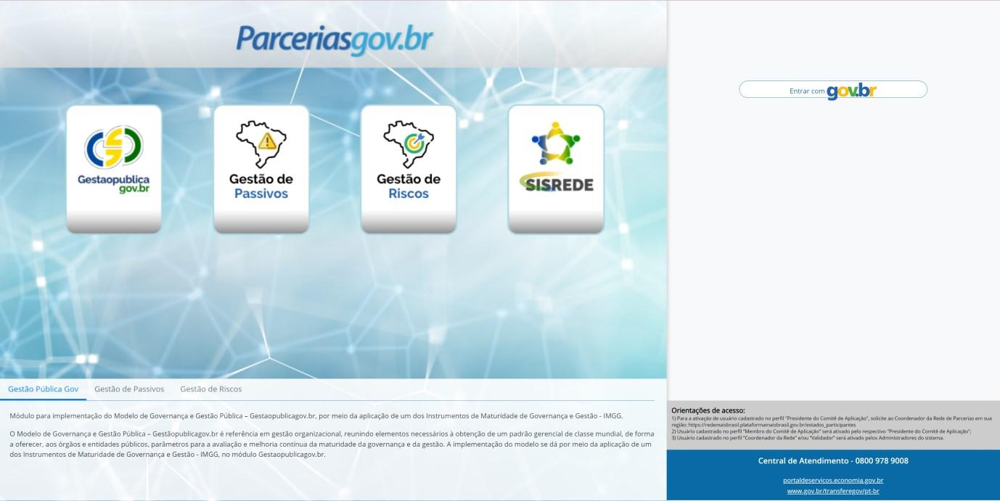  
*(Figura 1 – Tela inicial de acesso ao Sistema Gestaopublicagov.br)*

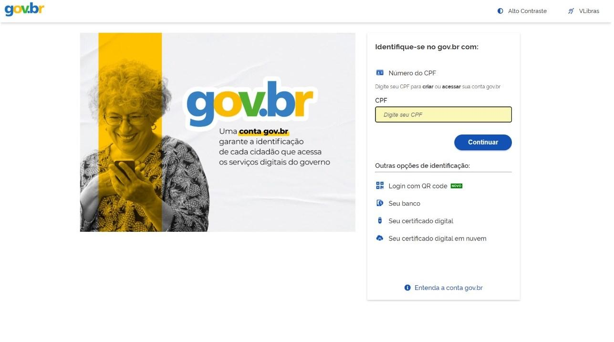  
*(Figura 2 – Credenciais de Acesso (CPF))*

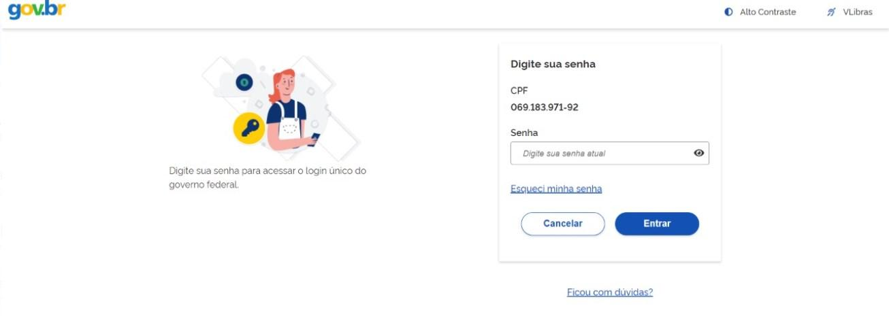  
*(Figura 3 – Credenciais de acesso (senha))*

## 5. MÓDULOS

Ao acessar o Sistema Gestaopublicagov.br, será apresentada a tela da Figura 6, que exibirá barra
lateral à esquerda, com o menu Meus Módulos e a versão atual do sistema. Na parte superior da tela,
será exibida a instituição principal do usuário (CNPJ e nome) e, no menu superior à direita, a
identificação deste.
Nessa tela, também serão exibidos os módulos do Transferegov.br aos quais o usuário tem acesso.
No caso da tela apresentada, é exibido apenas o módulo Gestaopublicagov.br. Para acesso ao sistema,
o usuário deverá clicar sobre a logo do Sistema Gestaopublicagov.br.

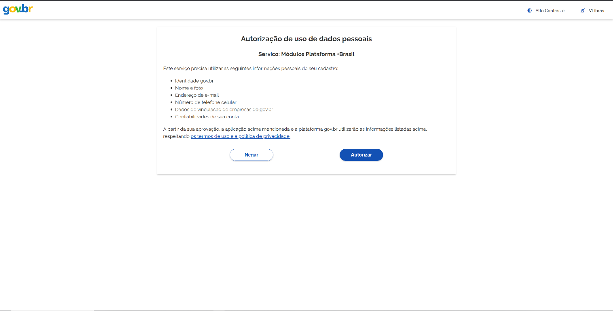  
*(Figura 4 – Autorização de uso de dados pessoais)*

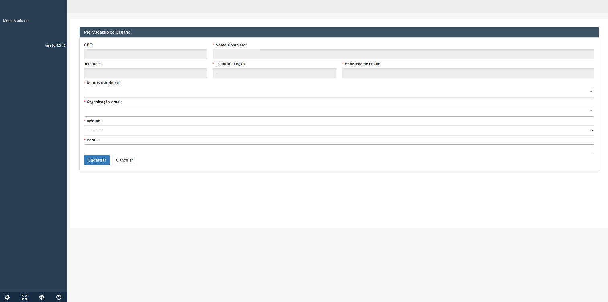  
*(Figura 5 – Tela de cadastro do usuário do Sistema Gestaopublicagov.br)*

Caso seja o primeiro acesso do usuário cadastrado com o perfil Presidente do Comitê de Aplicação,
será exibido o Termo de Adesão, conforme Figura 7. Após o seu aceite ao Termo de Adesão, o usuário
terá acesso ao sistema, sendo possível iniciar a aplicação de um Instrumento de Maturidade de
Governança e Gestão (IMGG).

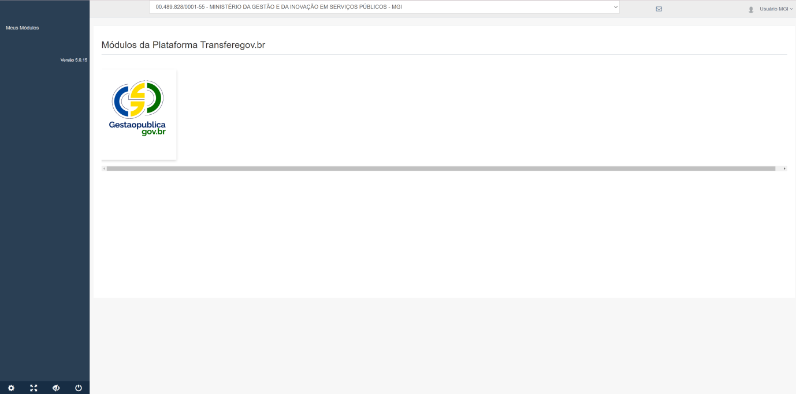  
*(Figura 6 – Tela Meus Módulos)*

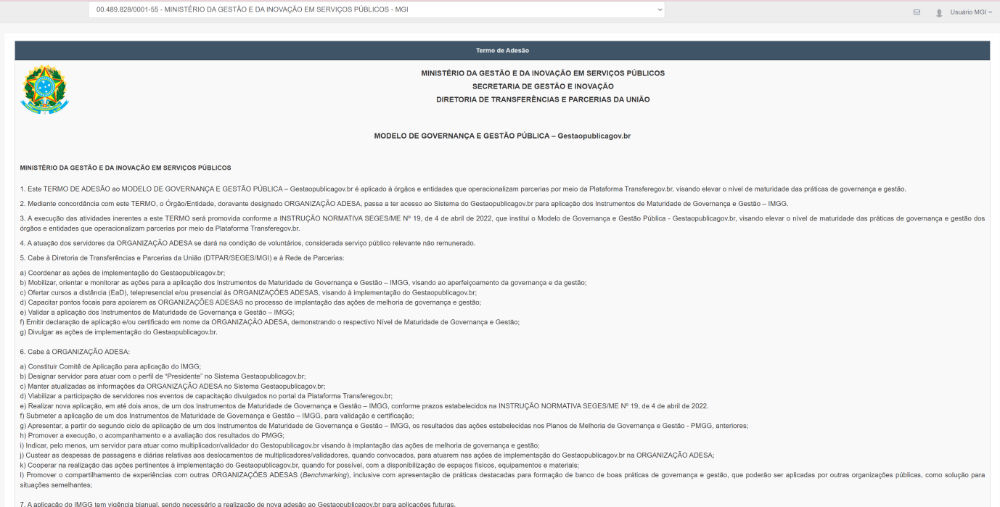  
*(Figura 7 – Tela Termo de Adesão)*

## 6. MENUS PRINCIPAIS

### 6.1 Menu PÁGINA INICIAL

Ao acessar o módulo do Gestaopublicagov.br, o usuário será direcionado à tela inicial do sistema,
correspondente ao menu Página Inicial.
Durante todo o uso do sistema, o usuário visualizará barra lateral à esquerda, com os principais
menus e a versão do sistema, a instituição principal (CNPJ e nome), na parte superior da tela, e o menu
superior à direita, com a identificação do usuário.
De acordo com o(s) perfil(is) do usuário, serão exibidos menus distintos na barra lateral de menus:
* Presidente do Comitê de Aplicação: Meus Módulos, Página Inicial, IMGG e Administrativo
(Figura 8);
* Membro do Comitê de Aplicação: Meus Módulos, Página Inicial e IMGG (Figura 9);
* Coordenador da Rede de Parcerias Federal: Meus Módulos, Página Inicial, IMGG e
Administrativo (Figura 10);
* Coordenador da Rede de Parcerias Estadual: Meus Módulos, Página Inicial, IMGG e
Administrativo (Figura 11);
* Coordenador da Rede de Parcerias Municipal: Meus Módulos, Página Inicial, IMGG e
Administrativo (Figura 12).
Nessa tela inicial, também será exibido o Painel de Controle, em que são apresentadas listas de
instrumentos de acordo com o(s) perfil(is) do usuário e com o âmbito de atuação deste.

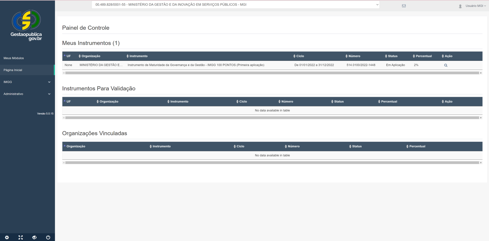  
*(Figura 8 – Presidente do Comitê de Aplicação)*

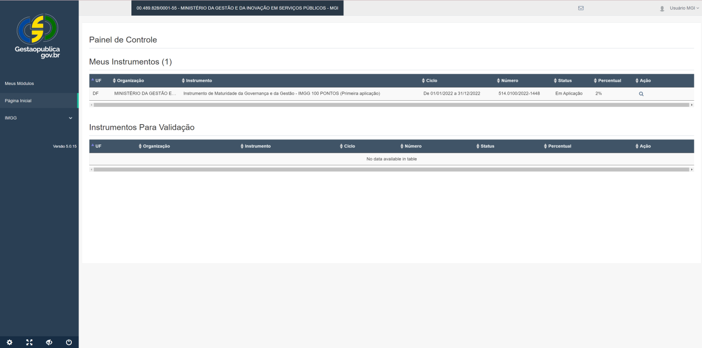  
*(Figura 9 – Membro do Comitê de Aplicação)*

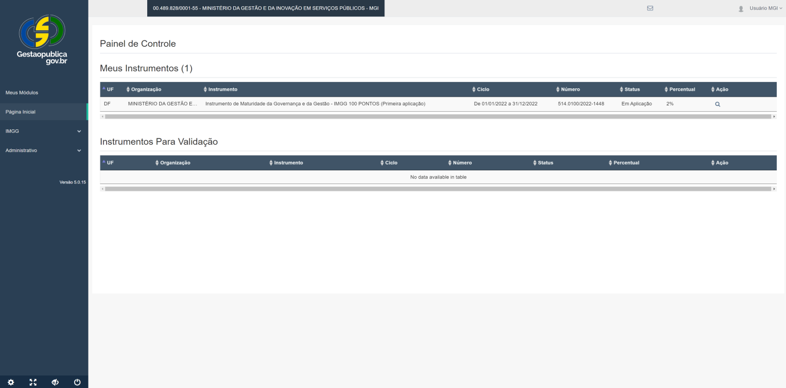  
*(Figura 10 – Coordenador da Rede de Parcerias Federal)*

Em Perfil(s), na parte superior da tela, à direita, conforme Figura 13, o usuário visualizará o(s)
respectivo(s) perfil(is).

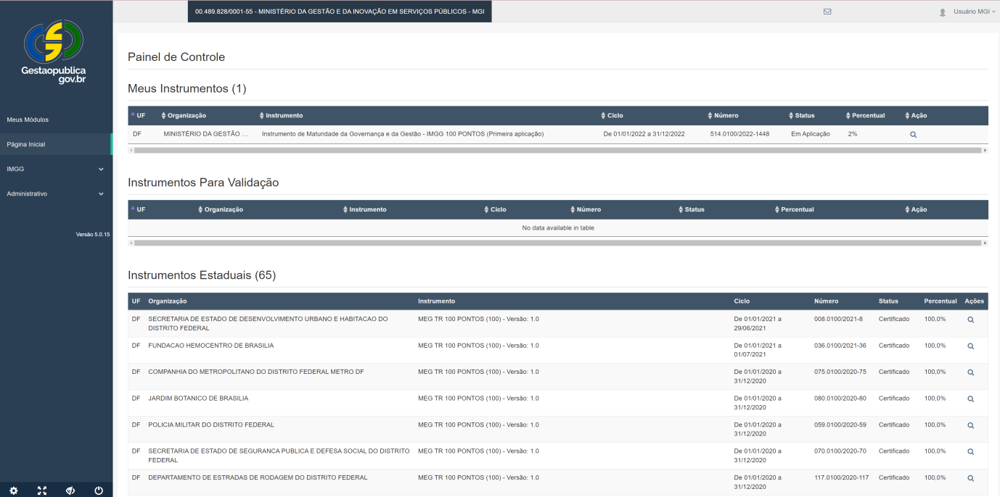  
*(Figura 11 – Coordenador da Rede de Parcerias Estadual)*

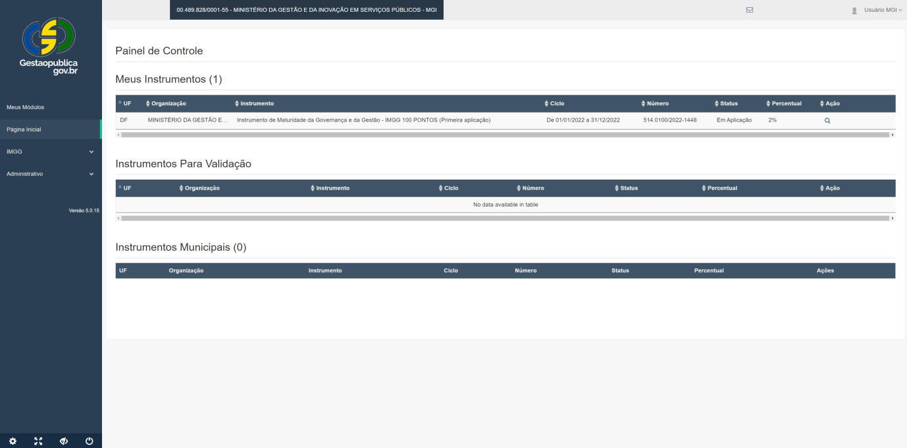  
*(Figura 12 – Coordenador da Rede de Parcerias Municipal)*

Caso a instituição tenha algum instrumento cadastrado, por meio do ícone de consulta
, será
apresentada a tela da Figura 14.
Ao clicarmos em Meu Cadastro, será apresentada a tela da Figura 15, com os dados do usuário.
Ao clicarmos em Sair, o usuário sairá do sistema, retornando à tela de acesso.

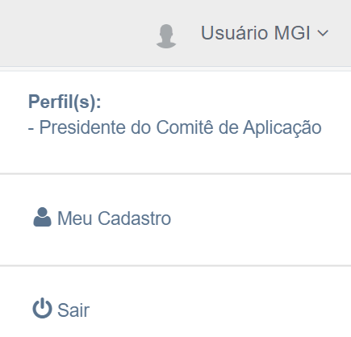  
*(Figura 13 – Perfil(is) do Usuário)*

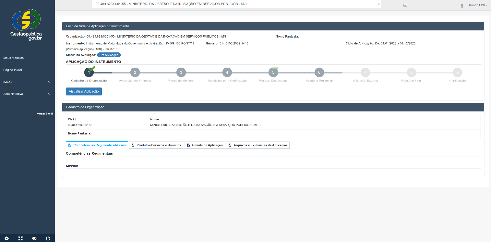  
*(Figura 14 – Tela inicial de Aplicação de IMGG)*

### 6.2 Menu IMGG

No menu IMGG, visível por todos os perfis, serão apresentados, de acordo com o perfil do usuário,
os submenus Aplicação, Monitoramento, Termo de Adesão, FAQ e Glossário:
* Presidente do Comitê de Aplicação: Aplicação, Monitoramento, Termo de Adesão, FAQ e
Glossário (Figura 16);
* Membro do Comitê de Aplicação: Aplicação, Monitoramento, FAQ e Glossário (Figura 17);
* Coordenador da Rede de Parcerias Federal: Aplicação, FAQ e Glossário (Figura 18);
* Coordenador da Rede de Parcerias Estadual: Aplicação, FAQ e Glossário (Figura 19);
* Coordenador da Rede de Parcerias Municipal: Aplicação, FAQ e Glossário (Figura 20).

#### 6.2.1 Submenu Aplicação

Ao clicarmos no submenu Aplicação, será apresentada tela de acompanhamento do(s)
instrumento(s), de acordo com o âmbito de atuação do usuário (Figuras 16-20), em que serão exibidos
campos para consulta (Instrumento, Número e Status) das aplicações de instrumentos realizadas.
Abaixo do campo de consulta, será exibida a lista Aplicação de Instrumentos, que exibirá a relação
de aplicações de instrumentos realizadas pela instituição do usuário, subdividida pelas colunas
Instrumento, Número, Ciclo de Avaliação, Status (Em Aplicação, Em Validação ou Certificação),
Percentual e Ação (com opção de reorganização por filtro). Na coluna Ação, serão apresentadas opções
de acordo com o perfil do usuário:
* Presidente do Comitê de Aplicação: visualizar
, alterar
ou excluir
uma aplicação de
instrumento.
* Demais perfis: visualizar
.

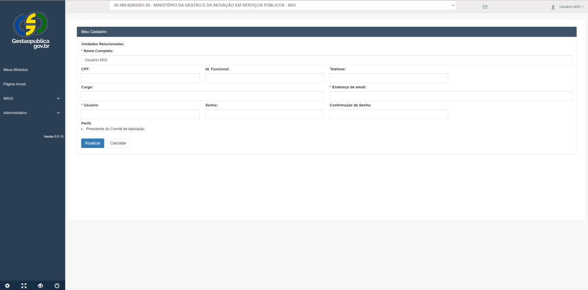  
*(Figura 15 – Meu Cadastro)*

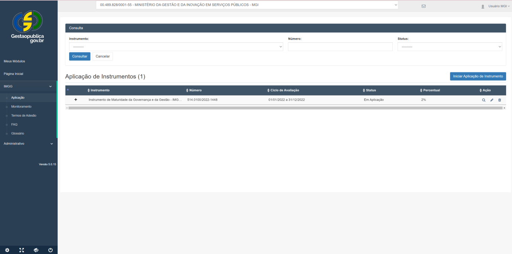  
*(Figura 16 – Presidente do Comitê de Aplicação)*

  
*(Figura 17 – Membro do Comitê de Aplicação)*

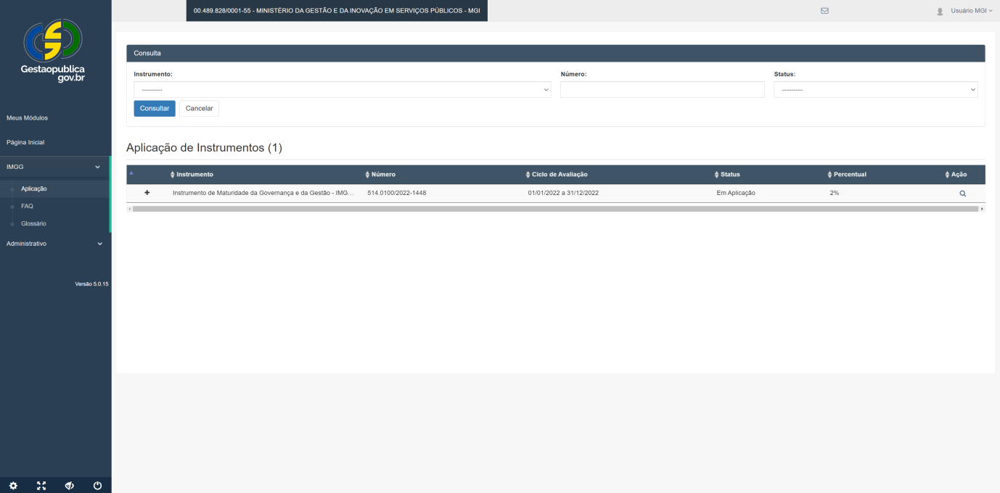  
*(Figura 18 – Coordenador da Rede de Parcerias Federal)*

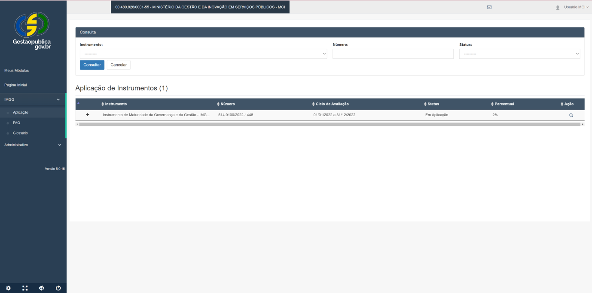  
*(Figura 19 – Coordenador da Rede de Parcerias Estadual)*

Exclusivamente no perfil de Presidente do Comitê de Aplicação, será exibido o botão Iniciar
Aplicação de Instrumento, conforme tela da Figura 16. Ao clicarmos nesse botão, o usuário cadastrado
com o perfil Presidente do Comitê de Aplicação visualizará a tela da Figura 21, dando início a uma
aplicação de Instrumento de Melhoria de Governança e Gestão pela instituição.

  
*(Figura 20 – Coordenador da Rede de Parcerias Municipal)*

Atenção! Para os procedimentos para aplicação do Instrumento de Maturidade de Governança e
Gestão – IMGG 100 pontos, consulte o Guia do Instrumento de Maturidade de Governança e Gestão
100 pontos, no Portal Transferegov.br, na sessão dedicada ao Gestaopublica.gov.br, disponível em
https://www.gov.br/transferegov/pt-br/modelo/sobre/sobre-modelo.

#### 6.2.2 Submenu Monitoramento

Ao clicarmos no submenu Monitoramento, visível apenas pelos perfis Presidente do Comitê de
Aplicação e Membro do Comitê de Aplicação, será apresentada tela com a lista Monitoração dos
Planos de Melhoria (Figuras  22 e 23), que relaciona os Planos de Melhoria de Governança e Gestão
(PMGGs) habilitados pela instituição do usuário, quando da aplicação de um IMGG, subdividida pelas
colunas Instrumento de Aplicação, Plano de Melhoria, Data Início, Periodicidade de Aplicação,
Periodicidade de Avalição e Ação.
Ao clicamos no botão Iniciar Novo Monitoramento, será apresentada tela inicial para a etapa
de monitoramento (Figuras 24 e 25).

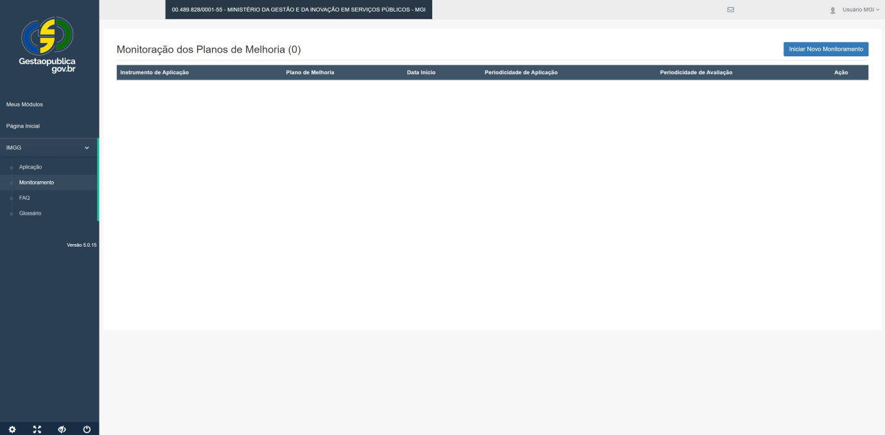  
*(Figura 23 – Membro do Comitê de Aplicação)*

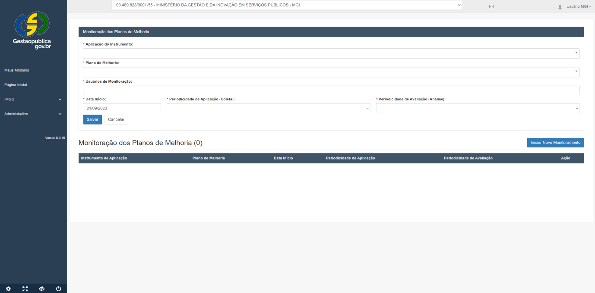  
*(Figura 24 – Presidente Comitê de Aplicação)*

Atenção! Para ter acesso ao passo a passo de como realizar a etapa de monitoramento no Sistema
Gestaopublicagov.br, consulte o Guia do Instrumento de Maturidade de Governança e Gestão 100
pontos, no Portal Transferegov.br, na sessão dedicada ao Gestaopublica.gov.br, disponível em
https://www.gov.br/transferegov/pt-br/modelo/sobre/sobre-modelo.

#### 6.2.3 Submenu Termos de Adesão

Ao clicamos no submenu Termos de Adesão, visível apenas para o usuário cadastrado com o perfil
“Presidente do Comitê de Aplicação”, será apresentada a tela da Figura 26, que exibirá lista com a
relação dos termos aceitos pelo usuário no sistema, termos de adesão e termos de validador (este
último, caso o usuário também tenha atuado como Validador Externo), subdividida pelas colunas
Organização, Data, Usuário, Termo e Status (Ativo ou Inativo) e Ação. É possível imprimir o termo por
meio do ícone
disponível no menu Ação.

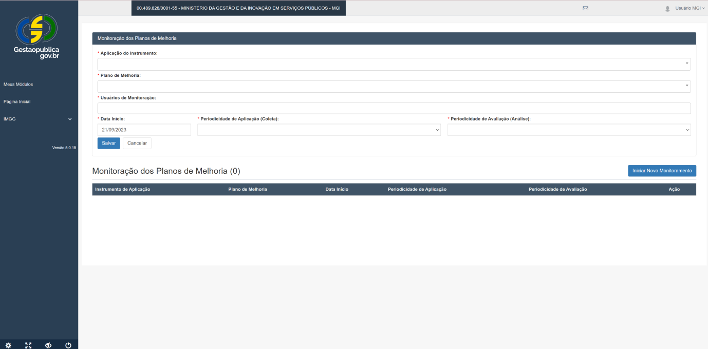  
*(Figura 25 – Membro do Comitê de Aplicação)*

#### 6.2.4 Submenu FAQ

Ao clicamos no submenu FAQ, visível por todos os perfis, será apresentada tela com campo de
consulta e lista com as perguntas frequentes já cadastradas no sistema, subdividida pelas colunas
Pergunta, Status (Ativo ou Inativo) e Ação (Figuras 27-31). Ao se clicar em +, ao lado do nome da
pergunta, será apresentada a resposta à pergunta desejada.

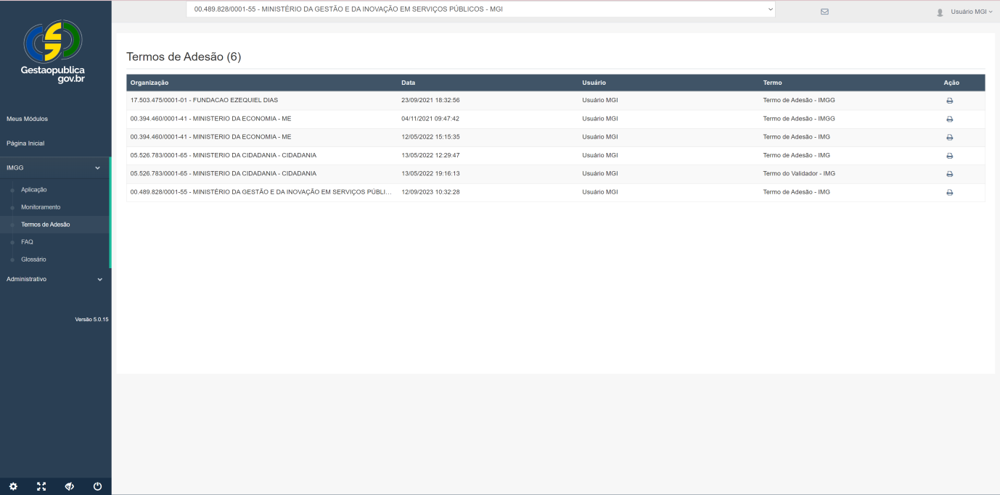  
*(Figura 26 – Presidente Comitê de Aplicação)*

  
*(Figura 28 – Membro do Comitê de Aplicação)*

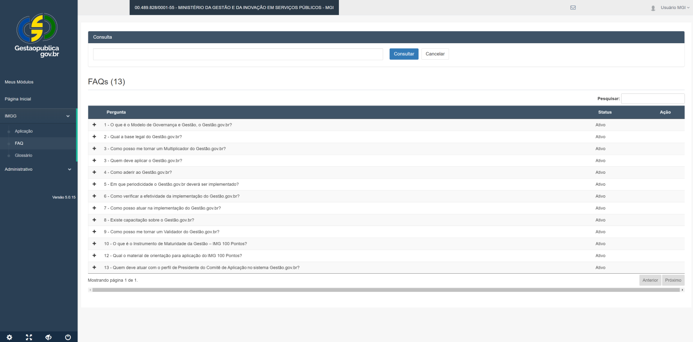  
*(Figura 29 – Coordenador da Rede de Parcerias Federal)*

#### 6.2.5 Submenu Glossário

Ao clicamos no submenu Glossário, visível por todos os perfis, será apresentada tela com campo
de consulta e lista com os termos do glossário já cadastrados no sistema, subdividida pelas colunas
Nome, Status (Ativo ou Inativo) e Ação (Figuras 32-36). Ao se clicar em +, ao lado do nome do termo,
será apresentada a definição deste.

  
*(Figura 30 – Coordenador da Rede de Parcerias Estadual)*

  
*(Figura 31 – Coordenador da Rede de Parcerias Municipal)*

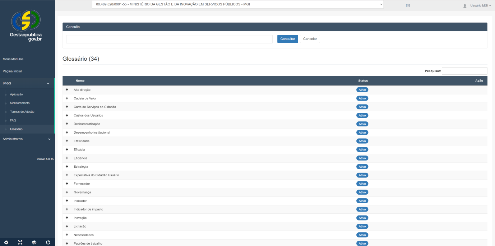  
*(Figura 32 – Presidente do Comitê de Aplicação)*

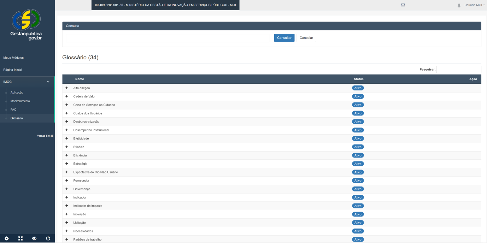  
*(Figura 33 – Membro do Comitê de Aplicação)*

  
*(Figura 34 – Coordenador Rede de Parcerias Federal)*

  
*(Figura 35 – Coordenador Rede de Parcerias Estadual)*

### 6.3 Menu Administrativo

Ao clicarmos no menu Administrativo, visível apenas pelo usuário cadastrado com o perfil
Presidente do Comitê de Aplicação e Coordenador da Rede de Parcerias Estadual/Federal/Municipal,
será exibida tela com campo para consulta de usuários e lista dos usuários ativos e inativos cadastrados
no sistema, subdividida pelas colunas CPF, Nome, Perfil e Ação (com possibilidade de
ativação/inativação do usuário).
* Presidente do Comitê de Aplicação:  visualizará os usuários que sejam de sua instituição;
* Coordenador da Rede de Parcerias Estadual/Federal/Municipal: visualizará os usuários
pertencentes ao seu âmbito de atuação.

#### 6.3.1 Submenu Usuários

Ao clicarmos no submenu Usuários, será apresentada a tela que exibe campo de consulta e a lista
Usuários, que relaciona os usuários da instituição cadastrados no sistema que sejam da mesma
instituição e/ou área de atuação do usuário logado no sistema (Figuras 37 – 40), subdividida pelas
colunas CPF, Nome, Perfil e Ação. Na coluna Ação, é possível ativar ou inativar o usuário.
Ao se clicar em +, na lista de usuários apresentados, serão exibidos os dados do cadastro do
usuário.
Os usuários inativos estarão sinalizados por
ou apenas em destaque
.
A ativação ou inativação do usuário se dará, respectivamente, pelos ícones
na coluna
Ação.

  
*(Figura 36 – Coordenador Rede de Parcerias Municipal)*

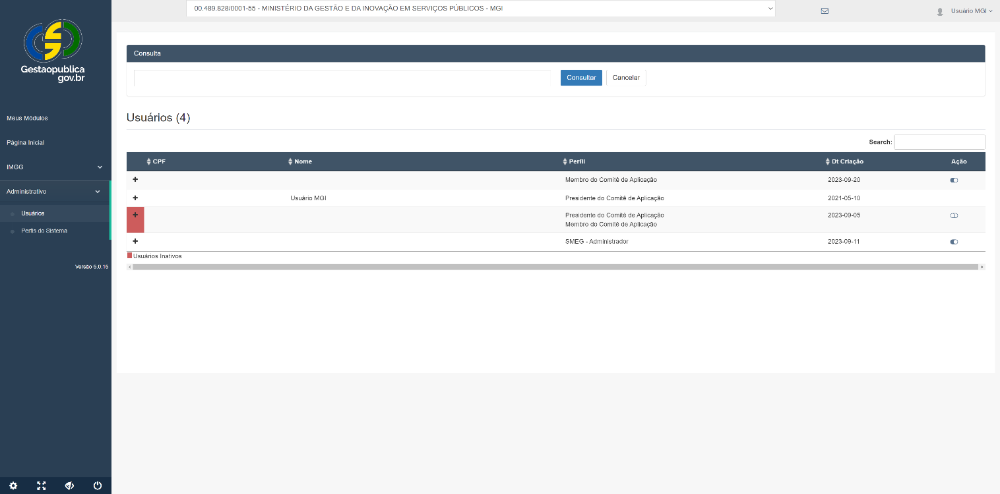  
*(Figura 37 – Presidente do Comitê de Aplicação)*

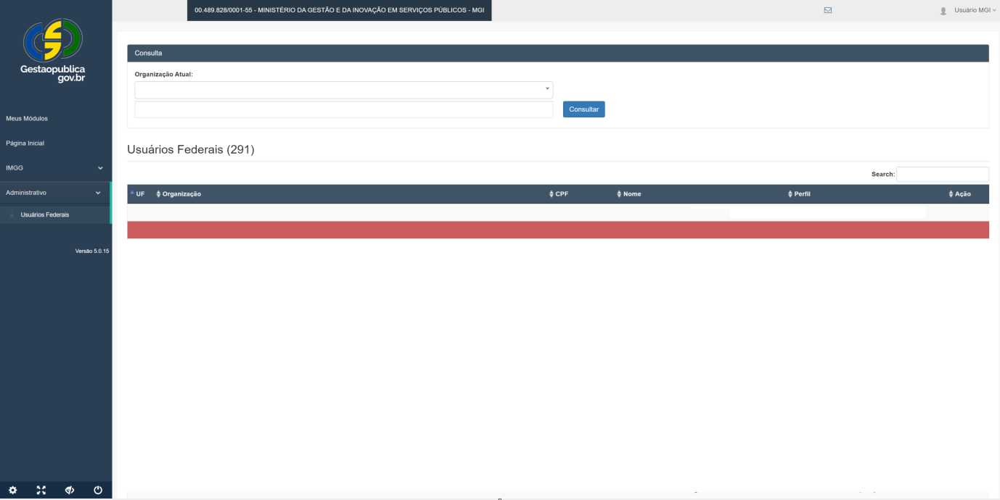  
*(Figura 38 – Coordenadores da Rede de Parcerias Federal)*

#### 6.3.2 Submenu Perfis do Sistema

Ao clicarmos no submenu Perfis do Sistema, disponível apenas para usuário cadastrado com o
perfil Presidente do Comite de Aplicação, será apresentada a tela da Figura 41, em que é exibida a lista
Perfis, que relaciona os perfis cadastrados no sistema, subdividida pelas colunas Nome, Módulo, Global
(sim/não) e Ação.

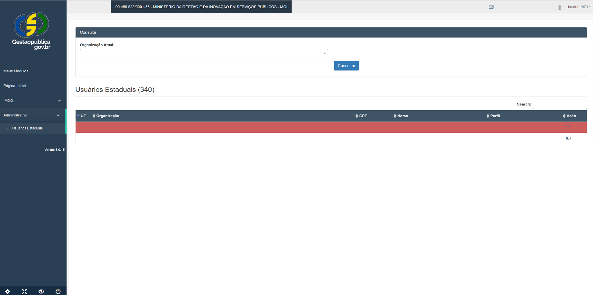  
*(Figura 39 – Coordenadores da Rede de Parcerias Estadual)*

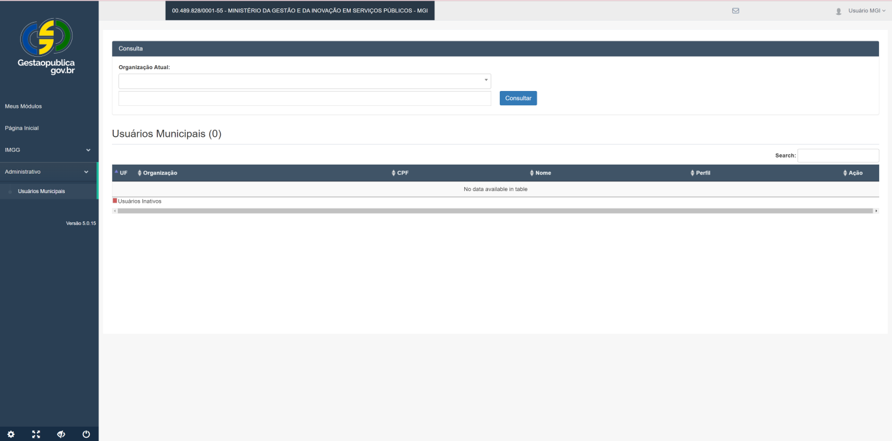  
*(Figura 40 – Coordenadores da Rede de Parcerias Municipal)*

Ao se clicar em +, na lista de perfis apresentados, serão relacionadas as permissões do perfil dentro
do sistema, conforme demonstrado na Figura 41.

## 7. PRINCIPAIS TELAS PARA APLICAÇÃO DO INSTRUMENTO DE MATURIDADE DE GOVERNANÇA

E GESTÃO 100 PONTOS (IMGG 100 PONTOS)
As telas abaixo relacionadas (Figuras 42 – 51) referem-se às principais telas utilizadas para a
aplicação do Instrumento de Maturidade de Governança e Gestão 100 pontos, que compreende a
etapa de Cadastro a Organização até o Relatório Preliminar.  No entanto, para ter acesso ao passo a
passo  para aplicação do IMGG 100 pontos, consulte o Guia do Instrumento de Maturidade de
Governança e Gestão - IMGG 100 pontos, no Portal Transferegov.br, na sessão dedicada ao
Gestaopublica.gov.br, disponível em https://www.gov.br/transferegov/pt-br/modelo/sobre/sobre-
modelo.

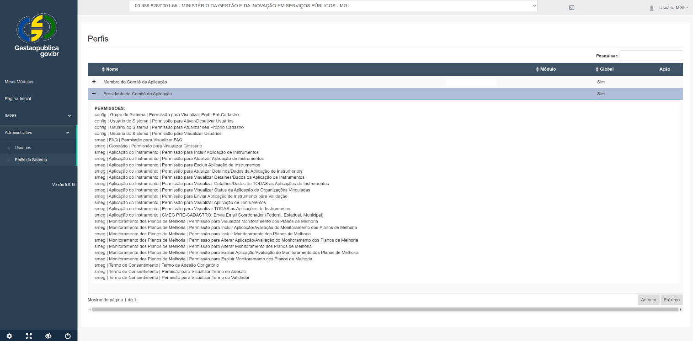  
*(Figura 41 – Presidente do Comitê de Aplicação)*

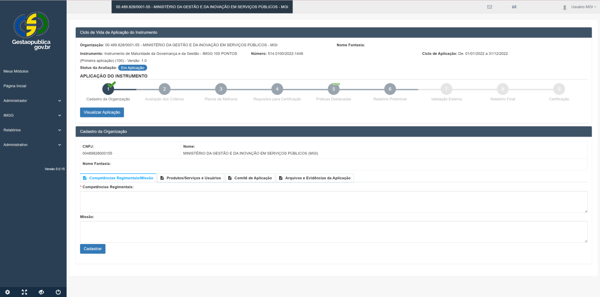  
*(Figura 42 – Tela de Cadastro da Organização (Competências Regimentais/Missão))*

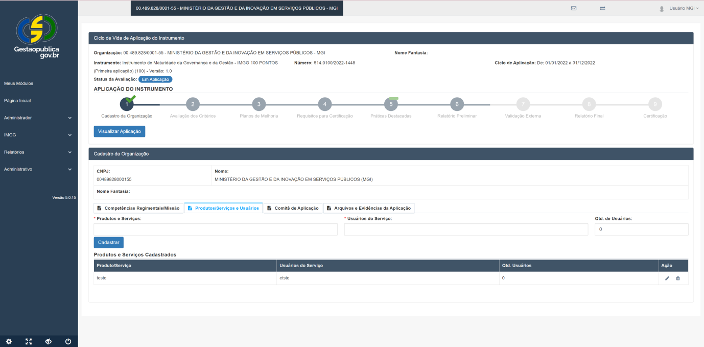  
*(Figura 43 – Tela de Cadastro da Organização (Produtos/Serviços e Usuários))*

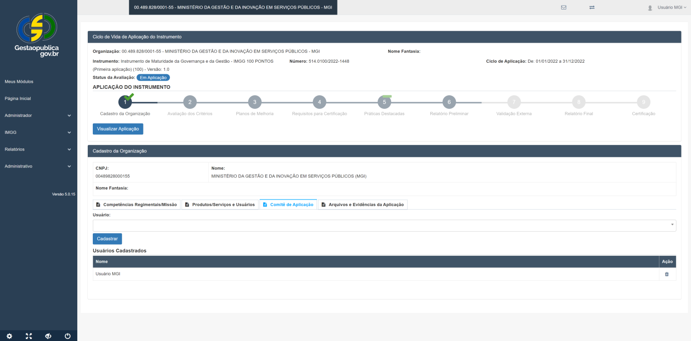  
*(Figura 44 – Tela de Cadastro da Organização (Comitê de Aplicação))*

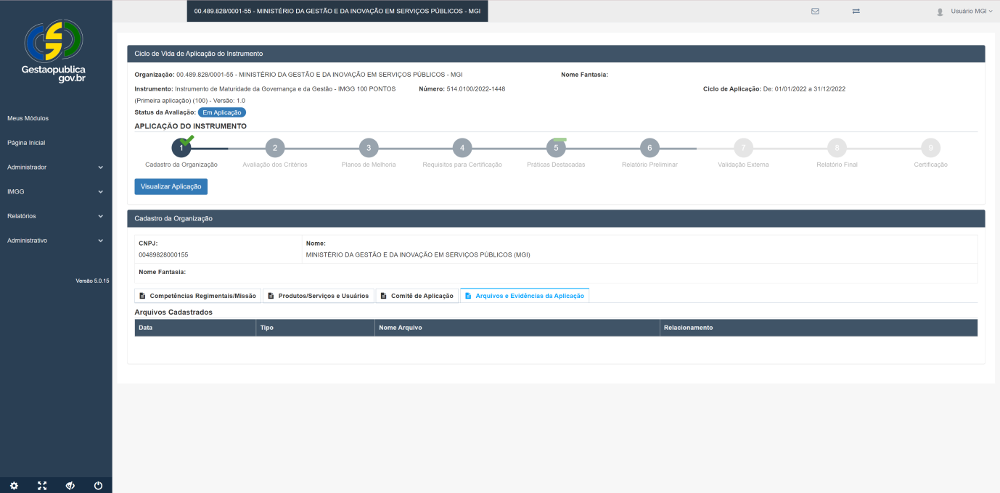  
*(Figura 45 – Tela de Cadastro da Organização (Arquivos e Evidências da Aplicação))*

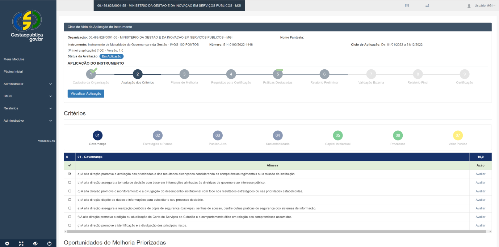  
*(Figura 46 – Tela de Avaliação (exibição das alíneas do Critério Governança))*

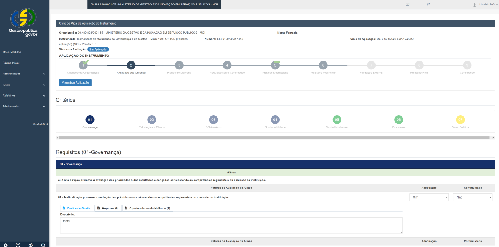  
*(Figura 47 – Tela de Avaliação – Fatores de Avaliação (requisitos 1 e 2 - alínea a – Critério 1))*

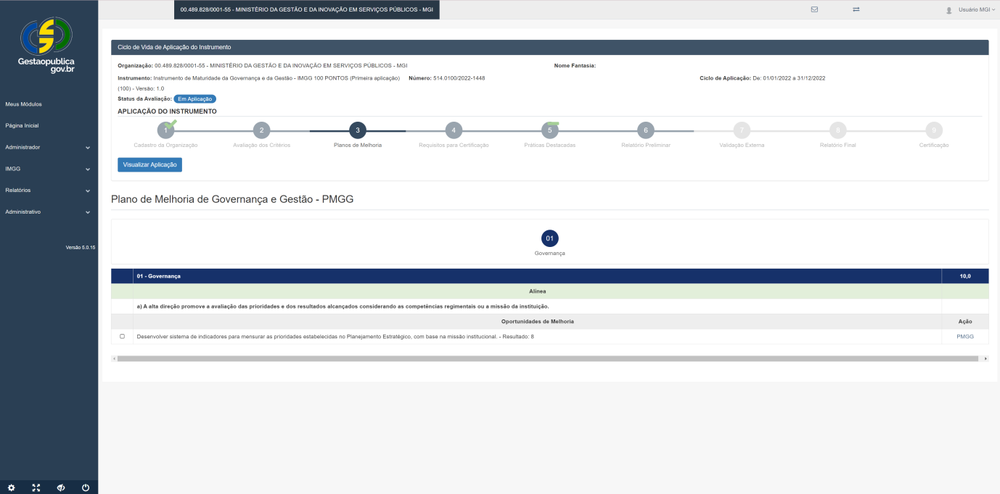  
*(Figura 48 – Tela Plano de Melhoria de Governança e Gestão (PMGG))*

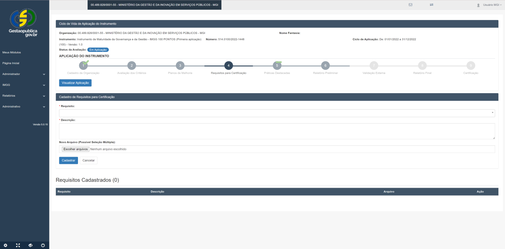  
*(Figura 49 – Tela de Requisitos (cadastro de requisitos para certificação))*

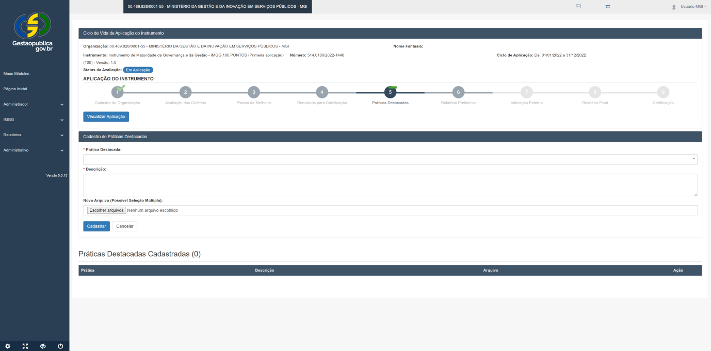  
*(Figura 50 – Tela de Práticas Destacadas (cadastro Práticas Destacadas))*

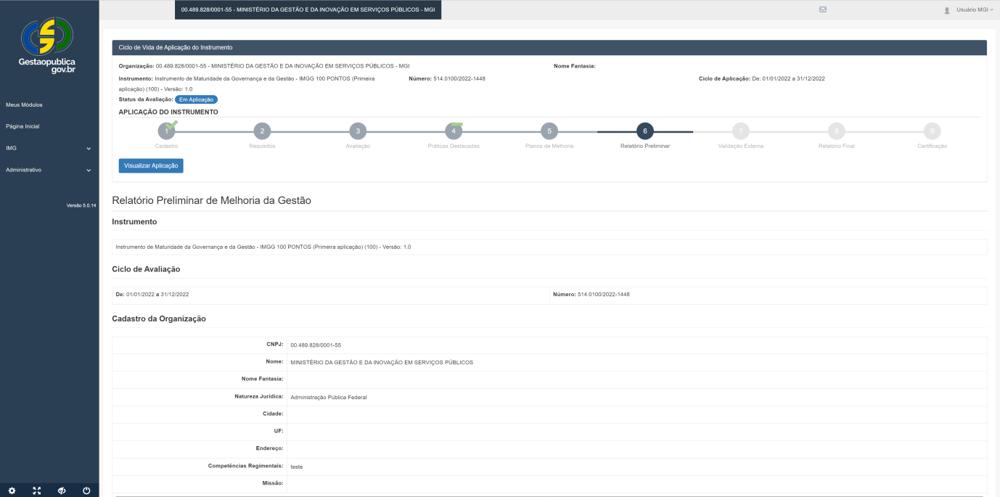  
*(Figura 51 – Tela Relatório Preliminar)*
