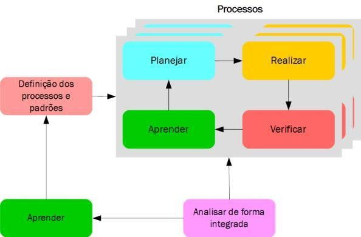
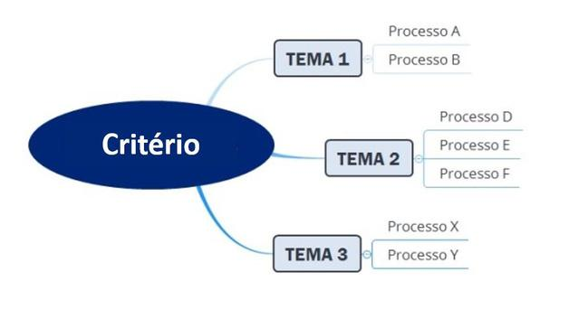

# MODELO DE GOVERNANÇA E GESTÃO PÚBLICA (GESTAOPUBLICAGOV.BR)

**Modelo de Governança e Gestão Pública – Versão 2.0**  
*Ministério da Gestão e da Inovação em Serviços Públicos | Secretaria de Gestão e Inovação | Diretoria de Transferências e Parcerias da União*

---

Ministério daGestão e da Inovação em Serviços Públicos
Diretoriade Transferências e Parcerias da União
1. INTRODUÇÃO ................................................................................................................................................. 3
2. CONCEITOS IMPORTANTES ............................................................................................................................ 4

### 2.1 Modelos ............................................................................................................................................. 4

### 2.2 Sistema ............................................................................................................................................... 4

### 2.3 Modelos de Referência à Gestão ....................................................................................................... 5

### 2.4 Governança Pública ........................................................................................................................... 5

### 2.5 Gestão Pública .................................................................................................................................... 5

3. FUNDAMENTAÇÃO ......................................................................................................................................... 5

### 3.1 O Modelo de Gestão Pública Brasileiro ............................................................................................. 6

### 3.2 Os Princípios da Administração Pública Brasileira ............................................................................. 6

#### 3.2.1 Princípios constitucionais ........................................................................................................ 6

#### 3.2.2 Ser Universal: Os Critérios da Gestão Contemporânea .......................................................... 7

### 3.3 Os Princípios da ISO 37000:2021 – Governança das Organizações ................................................. 10

### 3.4 Os Princípios da Gestão da Qualidade ............................................................................................. 11

#### 3.4.1 Princípios de Gestão da Qualidade: ...................................................................................... 11

4. MODELO DE GOVERNANÇA E GESTÃO PÚBLICA - GESTAOPUBLICAGOV.BR............................................... 11

### 4.1 O Diagrama do Gestaopublicagov.br ............................................................................................... 12

O Gestaopublicagov.br é representado por uma imagem constituída por duas letras “G”,
entrelaçadas, representando os termos “Governança” e “Gestão” e da expressão Gestão.gov.br. Está
representação visual remete ao símbolo do infinito, representação matemática que exprime a ideia
de contínua evolução. ............................................................................................................................ 12

### 4.2 Os Critérios de Maturidade de Governança e Gestão ..................................................................... 13

### 4.3 Processos e Resultados .................................................................................................................... 14

### 4.4 Diagrama do Ciclo da Gestão ........................................................................................................... 15

### 4.5 O Ciclo PDCL ..................................................................................................................................... 16

### 4.6 Como Interpretar os Critérios .......................................................................................................... 17

### 4.7 Critérios de Maturidade de Governança e Gestão .......................................................................... 18

#### 4.7.1 Governança ........................................................................................................................... 18

#### 4.7.2 Estratégias e Planos............................................................................................................... 20

#### 4.7.3 Público-Alvo........................................................................................................................... 21

#### 4.7.4 Sustentabilidade .................................................................................................................... 23

#### 4.7.5 Capital Intelectual ................................................................................................................. 25

#### 4.7.6 Processos ............................................................................................................................... 26

#### 4.7.7 Valor Público ......................................................................................................................... 27

5. CONCLUSÃO ................................................................................................................................................. 31
Sumário
1.INTRODUÇÃO
apresenta o Modelo de Governança e Gestão Pública – Gestaopublicagov.br, desenvolvido com o
propósito de ser o modelo referencial para avaliação e aprimoramento da governança e gestão dos
órgãos e entidades que operacionalizam as transferências e parcerias da União por meio da
Plataforma Transferegov.br.
Este documento tem como objetivo estabelecer as bases conceituais do Modelo de Governança e
da Gestão Pública – Gestaopublicagov.br, tendo como referência os princípios da Administração
Pública Brasileira; a ISO 37000:2021 – Governança das Organizações; a ISO 9000:2015 - Sistemas de
Gestão da Qualidade; e a ISO 9001: 2015 - Sistemas de Gestão da Qualidade.
O uso do modelo possibilita que órgãos e entidades públicos implementem ciclos contínuos de
avaliação de seus sistemas de gestão, oportunizando o conhecimento e a adequação das práticas
e dos resultados atuais, ao realizar o alinhamento aos requisitos do Gestaopublicagov.br. A
manutenção cíclica do processo de avaliação assegura que os resultados da gestão se
mantenham ao longo do tempo e se tornem efetivos, gerando valor à sociedade e favorecendo a
tomada de decisão com base em evidências.
Esta publicação reúne informações, conceitos, critérios, métodos e técnicas de orientação aos
gestores e servidores das organizações atuantes nas transferências e parcerias da União, para a
implementação de melhoria da governança e da gestão e, consequentemente, dos serviços
prestados ao cidadão.
Ministério daGestão e da Inovação em Serviços Públicos
Diretoriade Transferências e Parcerias da União

## 2. CONCEITOS IMPORTANTES

Antes de detalhar o Modelo de Governança e Gestão Pública – Gestaopublicagov.br, é preciso
refletir sobre alguns conceitos importantes.

### 2.2 Sistema

Um sistema é um conjunto de elementos interdependentes de modo a formar um todo organizado.
Apalavra sistema é originária do idioma grego e quer dizer combinar, ajustar, formar um conjunto.
Uma família é um exemplo de sistema. Ela contém elementos que são, em geral, o pai, a mãe e os
filhos. Essas pessoas dependem umas das outras, com papéis e responsabilidades distintas e
complementares. Quando combinadas, formam um todo organizado.
A família é o primeiro e principal ponto de referência para os seus membros, sendo importante
promover a interação destes com a sociedade. É no seio familiar que se desenvolve sentimentos,
como carinho, amor e respeito ao próximo, tanto em casa como fora de seus muros. É na família
que se promove a superação dos desafios, trabalhando a afetividade e a importância desse
sentimento no convívio, buscando, na interação entre as partes, uma formação de cidadãos
responsáveis.

### 2.1 Modelos

Modelos são representações abstratas e simplificadas de uma realidade, que pode ser tanto de
coisas mais simples, como uma caixa de papelão, um envelope ou até de coisas mais
complicadas, como o clima e um território. Ele não é a realidade em si, apenas a representa em
termos mais fáceis
e simples de entender.
Por exemplo, um mapa é um modelo de um território. Ele mostra, de maneira simples, aquilo que
existe num território. Se o território for de uma cidade, o mapa conterá as ruas, pontes, praças,
viadutos, rios, lagos, pontos turísticos etc.
Como ele precisa ser simples, conterá apenas detalhes relevantes da cidade, omitindo,
propositalmente, outros elementos, tais como as árvores e os postes das ruas, os nomes dos
edifícios, os limites dos terrenos, por exemplo.
O mapa é também abstrato, pois utilizamos letras, números, símbolos e desenhos para construí-lo.
Note que o mapa não é a cidade em si. Ele apenas representa a cidade de uma forma que podemos
entendê-la e, assim, orientarmo-nos nela.
Assim, podemos também dizer, de forma resumida, que um modelo é um protótipo ou exemplo
que se pretende reproduzir ou imitar, para favorecer o entendimento da dinâmica de interações
entre os elementos de um sistema.
Ministério daGestão e da Inovação em Serviços Públicos
Diretoriade Transferências e Parcerias da União

## 3. FUNDAMENTAÇÃO

### 2.4 Governança Pública

Conjunto de mecanismos de liderança, estratégia e controle cuja aplicação permita aperfeiçoar as
práticas para avaliar, direcionar e monitorar a gestão, com vistas à condução de políticas públicas e
àprestação de serviços de interesse da sociedade.

### 2.5 Gestão Pública

Função realizadora responsável por planejar a forma mais adequada de implementar as diretrizes
estabelecidas, executar os planos e fazer o controle de indicadores e de riscos. São atividades
relacionadas ao gerenciamento do que precisa serfeito; é a capacidade de planejar, organizar,
dirigir
e controlar, buscando obter a melhor relação entre recurso público, ação e resultado.

### 2.3 Modelos de Referência à Gestão

São modelos padronizados e genéricos que desempenham um papel de referência para os
tomadores de decisão a respeito de práticas a serem empregadas nas operações e processos
organizacionais.
Dessa forma, o Modelo de Governança e Gestão Pública – Gestaopublicagov.br deve ser
considerado como um modelo de referência em governança e gestão organizacional, que tem como
principal característica ser um modelo integrador.
Todo sistema possui um propósito a ser alcançado. No caso do sistema digestivo do corpo humano,
seu propósito é transformar os alimentos em nutrientes para o organismo. Um sistema elétrico,
formado por usinas, linhas de transmissão, postes e transformadores, existe para gerar e distribuir
eletricidade para consumidores de energia.
Uma organização também é considerada um sistema, seja ela pública ou privada. Ela tem partes
(pessoas, processos, edificações, sistemas de informação e equipamentos).
A boa integração dos elementos componentes do sistema é chamada de sinergia. A alta sinergia de
um sistema faz com que seja possível a este cumprir sua finalidade e atingir seu objetivo geral com
eficiência; por outro lado, se houver falta de sinergia, pode implicar o mau funcionamento do
sistema, vindo a causar, inclusive, falha completa, morte, falência, pane, queda do sistema etc.
Ministério daGestão e da Inovação em Serviços Públicos
Diretoriade Transferências e Parcerias da União

### 3.2 Os Princípios da Administração Pública Brasileira

#### 3.2.1 Princípios constitucionais

Em se tratando de gestão do Estado, é essencial levar em consideração, ainda, os princípios
constitucionais específicos para a administração pública, estabelecidos no artigo 37, da Constituição
da República Federativa do Brasil: “a administração pública direta e indireta de qualquer dos Poderes
da União, dos Estados, do Distrito Federal e dos Municípios obedecerá aos princípios de legalidade,
impessoalidade, moralidade, publicidade e eficiência”.

#### a) Legalidade

Em decorrência do princípio da legalidade e, por conseguinte, da soberania popular, somente a lei
pode delegar competências e poderes à Administração Pública e aos seus agentes públicos, como
criar ou extinguir competências estatais, ministério ou órgão da Presidência da República
diretamente subordinado ao Chefe do Poder Executivo, e cargos ou funções públicas (CF, art. 48).
O Gestaopublicagov.brestá alinhado aos normativos que regem os parâmetros dagovernança e
gestão preconizado pelaAdministração Pública, bem como aos mais recentes entendimentos sobre
gestão organizacional.Veja a seguir os principais pontos que fundamentam este modelo referencial.

### 3.1 O Modelo de Gestão Pública Brasileiro

Acompreensão de que um dos maiores desafios do setor público brasileiro é de natureza gerencial,
fez com que se buscasse um modelo de gestão focado em resultados e orientado para o cidadão.
Como exemplo de modelo de maturidade da gestão, temos o Modelo de Excelência em Gestão
Pública - MEGP, mantido pela Secretaria de Gestão do então Ministério do Planejamento, Orçamento
e Gestão. Esse modelo foi concebido e fundamentado em padrões internacionais que representam o
“estado da arte da gestão contemporânea”.
A contemporaneidade do modelo de gestão implica aperfeiçoá-lo, continuamente, para que se
mantenha atual a qualquer tempo.
O Gestaopublicagov.br, assim como o MEGP, é um modelo voltado à maturidade da governança e
da gestão. Isso porque ambos reúnem os elementos necessários à obtenção de um padrão gerencial
de classe mundial, oferecendo aos órgãos e entidades públicos parâmetros para a avaliação e
melhoria de seus sistemas de gestão.
O objetivo principal do Gestaopublicagov.br é contribuir com o aumento da maturidade da
governança e da gestão, tendo como foco a gestão dos órgãos que operam com recursos oriundos de
transferências da União. Dessa forma, pretende-se aprimorar a efetividade na entrega de valor
público à sociedade brasileira.
Ministério daGestão e da Inovação em Serviços Públicos
Diretoriade Transferências e Parcerias da União

#### 3.2.2 Ser Universal: Os Critérios da Gestão Contemporânea

Os Critérios, apresentados a seguir, definem o entendimento contemporâneo voltados à maturidade
da governança e gestão na administração pública.
Entende-se por Critérios os parâmetros que definem o entendimento contemporâneo relacionado
à maturidade da gestão na administração pública. O Gestaopublicagov.br contém em seu escopo
todos os Critérios da Gestão Contemporânea, quais sejam:

#### a) Pensamento sistêmico

Ter pensamento sistêmico é gerenciar levando-se em conta as múltiplas relações de
interdependência entre as unidades internas de uma organização e entre a organização e outras
organizações de seu ambiente externo. O aproveitamento dessas relações minimiza custos, qualifica
o gasto público, reduz tempo, gera conhecimento e aumenta a capacidade da organização de agregar
valor à sociedade. O pensamento sistêmico pressupõe, ainda, a valorização das redes

#### b) Impessoalidade

Aimpessoalidade é uma expressão da supremacia do interesse público, por isso, esse princípio não
admite a acepção de pessoas. O tratamento diferenciado restringe-se apenas aos casos previstos em
lei. A cortesia, a rapidez no atendimento, a confiabilidade e o conforto são requisitos de um serviço
público de qualidade e devem ser agregados a todos os usuários, indistintamente. Em se tratando de
instituição pública, todos os seus usuários são preferenciais, são pessoas muito importantes.

#### c) Moralidade

Esse princípio estabelece que a gestão pública deve pautar-se por um código moral. Exige da
Administração Pública atuação baseada nos padrões morais e costumes sociais. Mesmo em
consonância com a lei, os atos do administrador e demais agentes públicos não podem ofender a
moral e os bons costumes, as regras de boa administração, os princípios de justiça e de equidade e
a ideia comum de honestidade.

#### d) Publicidade

Ser transparente, dar ampla divulgação aos atos praticados pela Administração Pública. Esse
princípio é forte indutor do controle social.

#### e) Eficiência

Fazer o que precisa ser feito, com o máximo de qualidade, ao menor custo possível. Não se trata de
redução de custo de qualquer maneira, mas de buscar a melhor relação entre qualidade do serviço
e qualidade do gasto.
Ministério daGestão e da Inovação em Serviços Públicos
Diretoriade Transferências e Parcerias da União
formais com cidadãos-usuários, interessados e parceiros, bem como das redes que emergem
informalmente, entre as pessoas que as integram e, destas, com pessoas de outras organizações e
entidades.

#### b) Aprendizado organizacional

O aprendizado organizacional na gestão significa gerenciar buscando, continuamente, novos
patamares de conhecimento e transformando tais conhecimentos em bens individuais e,
Entender que a preservação e o compartilhamento do
conhecimento que a organização tem de si própria, de sua gestão e de seus processos é fator
imprescindível para o aumento de seu desempenho.

#### c) Cultura da inovação

Ter cultura de inovação é gerenciar promovendo um ambiente favorável à criatividade; isso requer
atitudes provocativas, no sentido de estimular as pessoas a buscarem, espontaneamente, novas
formas de enfrentar problemas e fazer diferente.

#### d) Liderança e constância de propósitos

Ter liderança e constância de propósitos significa gerenciar motivando e inspirando as pessoas, de
forma a obter delas o máximo de cooperação e o mínimo de oposição. Isso pressupõe: a) atuação
de forma transparente, compartilhando desafios e resultados com todas as pessoas; b) participação
pessoal e ativa da alta administração; c) constância na busca pela consecução dos objetivos
estabelecidos, mesmo que isso implique algum tipo de mudança; e d) prestação de contas sobre o
que acontece no dia a dia da organização.

#### e) Processos e informações

O critério de processos e informações significa gerenciar por processos — conjunto de centros
práticos de ação cujo propósito é cumprir a finalidade do órgão/entidade — e estabelecer o
processo decisório e de controle alicerçado em informações. Dessa forma, a gestão terá condições
de racionalizar sua atuação e dar o máximo de qualidade ao seu processo decisório.

#### f) Visão de futuro

Ter visão de futuro na gestão é gerenciar com direcionalidade estratégica. O processo decisório do
órgão/entidade deve ter por fator de referência o estado futuro desejado pela organização e
expresso em sua estratégia. É fundamental, para o êxito da estratégia, que a visão de futuro,
desdobrada em objetivos estratégicos, oriente a gestão da rotina e determine os momentos de
mudança na gestão dos processos.

#### g) Geração de valor

principalmente, organizacionais.
Ministério daGestão e da Inovação em Serviços Públicos
Diretoriade Transferências e Parcerias da União
Ageração de valor nagestão significa gerenciar de forma a alcançar resultadosconsistentes,
assegurando o aumentode valor tangível e intangível, com sustentabilidade, para todas as partes
interessadas.

#### h) Comprometimento com as pessoas

O comprometimento com as pessoas na gestão significa gerenciar de forma a estabelecer relações
com as pessoas, criando condições de melhoria da qualidade nas relações de trabalho, com o
objetivo de que se realizem humana e profissionalmente. Essa atitude gerencial pressupõe: a) dar
autonomia para atingir metas e alcançar resultados; b) criar oportunidades de aprendizado e de
desenvolvimento de competências; e c) reconhecer o bom desempenho.

#### i) Foco no cidadão e na sociedade

Ter foco no cidadão e na sociedade é gerenciar com vistas ao atendimento regular e contínuo das
necessidades dos cidadãos e da sociedade, na condição de sujeitos de direitos, beneficiários dos
serviços públicos e destinatários da ação decorrente do poder de Estado exercido pelos órgãos e
entidades públicos.

#### j) Desenvolvimento de parcerias

O desenvolvimento de parcerias na gestão significa gerenciar valendo-se da realização de atividades
conjuntas com outras organizações com objetivos comuns, de forma a buscar o pleno uso das suas
competências complementares para desenvolver sinergias.

#### k) Responsabilidade social

A responsabilidade social na gestão significa gerenciar de forma a assegurar a condição de cidadania,
com garantia de acesso aos bens e serviços essenciais, tendo, ao mesmo tempo, a atenção voltada
para a preservação da biodiversidade e dos ecossistemas naturais.

#### l) Controle social

O controle social na gestão significa gerenciar com a participação das partes interessadas. Essa
participação deve acontecer no planejamento, no acompanhamento e na avaliação das
atividades dos órgãos ou entidades públicas.

#### m) Gestão participativa

Gestão participativa é o estilo da gestão de excelência que determina uma atitude em que se busque
a cooperação das pessoas e que reconhece o potencial diferenciado de cada um e, ao mesmo tempo,
harmonize os interesses individuais e coletivos, a fim de conseguir a sinergia das equipes de trabalho.
Ministério daGestão e da Inovação em Serviços Públicos
Diretoriade Transferências e Parcerias da União

### 3.3 OsPrincípiosdaISO37000:2021–GovernançadasOrganizações

A ISO 37000:2021 Governança de Organizações, publicada em 14 de setembro de 2021, foi
desenvolvida pelo ISO/TC309, comitê técnico fundado em 2016, para padronizar os aspectos
relacionados à direção, ao controle e à responsabilidade das organizações. Essa norma estabelece
uma referênciaúnicaparaqueorganizaçõeseseusórgãosdiretivos,independentementedo tamanho,
tenham uma linguagem, princípios e práticas integrados para o exercício da boa governança.
Conforme divulgado no site do comitê técnico que desenvolveu esse novo padrão, sua aplicação,
além deserglobalatodasasorganizações,forneceprincípioseaspectos-chavedaspráticasaos órgãos de
governo, a fim de orientar as organizações sobre como cumprir com suas responsabilidades e seu
propósito. O padrão apresenta, ainda, como isso requer uma abordagem cuidadosa que considere o
engajamento das partes interessadas e uma visão sistêmica, de longo prazo e proativa, incluindo as
oportunidades e os riscos para que a organização permaneça viável ao longodotempo.
O
comitêtécnicodestaca,ainda,queaISO37000tambémreforçaanecessidadecríticade
supervisão
eficaz, em particular, por meio de um sistema de controle interno bem definido e processos de
garantia confiáveis. A responsabilidade, como princípio da boa governança, é destacada em todos os
níveis e, para o padrão, nem os membros do corpo diretivo nem aqueles a quem o poder foi
delegado estão acima da lei.
O corpodiretivoé,emúltimainstância,responsávelpelasaçõeseomissõesdaorganização, portanto, os
órgãos diretivos precisam garantir e definir funções e responsabilidades para que tenham um
sistema de prestação de contas e relatórios que funcione bem. A ISO 37000 enfatiza, ainda, que os
líderes devem definir o tom para uma cultura organizacional ética e precisam considerar o uso
estratégico e responsável dos dados, além de decisões transparentes e alinhadas com
asexpectativasmaisamplasdasociedade.

#### a) Princípiosdaboagovernança

A
seguir,sãoapresentadososprincípiosdaISO37000,querefletemasorientaçõesparaatomada
das
melhoresdecisõesdegovernança,considerandoasustentabilidadealongoprazocomoomais importante.
Confira:
1. Objetivo:razãodeexistênciadetodasasperspectivas.
2. Modelodevalor:oselementosquecompõemacriaçãoegeraçãodevalornecessáriospara cumprir o
propósito.
3. Estratégia:direcionareengajarestratégiasdeacordocomomodelodegeraçãodevalor.
4. Supervisão:supervisionarodesempenhoorganizacionalegarantirqueaorganizaçãoatendaa todas as
expectativas.
5. Prestaçãodecontas:responsabilizaraquelessobrequemocorpodiretivotemautoridade.
6. Engajamentodaspartesinteressadas:engajaraspartesinteressadaseatenderàsexpectativas.
7. Liderança:arranjosdeliderançaéticoseeficazes.
Ministério daGestão e da Inovação em Serviços Públicos
Diretoriade Transferências e Parcerias da União

#### 3.4.1 Princípios de Gestão da Qualidade:

* 
Foco no cliente.
* Abordagem de processo.
* 
Liderança.
* Engajamento das pessoas.
* Melhoria.
* Tomada de decisão baseada em evidências.
* Gestão de relacionamento.
4. MODELO DE GOVERNANÇA E GESTÃO PÚBLICA - GESTAOPUBLICAGOV.BR
O Modelo de Governança e Gestão Pública – Gestaopublicagov.br, considerando a singularidade
da gestão pública, foi desenvolvido tendo por base as premissas:
8. Dados e decisões: os dados como recurso para a tomada de decisões.
9. Governança de risco: o efeito da incerteza no propósito organizacional e nos resultados
estratégicos.
10. Responsabilidade social: tomada de decisão transparente alinhada com expectativas mais
amplas da sociedade.
11. Viabilidade e desempenho ao longo do tempo: permanecer viável ao longo do tempo sem
comprometer as gerações atuais e futuras.

### 3.4 Os Princípios da Gestão da Qualidade

Os Sistemas de Gestão da Qualidade - SGQ empregam a abordagem de processos, que incorpora o
Ciclo PDCL e o pensamento baseado em risco.
Segundo a ISO 9001:2015, “o pensamento baseado em risco permite a uma organização determinar
os fatores que poderiam causar os desvios dos resultados planejados em seus processos e em seu
SGQ, com controles preventivos para minimizar os efeitos negativos e aproveitar, ao máximo, as
oportunidades surgidas.”
A gestão da qualidade é uma ferramenta que promove a visão sistêmica da organização, ao buscar
controlar e dirigir os processos de forma a alcançar a melhoria de produtos e serviços, a satisfação
dos clientes ou a superação das expectativas destes. Na administração pública, os órgãos ou as
entidades públicas devem estabelecer o compromisso de observar padrões de qualidade, eficiência
eeficácia na execução de suas atividades, perante os seus públicos-alvo e a sociedade em geral,
especialmente, aquelas de prestação direta de serviços públicos aos cidadãos e às suas instituições.
Anorma ISO 9001 é baseada nos princípios de gestão da qualidade, que guiam os programas de
gerenciamento de qualidade das organizações que buscam melhorar seu desempenho.
Ministério daGestão e da Inovação em Serviços Públicos
Diretoriade Transferências e Parcerias da União
* 
* 
* 
O Diagrama do Gestaopublicagov.br pode ser interpretado com a seguinte lógica:
Esse modelo é constituído por sete partes integradas e interatuantes(Critérios), que orientam a
adoção de práticas de elevado nível de maturidade em governançaegestão, com a finalidade de levar
os órgãos e entidades que operam Transferências e Parcerias daUnião a padrões elevados de
desempenho e qualidade em gestão.
A gestão pública, enquanto gestão, é universal, devendo, portanto, estar alinhada aos
Princípios e Critérios da gestão contemporânea;
A gestão pública, enquanto pública e brasileira, é particular, devendo, portanto, estar
submetida aos valores constitucionais e legais;
A gestão pública é a gestão do Estado e, por isso, envolve a gestão dos órgãos e entidades
públicos dos três poderes e das três esferas de governo.

### 4.1 O Diagrama do Gestaopublicagov.br

O Gestaopublicagov.br é representado por uma imagem constituída por duas letras “G”,
entrelaçadas, representando os termos “Governança” e “Gestão” e da expressão Gestão.gov.br. Está
representação visual remete ao símbolo do infinito, representação matemática que exprime a ideia
de contínua evolução.
O Diagrama do Gestaopublicagov.br traduz, reforçar e expressar sua finalidade precípua de ser um
referencial para uma gestão pública de elevado nível de maturidade e, consequentemente,
possibilitar a efetividade da aplicação das políticas públicas oriundas das transferências e parcerias
da União, por meio da melhoria contínua da governança e da gestão dos órgãos e entidades e,
consequentemente, dos serviços prestados ao cidadão brasileiro.
Ministério daGestão e da Inovação em Serviços Públicos
Diretoriade Transferências e Parcerias da União

  
*(Figura 1 – Representação Gráfica do Gestaopublicagov.br)*

A Governançadefine como as Estratégias e Planos devem ser implementados e
materializados,considerando a Sustentabilidade e o Capital Intelectual existente, mediante
orientação por Processos, visando assegurar o Valor Público assumido com o Público-alvo.
Uma organização pública é considerada excelente quando atende, de forma equilibrada, a todos os
Princípios e Critérios da gestão contemporânea, refletindo um grau de maturidade elevado em seu
sistema de gestão.

### 4.2 Os Critérios de Maturidade de Governança e Gestão

Os Critérios de Maturidade de Governança e Gestão expressam um conjunto de valores e princípios
que revelam padrões culturais internalizados nas organizações Classe Mundial (expressão utilizada
para caracterizar uma organização considerada entre as melhores do mundo em gestão
organizacional) e reconhecidos internacionalmente, expressos por meio de seus processos e
resultados obtidos pelo atendimento aos Critérios da gestão contemporânea.
Cabe ressaltar que os Critérios não são aspectos isolados da gestão, mas sim inter-relacionados
entre si, o que caracteriza o Gestaopublicagov.br como um modelo verdadeiramente holístico.
Nesse modelo, os Critérios são expressos em características tangíveis, mensuráveis quantitativa
ou qualitativamente, por meio de processos e seus respectivos resultados.
Os Critérios para elevado nível de maturidade em governança e gestão, assim como seus
conceitos, estão descritos a seguir:

#### a) Governança

Estabelecimento de um sistema de governança e gestão e de um sistema de liderança
comprometidos com a ética e o elevado nível de maturidade, mobilizando as pessoas em torno de
valores, princípios e objetivos da organização; explorando as potencialidades das culturas presentes;
preparando líderes e pessoas; e interagindo com as partes interessadas.

#### b) Estratégias e Planos

Formulação das políticas públicas e programas e desenvolvimento de processos para gerar valor
com a implementação destes. Essas partes movem a organização e lhe dão a direção estratégica,
além de possibilitar conhecimento de todos da interdependência das atividades da organização,
internamente e com o ambiente em que atua.

#### c) Sustentabilidade

Compromisso da organização em responder pelos impactos de suas decisões e atividades, na
sociedade e no meio ambiente, e de contribuir para a melhoria das condições de vida, tanto atuais
quanto para as gerações futuras, por meio de um comportamento ético e transparente.
Ministério daGestão e da Inovação em Serviços Públicos
Diretoriade Transferências e Parcerias da União

### 4.3 Processos e Resultados

Como descrito anteriormente, os Critérios de Maturidade de Governança e Gestão são
materializados de forma tangível no sistema de gestão de uma organização, por meio de um
conjunto de processos, de natureza gerencial, inter-relacionados e coerentes com os valores e
princípios organizacionais.
Na estruturação dos processos, devem ser consideradas as seguintes características:

#### d) Público-alvo

Estabelecimento de pactos com entes externos e suas inter-relações com as estratégias e processos,
numa perspectiva de curto e longo prazos, principalmente com os usuários dos serviços prestados
pela organização.

#### e) Capital Intelectual

Desenvolvimento e manutenção do capital intelectual da organização, formado por pessoas
motivadas, engajadas e satisfeitas; e de suas habilidades e competências. Representa a inteligência
e a flexibilidade da organização e lhe dá a capacidade de adaptar-se aos novos cenários, corrigindo,
melhorando ou inovando suas práticas de gestão e, consequentemente, seu desempenho.

#### f) Processos

Reconhecimento de que a organização é formada por conjunto de processos, que precisam ser
entendidos de ponta a ponta e considerados na definição das estruturas: organizacional, de
trabalho
e de gestão. Os processos devem ser gerenciados, visando à busca da eficiência e da eficácia nas
atividades, de forma a agregar valor para as partes interessadas.

#### g) Valor Público

Alcance de resultados econômicos, sociais e ambientais, bem como de resultados dos processos que
os potencializam, em níveis elevados de maturidade em governança e gestão e que atendam às
necessidades e expectativas das partes interessadas. Representa o controle, pois, apenas pelos
resultados produzidos pela organização, é possível analisar a qualidade do sistema de gestão e o
nível de desempenho institucional.
No Gestaopublicagov.br, o aprendizado organizacional e a inovação estão presentes em todos os
Critérios de Maturidade de Governança e Gestão, demonstrando assim, quando da aplicação
desses temas em cada Critério, a relevância da busca contínua de novos conhecimentos e de sua
incorporação pelas pessoas nos processos organizacionais, bem como, da preservação e do
compartilhamento do conhecimento que a organização tem de si própria, de sua gestão e de seus
processos, fator imprescindível para o aumento de seu desempenho.
Ministério daGestão e da Inovação em Serviços Públicos
Diretoriade Transferências e Parcerias da União

### 4.4 Diagrama do Ciclo da Gestão

Abase conceitual do Gestaopublicagov.br utiliza o ciclo PDCL — do inglês: Plan (planejar), Do
(realizar), Check (verificar), Learn (aprender) —, como sugerido no diagrama do Ciclo da Gestão
abaixo:
* Padrões formalmente documentados ou não (dependendo da maturidadeeda relação da
cultura organizacional com a obtenção de resultados), aplicados de maneirasistemática, ou
seja, com a definição de: responsáveis, métodos, periodicidade e respectivoscontroles para
orientar seu funcionamento e monitorar sua aplicação.
Abrangência para áreas, partes interessadas, processos ou produtos, devendo considerar,
também, os riscos inerentes a cada um.
* 
* Avaliação adequada ao ciclo de aplicação, objetivando seu aperfeiçoamento, visando ao
aumento da eficiência ou eficácia. Inovações podem demonstrar sua maturidade, criando formas
diferentes de estruturação, execução ou controle nos processos.
* Produção de resultados relevantes para a organização, com tendências de melhoria e em níveis
de competitividade adequados às estratégias e ao modelo de negócio, atendendo ao Público-
Alvo.
Na parte que trata da interpretação dos Critérios de Maturidade de Governança e Gestão, que
contempla os processos, os detalhamentos e exemplos de ferramentas/metodologias; estão
relacionados os processos que sustentam a internalização desses Critérios na organização. Cabe
ressaltar que a palavra gestão, utilizada nos processos, pressupõe: planejamento, realização,
verificação e aprendizado. Outro aspecto a ser considerado é que os processos incorporam mais
de um Critério, visto que eles se inter-relacionam, em uma perspectiva holística.
Ministério daGestão e da Inovação em Serviços Públicos
Diretoriade Transferências e Parcerias da União

### 4.5 O Ciclo PDCL

P
A etapa de Planejamento (P) envolve atividades, processos de projeto ou
padronização para definição de resultados e sistemas — incluindo produtos,
indicadores de desempenho, objetivos, metas, planos, projetos, processos,
padrões, ativos tangíveis ou intangíveis (por exemplo, equipamentos,
O diagrama do ciclo da gestão considera, em seu movimento, que a definição dos processos ede seus
padrões está presente na organização de forma sistemática. Os processos, com abrangência
adequada ao perfil da organização, são sistematicamente implementados e executados a partirde
um planejamento, e verificados quanto ao cumprimento dos padrões planejados, promovendo
decisões que podem abranger ações corretivas ou preventivas, visando a sua melhoria, ou, ainda,
simplesmente, nenhuma decisão, pois o processo está sendo realizado de forma satisfatória. Esse
primeiro ciclo é chamado de ciclo de controle.
Já o segundo, denominado de ciclo de aprendizado, considera que, quando um processo está
necessitando de alterações nos seus padrões, identificadas principalmente no ciclo de controle,
sua avaliação deve ser realizada de forma integrada com os demais processos da organização,
sendo que as decisões considerarão melhorias e inovações nos padrões. Dessa forma,
promove-se o aprendizado e a integração do sistema gerencial. Ressalta-se, ainda, que, apesar
dessa diferenciação, nos dois momentos, é possível identificar o ciclo PDCL, destacado
anteriormente, sendo que a principal diferença está na abrangência em que realizamos a
análise.
Ministério daGestão e da Inovação em Serviços Públicos
Diretoriade Transferências e Parcerias da União

  
*(Figura 2 – Diagrama do Ciclo da Gestão (PDCL))*

4.6Como Interpretar os Critérios
Apróxima seção deste documento está estruturada com a seguinte lógica:
Cada Critério é desdobrado em temas, que, por sua vez, são concretizados mediante processos.
informações) e outros recursos dos ambientes interno eexterno — estruturados
conforme as necessidades e as expectativas das diferentes partes interessadas.
D
A etapa de Execução (D) envolve a realização de atividades ou processos para
geração de valor nos negócios com clientes e mercados, nos relacionamentos
com fornecedores, no retorno econômico-financeiro aos controladores, na
qualidade de vida profissional e pessoal da força de trabalho ou, também, na
responsabilidade socioambiental com a sociedade e gerações futuras.
C
A etapa de Verificação (C) envolve atividades ou processos de medição ou
avaliação de resultados e sistemas — incluindo produtos, indicadores de
desempenho, objetivos, metas, planos, projetos, processos, ativos tangíveis ou
intangíveis e outros recursos dos ambientes interno e externo — conforme
requisitos explícitos ou implícitos das diferentes partes interessadas, bem
como referenciais comparativos (competitivos ou cooperativos).
L
A etapa de Aprendizado (L) envolve atividades ou processos de melhorias
corretivas ou preventivas, para solução, respectivamente, de problemas reais ou
potenciais, incluindo inovações, aperfeiçoamento contínuo (kaizen), rupturas de
paradigmas (breakthrough) ou mesmo decisões de não interferência (por
exemplo, a manutenção de condições estatisticamente estáveis ou em níveis
aceitáveis de desempenho).
É importante ressaltar que o Ciclo PDCL, além de naturalmente apropriado para a organização em
âmbito global, pode ser igualmente aplicado para a realização de processos operacionais, conforme
ilustrado no diagrama do ciclo da gestão (por exemplo: produção e fornecimento de bens e
serviços, aplicações financeiras e investimentos em novos negócios, seleção e qualificação de
colaboradores, implantação de projetos socioambientais), bem como para a gestão de qualquer
conjunto de processos (por exemplo: auditorias, benchmarking, tratamento de reclamações, recall
e formulação deestratégias).
Ministério daGestão e da Inovação em Serviços Públicos
Diretoriade Transferências e Parcerias da União

  
*(Figura 3 – Estrutura de Critérios, Temas e Processos)*

#### 4.7.1 Governança

### 4.7 Critérios de Maturidade de Governança e Gestão

#### a) Valores e princípios organizacionais

Definição
* Estabelecimento de valores e princípios.
* Estabelecimento de padrões de conduta para assegurar relacionamento ético com as partes
interessadas, respeitar a diversidade, evitar conflito de interesses e combater a corrupção.
* Estabelecimento de diretrizes organizacionais.
Engajamento
* Comunicação, considerando cada uma das partes interessadas.
* Monitoramento da aplicação dos padrões de conduta ética.

#### b) Sistema de governança e gestão

Estruturação do sistema de governança
* Definição e constituição de comitês de governança das transferências da União.
* Estabelecimento de padrões e controles.
* Definição da comunicação com as partes interessadas, buscando a transparência.
* Atendimento à proteção dos direitos de todas as partes interessadas.
Ministério daGestão e da Inovação em Serviços Públicos
Diretoriade Transferências e Parcerias da União
Monitoramento e controle
* Monitoramento e controle da conformidade com os requisitos legais, regulamentares,
padrões estabelecidos e diretrizes organizacionais.
* Tratamento de pendências ou eventuais sanções.
* Prestação de contas das ações ao comitê de governança das transferências da União e às
partes interessadas.
Estruturação do sistema de gestão
* 
Definição das principais correlações entre os requisitos das partes interessadas, as
estratégias e processos da cadeia de valor.
* Estruturação do inter-relacionamento entre os processos.
* Definição dos principais elementos que sustentam a gestão das transferências da União
(soluções gerenciais, suas integrações e lógica de aplicação).
* Representação documental e diagramática do modelo de gestão.
* Comunicação do modelo de gestão para as partes interessadas pertinentes.
Estruturação do sistema de medição
* 
* 
Definição dos atributos.
Definição de indicadores.
* Equilíbrio no atendimento às necessidades das partes interessadas priorizadas pela
organização, em função dos indicadores estabelecidos.

#### c) Tomada de decisão

Identificação das informações
* Definição das informações estratégicas, de processos e das partes interessadas.
* Seleção das informações mais importantes para a tomada de decisão.
* Definição dos referenciais comparativos pertinentes, incluindo os referenciais de
maturidade em governança e gestão e os referenciais teóricos.
Utilização das informações disponíveis
* Integração das informações.
* Estabelecimento de reuniões de análise crítica.
* Definição das decisões críticas para a tomada de decisão.
* Envolvimento de pessoas de diferentes níveis e processos.
* Acompanhamento das decisões tomadas.
* Comunicação das decisões para as partes interessadas pertinentes.
Ministério daGestão e da Inovação em Serviços Públicos
Diretoriade Transferências e Parcerias da União

#### d) Riscos

Gestão de riscos
* Promoção da cultura de riscos.
* 
* 
* 
Classificação dos riscos.
Integração dos riscos.
Priorização dos riscos.
* Tratamento dos riscos priorizados.
* Comunicação dos riscos para as partes interessadas pertinentes.
* Monitoramento dos riscos.

#### 4.7.2 Estratégias e Planos

#### a) Gestão da Estratégia

Formulação das estratégias
* Análise do ambiente externo, considerando o macroambiente, o setor de atuação e suas
tendências e mercado de atuação e suas tendências.
Avaliação dos ativos intangíveis.
* 
* Análise do ambiente interno, considerando ativos intangíveis, riscos, aspectos culturais,
competências essenciais e necessidades de novas competências no médio e no longo prazos.
* Avaliação do modelo do negócio.
* 
Definição das estratégias, considerando os requisitos das partes interessadas, a
produtividade, as externalidades, a sustentabilidade e o legado para as gerações futuras.
Implementação das estratégias
* Definição dos indicadores de desempenho para compor o sistema de medição.
* Definição dos indicadores comparáveis ao desdobramento das metas de curto e longo
prazos, considerando os referenciais comparativos pertinentes e os requisitos das partes
interessadas.
* Desdobramento dos planos de ação, considerando a alocação de recursos.
* Acompanhamento da implementação dos planos de ação.
Análise do desempenho
* 
Utilização dos requisitos das partes interessadas.
* Utilização das informações dos referenciais comparativos pertinentes, incluindo os
referenciais de maturidade em governança e gestão e os referenciais teóricos.
* Utilização de variáveis do ambiente externo.
* Acompanhamento das decisões tomadas, incluindo os indicadores e planos de ação.
Ministério daGestão e da Inovação em Serviços Públicos
Diretoriade Transferências e Parcerias da União

#### 4.7.3 Público-Alvo

#### a) Requisitos das partes interessadas

Definição das partes interessadas

#### b) Políticas públicas

Formulação das políticas públicas
* Formação de agenda.
* 
Definição das políticas públicas, considerando os requisitos das partes interessadas, a
produtividade, as externalidades, a sustentabilidade e o legado para as gerações futuras;
tomada de decisão.
* Formulação, execução e monitoramento da estratégia.
Estruturação dos programas de governo
* Definição dos indicadores de desempenho para compor o sistema de medição.
* Definição dos indicadores comparáveis.
* Desdobramento das metas de curto e longo prazos, considerando os referenciais
comparativos pertinentes e os requisitos das partes interessadas.
* Desdobramento dos programas, considerando a alocação de recursos.
* Monitoramento e controle da implementação dos programas.

#### c) Projetos

Gestão do portfólio de projetos
* 
* 
* 
Seleção de propostas.
Alocação de recursos financeiros de contrapartida.
Priorização de projetos.
* Balanceamento dos esforços de acordo com a capacidade de execução.
* 
Análise de riscos do portfólio.
* Monitoramento e controle de riscos do portfólio.
Gestão de projetos
* 
Iniciação de projetos.
* Planejamento dos projetos.
* 
Execução dos projetos.
* Monitoramento e controle da execução dos projetos.
* Encerramento dos projetos.
Ministério daGestão e da Inovação em Serviços Públicos
Diretoriade Transferências e Parcerias da União
* 
* 
* 

#### c) Cidadão-usuário

Definição dos requisitos
* Tradução das necessidades e expectativas das partes interessadas em requisitos de
desempenho, incluindo os aspectos legais e de produtividade.
* Definição dos níveis de atendimento.
* Comunicação dos níveis de atendimento.
Identificação das necessidades e expectativas
* Compreensão das necessidades e expectativas identificadas.
* 
Priorização das necessidades e expectativas, considerando critérios de relevância.

#### b) Relacionamento com as partes interessadas

Estabelecimento de canais de relacionamento
* 
* 
Definição.
Divulgação.
* Monitoramento.
* 
Avaliação de Satisfação.
Comunicação
* Interação da liderança com as partes interessadas.
* Pronta divulgação dos fatos importantes e abertura dos dados e informações das
transferências da União.
* Relacionamento ético com cada parte interessada.
Tratamento das manifestações
* Tratamento de solicitações, reclamações e sugestões, formais e informais.
* 
Feedback de e para partes interessadas ou áreas.
* Utilização das informações para a melhoria de produtos e processos.
* Relacionamento ético com cada parte interessada.
Identificação daspartes interessadas tradicionais (cidadão-usuário, fornecedor, força de
trabalho).
Identificação das partes interessadas não tradicionais (governos, órgãos reguladores,
sindicatos, parceiros, imprensa, gerações futuras, investidor etc.).
Priorização das partes interessadas relevantes para as estratégias e as transferências da
União.
Ministério daGestão e da Inovação em Serviços Públicos
Diretoriade Transferências e Parcerias da União
Tratamento de impactos sociais
Relacionamento com o cidadão-usuário
* 
Divulgação dos serviços públicos viabilizados por transferências da União.
* Acompanhamento do atendimento das expectativas e necessidades do cidadão-usuário.
* Avaliação da satisfação do cidadão-usuário, incluindo as comparações em relação a
organizações de referência.

#### d) Fornecedor

Desenvolvimento de fornecedores
* 
* 
* 
* 
* 
* 
* 
Aquisição de bens e serviços de fornecedores locais.
Implementação de melhorias, inovações e otimização de custos.
Erradicação do trabalho infantil, degradante ou forçado.
Redução dos impactos ambientais e sociais com relação aos produtos fornecidos.
Identificação de potenciais fornecedores.
Seleção de fornecedores.
Capacitação de fornecedores.
Relacionamento com fornecedores
* 
Gestão de contratos.
* Avaliação de desempenho, considerando os requisitos de fornecimento.
* Comunicação do desempenho.

#### 4.7.4 Sustentabilidade

#### a) Social

Prevenção de impactos sociais
* Identificação dos impactos sociais.
* Definição dos requisitos de desempenho social.
* Prevenção de acidentes e eventuais situações de emergência que coloquem em risco a
sociedade.
* Atuação quanto aos grandes temas mundiais.
* Acessibilidade a produtos, processos, informações e instalações a pessoas com deficiências
ou pessoas com necessidades diferenciadas.
* Engajamento das partes interessadas.
Ministério daGestão e da Inovação em Serviços Públicos
Diretoriade Transferências e Parcerias da União
* Mitigação dos impactos sociais.
* Gestão da imagem perante a sociedade.
* Cumprimento da legislação.

#### b) Ambiental

Prevenção de impactos ambientais
* Identificação dos impactos ambientais.
* Definição dos requisitos de desempenho ambiental.
* Prevenção de acidentes e de eventuais situações de emergência que coloquem em risco o
meio ambiente.
Prevenção da poluição.
* Uso de tecnologias limpas.
* 
* 
Atenção ao ciclo de vida do produto.
* Atuação quanto aos grandes temas mundiais.
* Engajamento das partes interessadas.
Tratamento de impactos ambientais
* Monitoramento dos requisitos de desempenho ambiental.
* Resposta rápida para atender a eventuais situações de emergência que coloquem em risco
o meio ambiente.
* Otimização do uso de recursos.
* Mitigação dos impactos, considerando emissões sonoras, descarte de resíduos, emissões de
efluentes, emissões atmosféricas, mídias visuais.
* Cumprimento da legislação ambiental aplicável.

#### c) Econômico-financeira

Planejamento
* Definição dos indicadores de desempenho econômico-financeiros (interno e externo).
* Elaboração do orçamento quanto a receitas, despesas e investimentos.
* 
Garantia de recursos.
* Otimização de custos.
* 
Responsabilidade fiscal.
Execução
* Gerenciamento da execução financeira.
* Realinhamento do orçamento às estratégias.
Monitoramento
Ministério daGestão e da Inovação em Serviços Públicos
Diretoriade Transferências e Parcerias da União
* 
* 
* 
* 
* 
Monitoramento dos indicadores de desempenho econômico-financeiros.
Monitoramento das externalidades.
Gestão de Custos.
Gestão Orçamentária.
Controle fiscal.

#### 4.7.5 Capital Intelectual

#### a) Conhecimento

Identificação
* Definição dos conhecimentos mais importantes para a organização realizar sua missão e
implantar suas estratégias, a partir de critérios preestabelecidos.
* Classificação destes conhecimentos.
Desenvolvimento
* Criação de ambiente favorável para a busca e geração de conhecimentos.
* 
Utilização de redes de pessoas e organizações para obtê-los ou desenvolvê-los.
Retenção e Proteção
* Formas de armazenamento.
* Métodos para atrair e reter pessoas e parceiros.
Utilização
* Acesso aos conhecimentos retidos e protegidos.
* Compartilhamento.
* 
Utilização de redes de pessoas e organizações para sua difusão.
Atuação em rede
* Identificação das redes atuais e potenciais, internas ou externas, que sejam as mais
importantes para se relacionar ou delas se proteger.
* Cooperação entre organizações ou indivíduos, com interesses comuns e que possam
influenciar o êxito das transferências da União, especialmente, no âmbito da Rede +Brasil.

#### b) Força de trabalho

Desenvolvimento da força de trabalho
Ministério daGestão e da Inovação em Serviços Públicos
Diretoriade Transferências e Parcerias da União

#### 4.7.6 Processos

#### a) Gestão por Processos

Modelagem
* Estruturação da cadeia de valor.
* Desdobramento da cadeia de valor.
* Mapeamento dos processos.
* Definição dos requisitos aplicáveis aos processos, considerando também os advindos das
partes interessadas.
* 
* 
Capacitação.
Preparação das pessoas para o exercício de suas funções.
* Remuneração, reconhecimento e incentivos, visando à cultura de elevado nível de
maturidade em governança e gestão.
* Avaliação do desempenho das pessoas e das equipes, incluindo os líderes.
* Identificação de necessidades de desenvolvimento, considerando a participação dos líderes
e das próprias pessoas.
Relacionamento com a força de trabalho
* Tratamento dos perigos e riscos relacionados à saúde e à segurança.
* Promoção do bem-estar, satisfação e comprometimento das pessoas.
* Avaliação do clima organizacional.
* Promoção da melhoria da qualidade de vida dentro e fora do ambiente de trabalho.

#### c) Sucessão

Identificação de novos líderes e sucessores
* Definição de competências de liderança atuais e futuras.
* Seleção de pessoas com potencial de liderança e sucessores.
Preparação de novos líderes e sucessores
* Definição de plano de desenvolvimento.
* Acompanhamento do plano.
* 
Avaliação dos líderes e sucessores.
Ministério daGestão e da Inovação em Serviços Públicos
Diretoriade Transferências e Parcerias da União

#### 4.7.7 Valor Público

#### a) Resultados Sustentáveis

Esse modelo pretende representar a realidade a partir da definição de um conjunto de variáveis (ou
aspectos da realidade que se pretende representar, aspectos estes que podem ser
vistos/definidos/medidos de forma quantitativa ou qualitativa, por meio de indicadores).
Os indicadores são instrumentos de gestão essenciais nas atividades de monitoramento e avaliação
das organizações, assim como seus projetos, programas e políticas, pois permitem acompanhar o
alcance das metas, identificar avanços, melhorias de qualidade, correção de problemas, necessidades
de mudança etc.
Assim sendo, pode‐se dizer que os indicadores possuem, minimamente, duas funções básicas: a
primeira é descrever, por meio da geração de informações, o estado real dos acontecimentos e o
seu comportamento; a segunda é de caráter valorativo, que consiste em analisar as informações
presentes com base nas anteriores, de forma a realizar proposições valorativas.
Projeto
* Análise e melhoria dos processos, considerando a eficiência, eficácia e produtividade destes
e da aplicação de recursos, assim como métodos para reduzir a variabilidade, aumentar a
confiabilidade e a eficiência ecológica.
Incorporação de novas tecnologias.
Definição dos indicadores de processos.
* 
* 
* Identificação e desenvolvimento das competências necessárias atuais e futuras.
* 
Avaliação dos riscos dos processos.
* Implantação do novo processo ou do processo redesenhado ou remodelado.
Gerenciamento
* 
* 
Padronização.
Controle, incluindo indicadores de processo.
Análise da estrutura organizacional
* 
Definição de autoridade e responsabilidade.
* Planejamento do quadro de pessoal, próprio e terceiro, nos curto e longo prazos,
considerando a produtividade dos processos.
* Definição de novas modalidades de trabalho.
* Compatibilização entre a estrutura atual com o dimensionamento desejado.
Ministério daGestão e da Inovação em Serviços Públicos
Diretoriade Transferências e Parcerias da União
Geração de resultados sociais
De forma geral, os indicadores não são simplesmente números, ou seja, são atribuições de valor a
objetivos, acontecimentos ou situações, de acordo com regras, aos quais possam ser aplicados
critérios de avaliação, como, por exemplo, eficácia, efetividade e eficiência.
Geração de resultados econômico-financeiros
Os indicadores econômico-financeiros podem ser:
* 
Liquidez:
o
o
o
o
Percentual de capital circulante líquido livre;
Percentual de liquidez corrente;
Percentual de liquidez geral;
Percentual de liquidez seca.
* 
Atividade:
o Giro dos ativos permanentes;
o Percentual de giro do ativo total;
o Percentual de imobilização do patrimônio líquido.
* Endividamento:
o Percentual de endividamento geral;
o Percentual de garantia de capital de terceiros;
o Percentual de composição do endividamento;
o Percentual de comprometimento de longo prazo;
o Percentual de comprometimento de curto prazo.
* 
Resultado:
o Percentual de resultado patrimonial;
o Percentual de resultado orçamentário;
o Percentual de margem bruta orçamentária;
o
o
Percentual de retorno do ativo total;
Percentual de retorno do capital próprio;
o Percentual de retorno patrimonial.
Geração de resultados ambientais
Os indicadores de desempenho ambiental podem ser:
* Índice de consumo de água;
* Índice de consumo de energia;
* Índice de consumo de papel;
* 
Índice de disposição de resíduos sólidos;
* Índice de investimentos em áreas verdes;
* Índice de investimento em gestão de resíduos;
* 
* 
Índice de qualidade do ar;
Índice de redução de cobertura vegetal.
Ministério daGestão e da Inovação em Serviços Públicos
Diretoriade Transferências e Parcerias da União
Os indicadores de desempenho social podem ser:
* Índice de conformidade legal e regulamentar;
* Índice de exposição positiva na mídia;
* 
* 
Índice de danos à segurança da população ou usuários;
Índice de acessibilidade;
* Índice de desenvolvimento humano;
* 
Índice de geração de renda;
* Índice de imagem junto à sociedade;
* 
Índice de redução da desigualdade social;
* Índice de retorno dos programas sociais.
Geração de resultados relativos ao capital intelectual
Os indicadores de desempenho relativos ao capital intelectual podem ser:
* Percentual de absenteísmo;
* 
Percentual de avanço na carreira;
* Percentual de desempenho individual;
* Percentual de desempenho das equipes;
* Percentual de desenvolvimento de líderes;
* Percentual de efetividade da comunicação;
* Percentual de incremento de competências;
* Índice de aproveitamento interno;
* Índice de clima organizacional;
* Índice de eficácia do desenvolvimento;
* Índice de cumprimento do programa anual de capacitação;
* 
* 
* 
Índice de produtividade das equipes;
Índice de rotatividade geral;
Índice de rotatividade voluntária;
* Índice de satisfação com a liderança;
* 
Índice de sucessores por posição;
* Taxa de acidentes com afastamento;
* Taxa de acidentes sem afastamento;
* 
* 
Taxa de frequência de acidentes;
Taxa de gravidade.
Geração de resultados relativos aos fornecedores
Os indicadores de desempenho relativos aos fornecedores podem ser:
* Índice de conformidade com nível de serviço;
* 
Percentual de entregas perfeitas;
* Índice de atendimento aos requisitos dos fornecedores;
* 
Índice de fornecedores desenvolvidos;
Ministério daGestão e da Inovação em Serviços Públicos
Diretoriade Transferências e Parcerias da União
* Índice de fornecedores homologados por suprimento crítico;
* Índice de melhoria da qualidade dos produtos fornecidos;
* 
Índice de satisfação dos fornecedores;
* Taxa de desenvolvimento da cadeia produtiva.
Geração de resultados relativos aos processos
Os indicadores de desempenho relativos aos produtos e processos podem ser:
* 
Índice de capacidade utilizada;
* Índice de conformidade de processo;
* Índice de conformidade de produto;
* 
* 
* 
* 
Índice de duração de falha;
Índice de entregas perfeitas;
Índice de exposição a riscos operacionais;
Índice de frequência de falha;
* Grau de vulnerabilidade dos conhecimentos;
* Índice de atendimento das necessidades e expectativas das partes interessadas;
* Índice de cumprimento do plano estratégico;
* 
Índice de evolução da cultura desejada;
* Índice de riscos mitigados;
* 
* 
* 
Índice de perdas;
Índice de retorno dosprojetos de inovação;
Índice de retrabalho.
Ministério daGestão e da Inovação em Serviços Públicos
Diretoriade Transferências e Parcerias da União
5.CONCLUSÃO
Aimplementação do Gestaopublicagov.br se dá pela aplicação de um dos Instrumento de
Maturidade da Governança e Gestão – IMGG, e visa apoiar a implementação objetiva das condições
para o aprimoramento da governança e da gestão dos órgãos e entidades que operam com
transferências da União e que estão focadas em resultados para o cidadão.
O uso do Gestaopublicagov.br permite que órgãos e entidades públicos possam atuar na
implantação de ciclos contínuos de avaliação de seus sistemas de gestão, oportunizando o
conhecimento das práticas, os resultados atuais e seu alinhamento aos requisitos do
Gestaopublicagov.br.
Além disso, possibilita agregar valor às oportunidades de melhoria identificadas, bem como
incrementar e inovar nos pontos fortes, ambos identificados em cada processo de avaliação da
gestão. A manutenção cíclica do processo de avaliação assegura que os resultados da gestão se
mantenham ao longo do tempo e se tornem efetivos.
Nesse sentido, vale ressaltar que a opção pelo aprimoramento continuado da governança e da
gestão pública envolve um conjunto integrado de ações e é uma decisão da organização.
Ministério daGestão e da Inovação em Serviços Públicos
Diretoriade Transferências e Parcerias da União